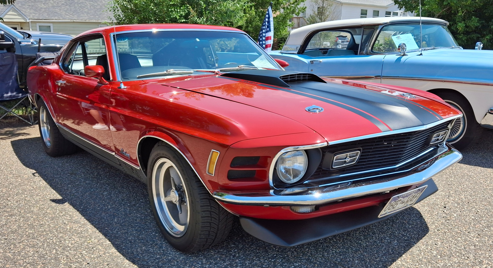
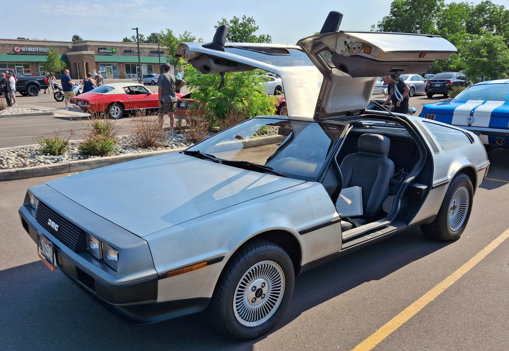
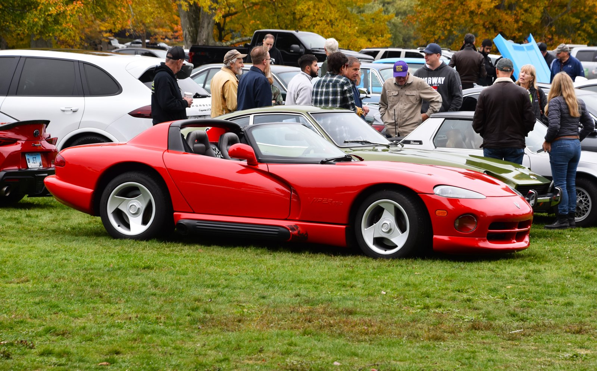
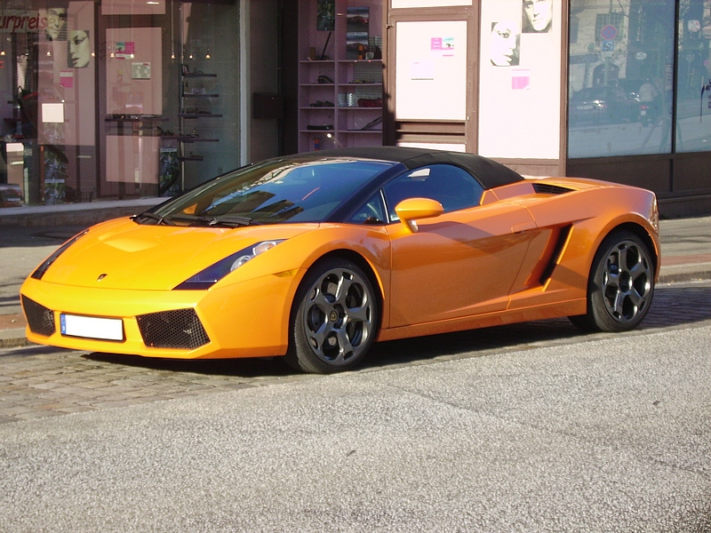
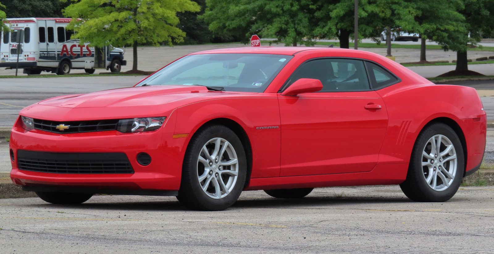

```{=html}
<div class="seven-decades-section">
  <!-- MAIN HEADING -->
  <div class="seven-decades-header">
    <div class="hero-eyebrow">Motoring Archive &bull; 1970 &mdash; 2024</div>
    <h1 class="timeline-headline">Cars looked different.</h1>
    <p class="timeline-subtitle">&ldquo;They didn't always come from the same design template.&rdquo;</p>
  </div>

  <!-- SIX EQUAL VERTICAL PANELS -->
  <div class="seven-decades-container">
    <div class="timeline-horizon-line"></div>
    <div class="seven-decades-grid">

      <!-- 1970s -->
      <div class="decade-panel">
        <span class="panel-decade-badge">1970s</span>
        <div class="panel-horizon-node"></div>
        <div class="panel-image-frame">
          
        </div>
        <div class="panel-meta">
          <span class="panel-year">1970</span>
          <span class="panel-model">Ford Mustang</span>
          <div class="panel-specs">
            <span>187 in</span>
            <span>3,120 lb</span>
            <span>4.9L V8</span>
            <span>210 hp</span>
          </div>
        </div>
      </div>

      <!-- 1980s -->
      <div class="decade-panel">
        <span class="panel-decade-badge">1980s</span>
        <div class="panel-horizon-node"></div>
        <div class="panel-image-frame">
          
        </div>
        <div class="panel-meta">
          <span class="panel-year">1981</span>
          <span class="panel-model">DeLorean DMC-12</span>
          <div class="panel-specs">
            <span>166 in</span>
            <span>2,718 lb</span>
            <span>2.85L V6</span>
            <span>130 hp</span>
          </div>
        </div>
      </div>

      <!-- 1990s -->
      <div class="decade-panel">
        <span class="panel-decade-badge">1990s</span>
        <div class="panel-horizon-node"></div>
        <div class="panel-image-frame">
          
        </div>
        <div class="panel-meta">
          <span class="panel-year">1992</span>
          <span class="panel-model">Dodge Viper</span>
          <div class="panel-specs">
            <span>175 in</span>
            <span>3,290 lb</span>
            <span>8.0L V10</span>
            <span>400 hp</span>
          </div>
        </div>
      </div>

      <!-- 2000s -->
      <div class="decade-panel">
        <span class="panel-decade-badge">2000s</span>
        <div class="panel-horizon-node"></div>
        <div class="panel-image-frame">
          
        </div>
        <div class="panel-meta">
          <span class="panel-year">2004</span>
          <span class="panel-model">Lamborghini Gallardo</span>
          <div class="panel-specs">
            <span>169 in</span>
            <span>3,153 lb</span>
            <span>5.0L V10</span>
            <span>493 hp</span>
          </div>
        </div>
      </div>

      <!-- 2010s -->
      <div class="decade-panel">
        <span class="panel-decade-badge">2010s</span>
        <div class="panel-horizon-node"></div>
        <div class="panel-image-frame">
          
        </div>
        <div class="panel-meta">
          <span class="panel-year">2010</span>
          <span class="panel-model">Chevrolet Camaro</span>
          <div class="panel-specs">
            <span>190 in</span>
            <span>3,741 lb</span>
            <span>3.6L V6</span>
            <span>304 hp</span>
          </div>
        </div>
      </div>

      <!-- 2020s -->
      <div class="decade-panel">
        <span class="panel-decade-badge">2020s</span>
        <div class="panel-horizon-node"></div>
        <div class="panel-image-frame">
          
        </div>
        <div class="panel-meta">
          <span class="panel-year">2020</span>
          <span class="panel-model">Toyota GR Supra</span>
          <div class="panel-specs">
            <span>172 in</span>
            <span>3,397 lb</span>
            <span>3.0L Turbo I6</span>
            <span>382 hp</span>
          </div>
        </div>
      </div>

    </div>
  </div>

  <!-- OUTRO STATEMENT & INVESTIGATION QUESTION -->
  <div class="seven-decades-outro">
    <div class="outro-statement">&ldquo;Six decades. Six different ideas of what a car should look like.&rdquo;</div>
    <div class="outro-transition-box">
      <div class="transition-question">Did cars actually become more similar?</div>
      <p class="transition-subtext">Look at the data across forty years of design.</p>
    </div>
  </div>
</div>

<div class="comparison-section">
<div class="comparison-header">
  <div class="comparison-eyebrow">Case Study &bull; Forty Years</div>
  <h2 class="comparison-title">Forty years of change: 1980 and 2024</h2>
  <p class="comparison-subtitle">Different shapes. Different proportions. Different priorities.</p>
</div>

<div class="comparison-stage">
  <!-- Older Car: Volvo 244 -->
  <div class="car-card older-car">
    <div class="car-media">
      
      <span class="era-tag">1980</span>
    </div>
    <div class="car-meta">
      <h3 class="car-name">Volvo 244</h3>
      <div class="car-category">3-Box Compact Executive Sedan &bull; Sweden</div>
      
      <dl class="car-specs-grid">
        <div class="spec-row">
          <dt>Length</dt>
          <dd>188.2 in <span class="spec-metric">(4,780 mm)</span></dd>
        </div>
        <div class="spec-row">
          <dt>Width</dt>
          <dd>67.3 in <span class="spec-metric">(1,710 mm)</span></dd>
        </div>
        <div class="spec-row">
          <dt>Height</dt>
          <dd>56.3 in <span class="spec-metric">(1,430 mm)</span></dd>
        </div>
        <div class="spec-row">
          <dt>Curb Weight</dt>
          <dd>2,756 lb <span class="spec-metric">(1,250 kg)</span></dd>
        </div>
        <div class="spec-row">
          <dt>Powertrain</dt>
          <dd>2.0L Inline-4 Gas &bull; 90 hp</dd>
        </div>
        <div class="spec-row">
          <dt>Drivetrain</dt>
          <dd>Rear-Wheel Drive (RWD)</dd>
        </div>
      </dl>
    </div>
  </div>

  <!-- Divider / Time Bridge -->
  <div class="comparison-bridge">
    <div class="bridge-line"></div>
    <div class="bridge-badge">VS</div>
    <div class="bridge-line"></div>
  </div>

  <!-- Modern Car: Tesla Model Y -->
  <div class="car-card modern-car">
    <div class="car-media">
      
      <span class="era-tag">2024</span>
    </div>
    <div class="car-meta">
      <h3 class="car-name">Tesla Model Y</h3>
      <div class="car-category">Fastback Crossover SUV &bull; United States</div>
      
      <dl class="car-specs-grid">
        <div class="spec-row">
          <dt>Length</dt>
          <dd>188.0 in <span class="spec-metric">(4,775 mm)</span></dd>
        </div>
        <div class="spec-row">
          <dt>Width</dt>
          <dd>78.0 in <span class="spec-metric">(1,981 mm)</span></dd>
        </div>
        <div class="spec-row">
          <dt>Height</dt>
          <dd>63.9 in <span class="spec-metric">(1,623 mm)</span></dd>
        </div>
        <div class="spec-row">
          <dt>Curb Weight</dt>
          <dd>4,403 lb <span class="spec-metric">(1,997 kg)</span></dd>
        </div>
        <div class="spec-row">
          <dt>Powertrain</dt>
          <dd>Dual Electric Motors &bull; 514 hp</dd>
        </div>
        <div class="spec-row">
          <dt>Drivetrain</dt>
          <dd>All-Wheel Drive (AWD)</dd>
        </div>
      </dl>
    </div>
  </div>
</div>

<!-- Delta / Data Insight Strip -->
<div class="comparison-delta-strip">
  <div class="delta-header">MEASURABLE SHIFT (1980 &rarr; 2024)</div>
  <div class="delta-grid">
    <div class="delta-item">
      <span class="delta-value">&minus;0.2 in</span>
      <span class="delta-label">Length (Same Footprint)</span>
    </div>
    <div class="delta-item highlight">
      <span class="delta-value">+10.7 in</span>
      <span class="delta-label">Width (+16% wider)</span>
    </div>
    <div class="delta-item highlight">
      <span class="delta-value">+7.6 in</span>
      <span class="delta-label">Height (+14% taller)</span>
    </div>
    <div class="delta-item highlight">
      <span class="delta-value">+1,647 lb</span>
      <span class="delta-label">Weight (+60% heavier)</span>
    </div>
    <div class="delta-item highlight">
      <span class="delta-value">+424 hp</span>
      <span class="delta-label">Power (5.7&times; output)</span>
    </div>
  </div>
</div>

<!-- Editorial Observation & Narrative -->
<div class="comparison-narrative">
  <h3 class="narrative-heading">On paper, they’re different too.</h3>
  <div class="narrative-body">
    <p>
      In 1980, the Volvo 244 embodied traditional European packaging: sharp, three-box geometry, thin steel pillars, an upright greenhouse, and an accessible four-cylinder engine driving the rear wheels. Its identity was carved out of simple right angles and upright glass built for 360-degree road visibility.
    </p>
    <p>
      Forty years later, the Tesla Model Y occupies almost the exact same street length, but every design priority has inverted. Massive safety crumble zones, thick reinforced rollover pillars, floor-mounted battery packs, and relentless wind-tunnel tuning produced a tall, cab-forward, seamless aerodynamic teardrop.
    </p>
    <p class="narrative-question">
      <em>But is this just nostalgia — or did cars actually become more similar?</em>
    </p>
    <div style="margin-top: 1.5rem;">
      <a href="story.html" class="palette-cta-btn">Read the story &rarr;</a>
    </div>
  </div>
</div>
</div>

```
