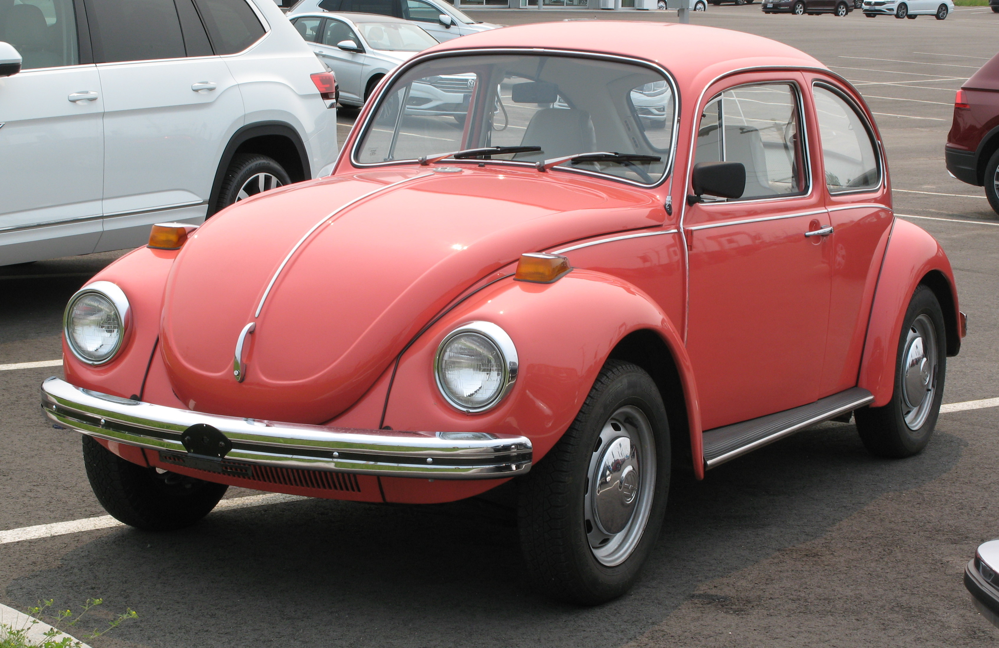
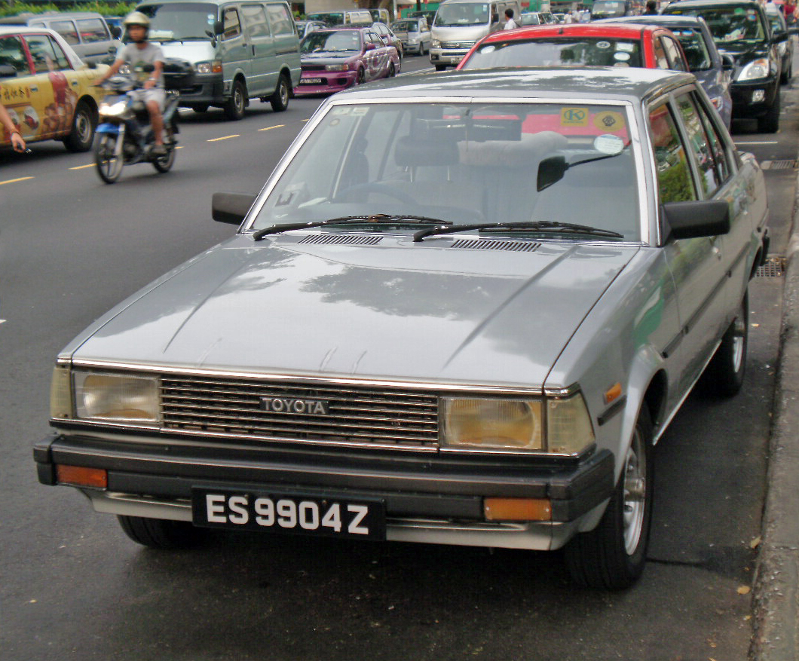
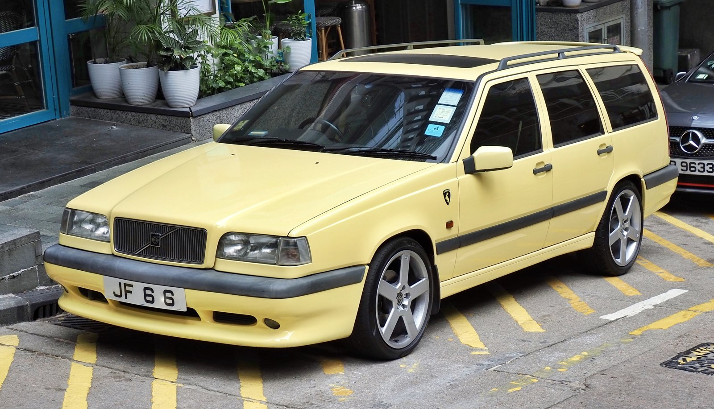
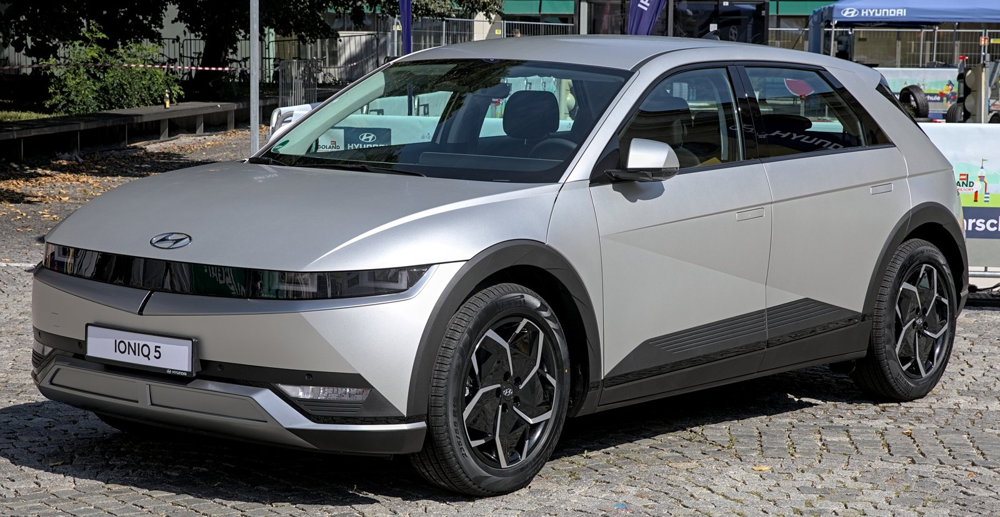
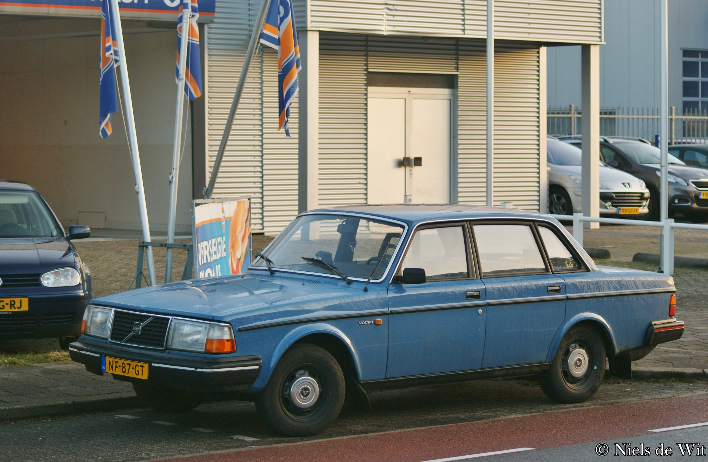
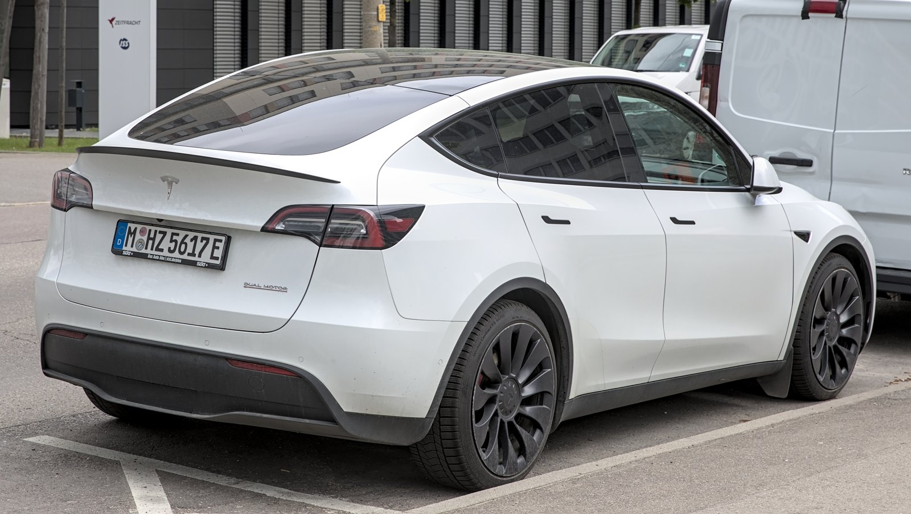

```{=html}
<div class="seven-decades-section">
  <!-- MAIN HEADING -->
  <div class="seven-decades-header">
    <div class="hero-eyebrow">Automotive Evolution &bull; 1970 &mdash; 2024</div>
    <h1 class="timeline-headline">THEY LOOKED DIFFERENT.</h1>
    <p class="timeline-subtitle">&ldquo;Cars didn't always look like they came from the same design template.&rdquo;</p>
  </div>

  <!-- SIX EQUAL VERTICAL PANELS -->
  <div class="seven-decades-container">
    <div class="timeline-horizon-line"></div>
    <div class="seven-decades-grid">

      <!-- 1970s -->
      <div class="decade-panel">
        <span class="panel-decade-badge">1970s</span>
        <div class="panel-horizon-node"></div>
        <div class="panel-image-frame">
          
        </div>
        <div class="panel-meta">
          <span class="panel-year">1971</span>
          <span class="panel-model">VOLKSWAGEN BEETLE</span>
          <div class="panel-specs">
            <span>160 in</span>
            <span>1,625 lb</span>
            <span>1.2L Flat-4</span>
            <span>35 hp</span>
          </div>
        </div>
      </div>

      <!-- 1980s -->
      <div class="decade-panel">
        <span class="panel-decade-badge">1980s</span>
        <div class="panel-horizon-node"></div>
        <div class="panel-image-frame">
          
        </div>
        <div class="panel-meta">
          <span class="panel-year">1980</span>
          <span class="panel-model">TOYOTA COROLLA</span>
          <div class="panel-specs">
            <span>158 in</span>
            <span>2,060 lb</span>
            <span>1.3L I4</span>
            <span>82 hp</span>
          </div>
        </div>
      </div>

      <!-- 1990s -->
      <div class="decade-panel">
        <span class="panel-decade-badge">1990s</span>
        <div class="panel-horizon-node"></div>
        <div class="panel-image-frame">
          
        </div>
        <div class="panel-meta">
          <span class="panel-year">1995</span>
          <span class="panel-model">VOLVO 850</span>
          <div class="panel-specs">
            <span>184 in</span>
            <span>3,177 lb</span>
            <span>2.3L Turbo I5</span>
            <span>240 hp</span>
          </div>
        </div>
      </div>

      <!-- 2000s -->
      <div class="decade-panel">
        <span class="panel-decade-badge">2000s</span>
        <div class="panel-horizon-node"></div>
        <div class="panel-image-frame">
          
        </div>
        <div class="panel-meta">
          <span class="panel-year">2003</span>
          <span class="panel-model">TOYOTA PRIUS</span>
          <div class="panel-specs">
            <span>175 in</span>
            <span>2,810 lb</span>
            <span>1.5L Hybrid I4</span>
            <span>78 hp</span>
          </div>
        </div>
      </div>

      <!-- 2010s -->
      <div class="decade-panel">
        <span class="panel-decade-badge">2010s</span>
        <div class="panel-horizon-node"></div>
        <div class="panel-image-frame">
          
        </div>
        <div class="panel-meta">
          <span class="panel-year">2016</span>
          <span class="panel-model">VOLVO XC90</span>
          <div class="panel-specs">
            <span>195 in</span>
            <span>4,420 lb</span>
            <span>2.0L Turbo I4</span>
            <span>250 hp</span>
          </div>
        </div>
      </div>

      <!-- 2020s -->
      <div class="decade-panel">
        <span class="panel-decade-badge">2020s</span>
        <div class="panel-horizon-node"></div>
        <div class="panel-image-frame">
          
        </div>
        <div class="panel-meta">
          <span class="panel-year">2021</span>
          <span class="panel-model">HYUNDAI IONIQ 5</span>
          <div class="panel-specs">
            <span>186 in</span>
            <span>4,450 lb</span>
            <span>Dual Motor EV</span>
            <span>305 hp</span>
          </div>
        </div>
      </div>

    </div>
  </div>

  <!-- OUTRO STATEMENT & INVESTIGATION QUESTION -->
  <div class="seven-decades-outro">
    <div class="outro-statement">&ldquo;Six decades. Six different ideas of what a car should look like.&rdquo;</div>
    <div class="outro-transition-box">
      <div class="transition-question">But how much of that difference is real?</div>
      <p class="transition-subtext">Did cars actually become more similar &mdash; or does it just feel that way?</p>
    </div>
  </div>
</div>

<div class="comparison-section">
<div class="comparison-header">
  <div class="comparison-eyebrow">Case Study: 40 Years of Transformation</div>
  <h2 class="comparison-title">MEASURING THE SHIFT: 1980 VS. 2024</h2>
  <p class="comparison-subtitle">Different shapes. Different proportions. Different ideas of what a car could be.</p>
</div>

<div class="comparison-stage">
  <!-- Older Car: Volvo 244 -->
  <div class="car-card older-car">
    <div class="car-media">
      
      <span class="era-tag">1980</span>
    </div>
    <div class="car-meta">
      <h3 class="car-name">Volvo 244</h3>
      <div class="car-category">3-Box Compact Executive Sedan &bull; Sweden</div>
      
      <dl class="car-specs-grid">
        <div class="spec-row">
          <dt>Length</dt>
          <dd>188.2 in <span class="spec-metric">(4,780 mm)</span></dd>
        </div>
        <div class="spec-row">
          <dt>Width</dt>
          <dd>67.3 in <span class="spec-metric">(1,710 mm)</span></dd>
        </div>
        <div class="spec-row">
          <dt>Height</dt>
          <dd>56.3 in <span class="spec-metric">(1,430 mm)</span></dd>
        </div>
        <div class="spec-row">
          <dt>Curb Weight</dt>
          <dd>2,756 lb <span class="spec-metric">(1,250 kg)</span></dd>
        </div>
        <div class="spec-row">
          <dt>Powertrain</dt>
          <dd>2.0L Inline-4 Gas &bull; 90 hp</dd>
        </div>
        <div class="spec-row">
          <dt>Drivetrain</dt>
          <dd>Rear-Wheel Drive (RWD)</dd>
        </div>
      </dl>
    </div>
  </div>

  <!-- Divider / Time Bridge -->
  <div class="comparison-bridge">
    <div class="bridge-line"></div>
    <div class="bridge-badge">VS</div>
    <div class="bridge-line"></div>
  </div>

  <!-- Modern Car: Tesla Model Y -->
  <div class="car-card modern-car">
    <div class="car-media">
      
      <span class="era-tag">2024</span>
    </div>
    <div class="car-meta">
      <h3 class="car-name">Tesla Model Y</h3>
      <div class="car-category">Fastback Crossover SUV &bull; United States</div>
      
      <dl class="car-specs-grid">
        <div class="spec-row">
          <dt>Length</dt>
          <dd>188.0 in <span class="spec-metric">(4,775 mm)</span></dd>
        </div>
        <div class="spec-row">
          <dt>Width</dt>
          <dd>78.0 in <span class="spec-metric">(1,981 mm)</span></dd>
        </div>
        <div class="spec-row">
          <dt>Height</dt>
          <dd>63.9 in <span class="spec-metric">(1,623 mm)</span></dd>
        </div>
        <div class="spec-row">
          <dt>Curb Weight</dt>
          <dd>4,403 lb <span class="spec-metric">(1,997 kg)</span></dd>
        </div>
        <div class="spec-row">
          <dt>Powertrain</dt>
          <dd>Dual Electric Motors &bull; 514 hp</dd>
        </div>
        <div class="spec-row">
          <dt>Drivetrain</dt>
          <dd>All-Wheel Drive (AWD)</dd>
        </div>
      </dl>
    </div>
  </div>
</div>

<!-- Delta / Data Insight Strip -->
<div class="comparison-delta-strip">
  <div class="delta-header">MEASURABLE SHIFT (1980 &rarr; 2024)</div>
  <div class="delta-grid">
    <div class="delta-item">
      <span class="delta-value">&minus;0.2 in</span>
      <span class="delta-label">Length (Same Footprint)</span>
    </div>
    <div class="delta-item highlight">
      <span class="delta-value">+10.7 in</span>
      <span class="delta-label">Width (+16% wider)</span>
    </div>
    <div class="delta-item highlight">
      <span class="delta-value">+7.6 in</span>
      <span class="delta-label">Height (+14% taller)</span>
    </div>
    <div class="delta-item highlight">
      <span class="delta-value">+1,647 lb</span>
      <span class="delta-label">Weight (+60% heavier)</span>
    </div>
    <div class="delta-item highlight">
      <span class="delta-value">+424 hp</span>
      <span class="delta-label">Power (5.7&times; output)</span>
    </div>
  </div>
</div>

<!-- Editorial Observation & Narrative -->
<div class="comparison-narrative">
  <h3 class="narrative-heading">On paper, they’re different too.</h3>
  <div class="narrative-body">
    <p>
      In 1980, the Volvo 244 embodied traditional European packaging: sharp, three-box geometry, thin steel pillars, an upright greenhouse, and an accessible four-cylinder engine driving the rear wheels. Its identity was carved out of simple right angles and upright glass built for 360-degree road visibility.
    </p>
    <p>
      Forty years later, the Tesla Model Y occupies almost the exact same street length, but every design priority has inverted. Massive safety crumble zones, thick reinforced rollover pillars, floor-mounted battery packs, and relentless wind-tunnel tuning produced a tall, cab-forward, seamless aerodynamic teardrop.
    </p>
    <p class="narrative-question">
      <em>But is this just nostalgia — or did cars actually become more similar?</em>
    </p>
  </div>
</div>
</div>

<!-- SECTION 3: DECADE COLOR PALETTE (1970 - 2024) -->
<div class="home-palette-section">
  <div class="home-palette-header">
    <div class="palette-eyebrow">The Automotive Palette &bull; 1970 &mdash; 2024</div>
    <h2 class="palette-statement">CARS DIDN'T JUST CHANGE SHAPE. THEY CHANGED COLOR.</h2>
    <p class="palette-question">So what happened to the palette?</p>
  </div>

  <div class="home-palette-card">
    <!-- Palette Legend & Live Readout -->
    <div class="palette-toolbar">
      <div class="palette-legend">
        <div class="palette-legend-item"><span class="legend-swatch" style="background-color: #f8fafc; border: 1px solid rgba(255,255,255,0.4);"></span>White</div>
        <div class="palette-legend-item"><span class="legend-swatch" style="background-color: #18181b;"></span>Black</div>
        <div class="palette-legend-item"><span class="legend-swatch" style="background-color: #64748b;"></span>Gray</div>
        <div class="palette-legend-item"><span class="legend-swatch" style="background-color: #cbd5e1; border: 1px solid rgba(255,255,255,0.4);"></span>Silver</div>
        <div class="palette-legend-item"><span class="legend-swatch" style="background-color: #2563eb;"></span>Blue</div>
        <div class="palette-legend-item"><span class="legend-swatch" style="background-color: #dc2626;"></span>Red</div>
        <div class="palette-legend-item"><span class="legend-swatch" style="background-color: #16a34a;"></span>Green</div>
        <div class="palette-legend-item"><span class="legend-swatch" style="background-color: #a16207;"></span>Brown / Beige</div>
        <div class="palette-legend-item"><span class="legend-swatch" style="background-color: #eab308;"></span>Gold / Yellow</div>
        <div class="palette-legend-item"><span class="legend-swatch" style="background-color: #7c3aed;"></span>Other</div>
      </div>
      <div class="palette-readout" id="home-palette-readout">
        <span class="readout-idle">Hover over any color section to inspect its exact historical share</span>
      </div>
    </div>

    <div class="mobile-scroll-hint">
      <span>&larr; Swipe horizontally to view 1970s &rarr; 2020s &rarr;</span>
    </div>

    <!-- The 6 Decade Columns Side by Side -->
    <div class="palette-decades-grid">
    <!-- Column: 1970s -->
    <div class="decade-palette-column" onmouseleave="resetHomePaletteReadout()">
      <div class="column-header">
        <span class="column-decade">1970s</span>
        <span class="column-range">1970–1979</span>
      </div>
      <div class="column-pillar">
        <div class="palette-slice" style="height: 13.1%; background-color: #f8fafc; color: #0f172a; border-top: 1px solid rgba(255,255,255,0.25); border-bottom: 1px solid rgba(255,255,255,0.25);" onmouseenter="updateHomePaletteReadout('1970s', 'White', 13.1)" title="White: 13.1% (1970s)">
          <span class="slice-pct">13%</span>
        </div>
        <div class="palette-slice is-compact" style="height: 4.8%; background-color: #18181b; " onmouseenter="updateHomePaletteReadout('1970s', 'Black', 4.8)" title="Black: 4.8% (1970s)"></div>
        <div class="palette-slice is-compact" style="height: 4.0%; background-color: #64748b; " onmouseenter="updateHomePaletteReadout('1970s', 'Gray', 4.0)" title="Gray: 4.0% (1970s)"></div>
        <div class="palette-slice is-compact" style="height: 4.2%; background-color: #cbd5e1; border-top: 1px solid rgba(255,255,255,0.25); border-bottom: 1px solid rgba(255,255,255,0.25);" onmouseenter="updateHomePaletteReadout('1970s', 'Silver', 4.2)" title="Silver: 4.2% (1970s)"></div>
        <div class="palette-slice" style="height: 15.3%; background-color: #2563eb; color: #ffffff; " onmouseenter="updateHomePaletteReadout('1970s', 'Blue', 15.3)" title="Blue: 15.3% (1970s)">
          <span class="slice-pct">15%</span>
        </div>
        <div class="palette-slice" style="height: 11.0%; background-color: #dc2626; color: #ffffff; " onmouseenter="updateHomePaletteReadout('1970s', 'Red', 11.0)" title="Red: 11.0% (1970s)">
          <span class="slice-pct">11%</span>
        </div>
        <div class="palette-slice" style="height: 15.7%; background-color: #16a34a; color: #ffffff; " onmouseenter="updateHomePaletteReadout('1970s', 'Green', 15.7)" title="Green: 15.7% (1970s)">
          <span class="slice-pct">16%</span>
        </div>
        <div class="palette-slice" style="height: 20.3%; background-color: #a16207; color: #ffffff; " onmouseenter="updateHomePaletteReadout('1970s', 'Brown / Beige', 20.3)" title="Brown / Beige: 20.3% (1970s)">
          <span class="slice-pct">20%</span>
        </div>
        <div class="palette-slice" style="height: 8.6%; background-color: #eab308; color: #0f172a; " onmouseenter="updateHomePaletteReadout('1970s', 'Gold / Yellow', 8.6)" title="Gold / Yellow: 8.6% (1970s)">
          <span class="slice-pct">9%</span>
        </div>
        <div class="palette-slice is-compact" style="height: 3.0%; background-color: #7c3aed; " onmouseenter="updateHomePaletteReadout('1970s', 'Other', 3.0)" title="Other: 3.0% (1970s)"></div>
      </div>
      <div class="column-footer">
        <div class="footer-highlight">
          <span class="footer-pct">26%</span>
          <span class="footer-label">Greyscale</span>
        </div>
        <div class="footer-sub">74% Chromatic</div>
      </div>
    </div>
    <!-- Column: 1980s -->
    <div class="decade-palette-column" onmouseleave="resetHomePaletteReadout()">
      <div class="column-header">
        <span class="column-decade">1980s</span>
        <span class="column-range">1980–1989</span>
      </div>
      <div class="column-pillar">
        <div class="palette-slice" style="height: 16.7%; background-color: #f8fafc; color: #0f172a; border-top: 1px solid rgba(255,255,255,0.25); border-bottom: 1px solid rgba(255,255,255,0.25);" onmouseenter="updateHomePaletteReadout('1980s', 'White', 16.7)" title="White: 16.7% (1980s)">
          <span class="slice-pct">17%</span>
        </div>
        <div class="palette-slice" style="height: 9.3%; background-color: #18181b; color: #ffffff; " onmouseenter="updateHomePaletteReadout('1980s', 'Black', 9.3)" title="Black: 9.3% (1980s)">
          <span class="slice-pct">9%</span>
        </div>
        <div class="palette-slice is-compact" style="height: 4.8%; background-color: #64748b; " onmouseenter="updateHomePaletteReadout('1980s', 'Gray', 4.8)" title="Gray: 4.8% (1980s)"></div>
        <div class="palette-slice" style="height: 7.9%; background-color: #cbd5e1; color: #0f172a; border-top: 1px solid rgba(255,255,255,0.25); border-bottom: 1px solid rgba(255,255,255,0.25);" onmouseenter="updateHomePaletteReadout('1980s', 'Silver', 7.9)" title="Silver: 7.9% (1980s)">
          <span class="slice-pct">8%</span>
        </div>
        <div class="palette-slice" style="height: 15.1%; background-color: #2563eb; color: #ffffff; " onmouseenter="updateHomePaletteReadout('1980s', 'Blue', 15.1)" title="Blue: 15.1% (1980s)">
          <span class="slice-pct">15%</span>
        </div>
        <div class="palette-slice" style="height: 15.0%; background-color: #dc2626; color: #ffffff; " onmouseenter="updateHomePaletteReadout('1980s', 'Red', 15.0)" title="Red: 15.0% (1980s)">
          <span class="slice-pct">15%</span>
        </div>
        <div class="palette-slice" style="height: 8.3%; background-color: #16a34a; color: #ffffff; " onmouseenter="updateHomePaletteReadout('1980s', 'Green', 8.3)" title="Green: 8.3% (1980s)">
          <span class="slice-pct">8%</span>
        </div>
        <div class="palette-slice" style="height: 12.6%; background-color: #a16207; color: #ffffff; " onmouseenter="updateHomePaletteReadout('1980s', 'Brown / Beige', 12.6)" title="Brown / Beige: 12.6% (1980s)">
          <span class="slice-pct">13%</span>
        </div>
        <div class="palette-slice" style="height: 5.6%; background-color: #eab308; color: #0f172a; " onmouseenter="updateHomePaletteReadout('1980s', 'Gold / Yellow', 5.6)" title="Gold / Yellow: 5.6% (1980s)">
          <span class="slice-pct">6%</span>
        </div>
        <div class="palette-slice is-compact" style="height: 4.7%; background-color: #7c3aed; " onmouseenter="updateHomePaletteReadout('1980s', 'Other', 4.7)" title="Other: 4.7% (1980s)"></div>
      </div>
      <div class="column-footer">
        <div class="footer-highlight">
          <span class="footer-pct">39%</span>
          <span class="footer-label">Greyscale</span>
        </div>
        <div class="footer-sub">61% Chromatic</div>
      </div>
    </div>
    <!-- Column: 1990s -->
    <div class="decade-palette-column" onmouseleave="resetHomePaletteReadout()">
      <div class="column-header">
        <span class="column-decade">1990s</span>
        <span class="column-range">1990–1999</span>
      </div>
      <div class="column-pillar">
        <div class="palette-slice" style="height: 24.2%; background-color: #f8fafc; color: #0f172a; border-top: 1px solid rgba(255,255,255,0.25); border-bottom: 1px solid rgba(255,255,255,0.25);" onmouseenter="updateHomePaletteReadout('1990s', 'White', 24.2)" title="White: 24.2% (1990s)">
          <span class="slice-pct">24%</span>
        </div>
        <div class="palette-slice" style="height: 10.8%; background-color: #18181b; color: #ffffff; " onmouseenter="updateHomePaletteReadout('1990s', 'Black', 10.8)" title="Black: 10.8% (1990s)">
          <span class="slice-pct">11%</span>
        </div>
        <div class="palette-slice" style="height: 5.0%; background-color: #64748b; color: #ffffff; " onmouseenter="updateHomePaletteReadout('1990s', 'Gray', 5.0)" title="Gray: 5.0% (1990s)">
          <span class="slice-pct">5%</span>
        </div>
        <div class="palette-slice" style="height: 10.5%; background-color: #cbd5e1; color: #0f172a; border-top: 1px solid rgba(255,255,255,0.25); border-bottom: 1px solid rgba(255,255,255,0.25);" onmouseenter="updateHomePaletteReadout('1990s', 'Silver', 10.5)" title="Silver: 10.5% (1990s)">
          <span class="slice-pct">10%</span>
        </div>
        <div class="palette-slice" style="height: 10.8%; background-color: #2563eb; color: #ffffff; " onmouseenter="updateHomePaletteReadout('1990s', 'Blue', 10.8)" title="Blue: 10.8% (1990s)">
          <span class="slice-pct">11%</span>
        </div>
        <div class="palette-slice" style="height: 13.7%; background-color: #dc2626; color: #ffffff; " onmouseenter="updateHomePaletteReadout('1990s', 'Red', 13.7)" title="Red: 13.7% (1990s)">
          <span class="slice-pct">14%</span>
        </div>
        <div class="palette-slice" style="height: 14.5%; background-color: #16a34a; color: #ffffff; " onmouseenter="updateHomePaletteReadout('1990s', 'Green', 14.5)" title="Green: 14.5% (1990s)">
          <span class="slice-pct">14%</span>
        </div>
        <div class="palette-slice is-compact" style="height: 4.4%; background-color: #a16207; " onmouseenter="updateHomePaletteReadout('1990s', 'Brown / Beige', 4.4)" title="Brown / Beige: 4.4% (1990s)"></div>
        <div class="palette-slice is-compact" style="height: 2.7%; background-color: #eab308; " onmouseenter="updateHomePaletteReadout('1990s', 'Gold / Yellow', 2.7)" title="Gold / Yellow: 2.7% (1990s)"></div>
        <div class="palette-slice is-compact" style="height: 3.4%; background-color: #7c3aed; " onmouseenter="updateHomePaletteReadout('1990s', 'Other', 3.4)" title="Other: 3.4% (1990s)"></div>
      </div>
      <div class="column-footer">
        <div class="footer-highlight">
          <span class="footer-pct">50%</span>
          <span class="footer-label">Greyscale</span>
        </div>
        <div class="footer-sub">50% Chromatic</div>
      </div>
    </div>
    <!-- Column: 2000s -->
    <div class="decade-palette-column" onmouseleave="resetHomePaletteReadout()">
      <div class="column-header">
        <span class="column-decade">2000s</span>
        <span class="column-range">2000–2009</span>
      </div>
      <div class="column-pillar">
        <div class="palette-slice" style="height: 20.9%; background-color: #f8fafc; color: #0f172a; border-top: 1px solid rgba(255,255,255,0.25); border-bottom: 1px solid rgba(255,255,255,0.25);" onmouseenter="updateHomePaletteReadout('2000s', 'White', 20.9)" title="White: 20.9% (2000s)">
          <span class="slice-pct">21%</span>
        </div>
        <div class="palette-slice" style="height: 14.2%; background-color: #18181b; color: #ffffff; " onmouseenter="updateHomePaletteReadout('2000s', 'Black', 14.2)" title="Black: 14.2% (2000s)">
          <span class="slice-pct">14%</span>
        </div>
        <div class="palette-slice" style="height: 9.3%; background-color: #64748b; color: #ffffff; " onmouseenter="updateHomePaletteReadout('2000s', 'Gray', 9.3)" title="Gray: 9.3% (2000s)">
          <span class="slice-pct">9%</span>
        </div>
        <div class="palette-slice" style="height: 24.2%; background-color: #cbd5e1; color: #0f172a; border-top: 1px solid rgba(255,255,255,0.25); border-bottom: 1px solid rgba(255,255,255,0.25);" onmouseenter="updateHomePaletteReadout('2000s', 'Silver', 24.2)" title="Silver: 24.2% (2000s)">
          <span class="slice-pct">24%</span>
        </div>
        <div class="palette-slice" style="height: 8.5%; background-color: #2563eb; color: #ffffff; " onmouseenter="updateHomePaletteReadout('2000s', 'Blue', 8.5)" title="Blue: 8.5% (2000s)">
          <span class="slice-pct">8%</span>
        </div>
        <div class="palette-slice" style="height: 10.0%; background-color: #dc2626; color: #ffffff; " onmouseenter="updateHomePaletteReadout('2000s', 'Red', 10.0)" title="Red: 10.0% (2000s)">
          <span class="slice-pct">10%</span>
        </div>
        <div class="palette-slice is-compact" style="height: 4.4%; background-color: #16a34a; " onmouseenter="updateHomePaletteReadout('2000s', 'Green', 4.4)" title="Green: 4.4% (2000s)"></div>
        <div class="palette-slice is-compact" style="height: 4.3%; background-color: #a16207; " onmouseenter="updateHomePaletteReadout('2000s', 'Brown / Beige', 4.3)" title="Brown / Beige: 4.3% (2000s)"></div>
        <div class="palette-slice is-compact" style="height: 1.2%; background-color: #eab308; " onmouseenter="updateHomePaletteReadout('2000s', 'Gold / Yellow', 1.2)" title="Gold / Yellow: 1.2% (2000s)"></div>
        <div class="palette-slice is-compact" style="height: 3.0%; background-color: #7c3aed; " onmouseenter="updateHomePaletteReadout('2000s', 'Other', 3.0)" title="Other: 3.0% (2000s)"></div>
      </div>
      <div class="column-footer">
        <div class="footer-highlight">
          <span class="footer-pct">69%</span>
          <span class="footer-label">Greyscale</span>
        </div>
        <div class="footer-sub">31% Chromatic</div>
      </div>
    </div>
    <!-- Column: 2010s -->
    <div class="decade-palette-column" onmouseleave="resetHomePaletteReadout()">
      <div class="column-header">
        <span class="column-decade">2010s</span>
        <span class="column-range">2010–2019</span>
      </div>
      <div class="column-pillar">
        <div class="palette-slice" style="height: 32.1%; background-color: #f8fafc; color: #0f172a; border-top: 1px solid rgba(255,255,255,0.25); border-bottom: 1px solid rgba(255,255,255,0.25);" onmouseenter="updateHomePaletteReadout('2010s', 'White', 32.1)" title="White: 32.1% (2010s)">
          <span class="slice-pct">32%</span>
        </div>
        <div class="palette-slice" style="height: 18.8%; background-color: #18181b; color: #ffffff; " onmouseenter="updateHomePaletteReadout('2010s', 'Black', 18.8)" title="Black: 18.8% (2010s)">
          <span class="slice-pct">19%</span>
        </div>
        <div class="palette-slice" style="height: 14.4%; background-color: #64748b; color: #ffffff; " onmouseenter="updateHomePaletteReadout('2010s', 'Gray', 14.4)" title="Gray: 14.4% (2010s)">
          <span class="slice-pct">14%</span>
        </div>
        <div class="palette-slice" style="height: 12.8%; background-color: #cbd5e1; color: #0f172a; border-top: 1px solid rgba(255,255,255,0.25); border-bottom: 1px solid rgba(255,255,255,0.25);" onmouseenter="updateHomePaletteReadout('2010s', 'Silver', 12.8)" title="Silver: 12.8% (2010s)">
          <span class="slice-pct">13%</span>
        </div>
        <div class="palette-slice" style="height: 7.8%; background-color: #2563eb; color: #ffffff; " onmouseenter="updateHomePaletteReadout('2010s', 'Blue', 7.8)" title="Blue: 7.8% (2010s)">
          <span class="slice-pct">8%</span>
        </div>
        <div class="palette-slice" style="height: 6.5%; background-color: #dc2626; color: #ffffff; " onmouseenter="updateHomePaletteReadout('2010s', 'Red', 6.5)" title="Red: 6.5% (2010s)">
          <span class="slice-pct">6%</span>
        </div>
        <div class="palette-slice is-compact" style="height: 1.4%; background-color: #16a34a; " onmouseenter="updateHomePaletteReadout('2010s', 'Green', 1.4)" title="Green: 1.4% (2010s)"></div>
        <div class="palette-slice is-compact" style="height: 2.7%; background-color: #a16207; " onmouseenter="updateHomePaletteReadout('2010s', 'Brown / Beige', 2.7)" title="Brown / Beige: 2.7% (2010s)"></div>
        <div class="palette-slice is-compact" style="height: 1.0%; background-color: #eab308; " onmouseenter="updateHomePaletteReadout('2010s', 'Gold / Yellow', 1.0)" title="Gold / Yellow: 1.0% (2010s)"></div>
        <div class="palette-slice is-compact" style="height: 2.5%; background-color: #7c3aed; " onmouseenter="updateHomePaletteReadout('2010s', 'Other', 2.5)" title="Other: 2.5% (2010s)"></div>
      </div>
      <div class="column-footer">
        <div class="footer-highlight">
          <span class="footer-pct">78%</span>
          <span class="footer-label">Greyscale</span>
        </div>
        <div class="footer-sub">22% Chromatic</div>
      </div>
    </div>
    <!-- Column: 2020s -->
    <div class="decade-palette-column" onmouseleave="resetHomePaletteReadout()">
      <div class="column-header">
        <span class="column-decade">2020s</span>
        <span class="column-range">2020–2024</span>
      </div>
      <div class="column-pillar">
        <div class="palette-slice" style="height: 36.4%; background-color: #f8fafc; color: #0f172a; border-top: 1px solid rgba(255,255,255,0.25); border-bottom: 1px solid rgba(255,255,255,0.25);" onmouseenter="updateHomePaletteReadout('2020s', 'White', 36.4)" title="White: 36.4% (2020s)">
          <span class="slice-pct">36%</span>
        </div>
        <div class="palette-slice" style="height: 20.8%; background-color: #18181b; color: #ffffff; " onmouseenter="updateHomePaletteReadout('2020s', 'Black', 20.8)" title="Black: 20.8% (2020s)">
          <span class="slice-pct">21%</span>
        </div>
        <div class="palette-slice" style="height: 16.0%; background-color: #64748b; color: #ffffff; " onmouseenter="updateHomePaletteReadout('2020s', 'Gray', 16.0)" title="Gray: 16.0% (2020s)">
          <span class="slice-pct">16%</span>
        </div>
        <div class="palette-slice" style="height: 8.6%; background-color: #cbd5e1; color: #0f172a; border-top: 1px solid rgba(255,255,255,0.25); border-bottom: 1px solid rgba(255,255,255,0.25);" onmouseenter="updateHomePaletteReadout('2020s', 'Silver', 8.6)" title="Silver: 8.6% (2020s)">
          <span class="slice-pct">9%</span>
        </div>
        <div class="palette-slice" style="height: 7.8%; background-color: #2563eb; color: #ffffff; " onmouseenter="updateHomePaletteReadout('2020s', 'Blue', 7.8)" title="Blue: 7.8% (2020s)">
          <span class="slice-pct">8%</span>
        </div>
        <div class="palette-slice is-compact" style="height: 4.2%; background-color: #dc2626; " onmouseenter="updateHomePaletteReadout('2020s', 'Red', 4.2)" title="Red: 4.2% (2020s)"></div>
        <div class="palette-slice is-compact" style="height: 1.0%; background-color: #16a34a; " onmouseenter="updateHomePaletteReadout('2020s', 'Green', 1.0)" title="Green: 1.0% (2020s)"></div>
        <div class="palette-slice is-compact" style="height: 2.0%; background-color: #a16207; " onmouseenter="updateHomePaletteReadout('2020s', 'Brown / Beige', 2.0)" title="Brown / Beige: 2.0% (2020s)"></div>
        <div class="palette-slice is-compact" style="height: 1.0%; background-color: #eab308; " onmouseenter="updateHomePaletteReadout('2020s', 'Gold / Yellow', 1.0)" title="Gold / Yellow: 1.0% (2020s)"></div>
        <div class="palette-slice is-compact" style="height: 2.2%; background-color: #7c3aed; " onmouseenter="updateHomePaletteReadout('2020s', 'Other', 2.2)" title="Other: 2.2% (2020s)"></div>
      </div>
      <div class="column-footer">
        <div class="footer-highlight">
          <span class="footer-pct">82%</span>
          <span class="footer-label">Greyscale</span>
        </div>
        <div class="footer-sub">18% Chromatic</div>
      </div>
    </div>
    </div>

    <!-- Bottom Meta & Story Transition -->
    <div class="palette-card-footer">
      <div class="palette-source-text">
        <span>Quantitative Data: Axalta Global Automotive Color Popularity Historical Archive (1970&ndash;2024). Calculated across 55 consecutive years of production records.</span>
      </div>
      <div class="palette-cta-wrapper">
        <a href="story.html" class="palette-cta-btn">Explore The Full Story &amp; Annual Data &rarr;</a>
      </div>
    </div>
  </div>
</div>

<script>
function updateHomePaletteReadout(decade, colorName, pct) {
  const el = document.getElementById("home-palette-readout");
  if (!el) return;
  el.innerHTML = `<strong>${decade}</strong> &bull; <span style="color: #38bdf8;">${colorName}</span> commanded <strong>${pct.toFixed(1)}%</strong> of global production`;
}

function resetHomePaletteReadout() {
  const el = document.getElementById("home-palette-readout");
  if (!el) return;
  el.innerHTML = `<span class="readout-idle">Hover over any color section to inspect its exact historical share</span>`;
}
</script>

```
