```{=html}
<!-- SECTION 1 — STORY OPENING -->
<div class="story-hero">
  <div class="story-hero-content">
    <div class="story-eyebrow">An Automotive Data Investigation</div>
    <h1 class="story-title">WHERE DID CAR CHARACTER GO?</h1>
    
    <!-- Framed Specimen Showcase Car -->
    <div class="hero-car-frame">
      <div class="frame-top-bar">
        <span class="frame-tag">SPECIMEN // 1984 Ferrari Testarossa</span>
        <span class="frame-sub">Side Strakes &bull; Flat-12 Silhouette</span>
      </div>
      <div class="frame-viewport">
        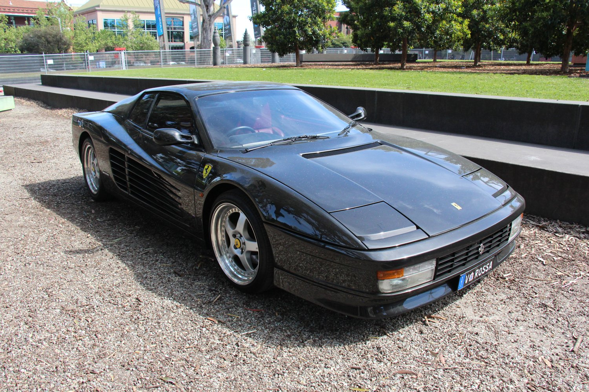
      </div>
      <div class="frame-bottom-bar">
        Distinctive, wide-hipped geometric styling before regulatory and aerodynamic convergence took hold.
      </div>
    </div>

    <div class="story-subtitles">
      <p class="story-lead">Cars didn't suddenly become boring.<br>They changed — slowly, over decades.</p>
      <p class="story-question">The question is whether those changes actually made cars more alike.</p>
    </div>
    
    <div class="scroll-prompt">
      <span>SCROLL TO EXPLORE</span>
      <div class="scroll-arrow">&darr;</div>
    </div>
  </div>
</div>

<div class="story-container">
  <!-- SECTION 2 — SOMETHING FEELS DIFFERENT -->
  <section class="story-section">
    <div class="section-badge">Observation</div>
    <h2 class="section-heading">SOMETHING FEELS DIFFERENT.</h2>
    <div class="editorial-text">
      <p>Look across a parking lot today and you'll see hundreds of cars.</p>
      <p>But how different are they really?</p>
    </div>

    <!-- Sequence of Contrasting Cars Across Decades: 3 cars per decade (18 cars total) -->
    <div class="car-sequence-wrapper">
      
      <!-- 1970s -->
      <div class="decade-gallery-block">
        <div class="decade-gallery-header">
          <span class="decade-gallery-title">1970s</span>
          <span class="decade-gallery-sub">Chrome bumpers, air-cooling, and muscle proportions</span>
        </div>
        <div class="decade-cars-grid">
          <div class="sequence-card">
            <div class="sequence-img-wrap">
              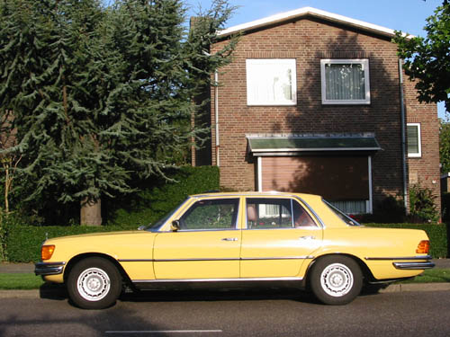
            </div>
            <div class="sequence-caption">
              <span class="seq-year">1975 &bull; Luxury</span>
              <span class="seq-name">Mercedes-Benz S-Class</span>
              <span class="seq-desc">Upright ribbed-tail executive flagship sedan</span>
            </div>
          </div>
          <div class="sequence-card">
            <div class="sequence-img-wrap">
              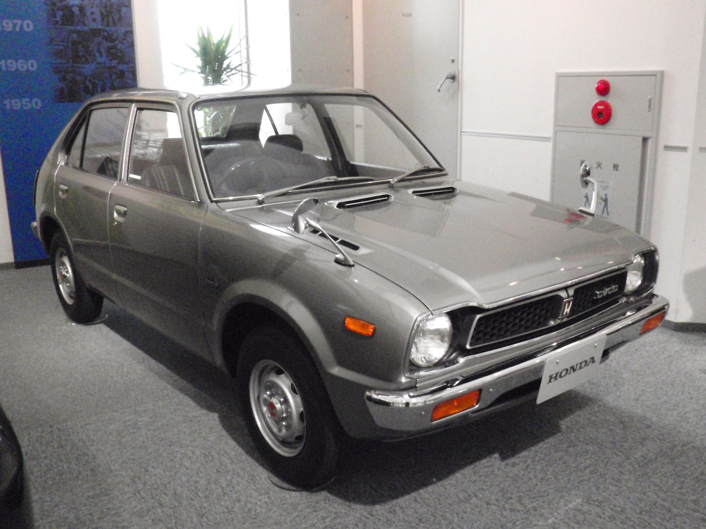
            </div>
            <div class="sequence-caption">
              <span class="seq-year">1975 &bull; Economy</span>
              <span class="seq-name">Honda Civic</span>
              <span class="seq-desc">Transverse-engine fuel-efficient compact</span>
            </div>
          </div>
          <div class="sequence-card">
            <div class="sequence-img-wrap">
              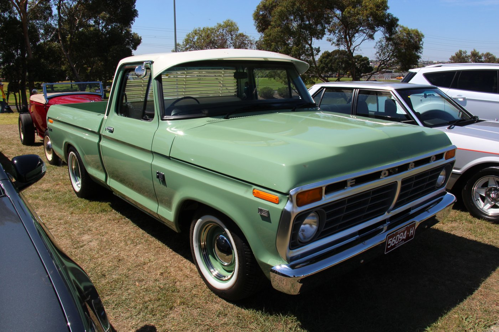
            </div>
            <div class="sequence-caption">
              <span class="seq-year">1977 &bull; Utility</span>
              <span class="seq-name">Ford F-150</span>
              <span class="seq-desc">Rugged square-jawed American workhorse truck</span>
            </div>
          </div>
        </div>
      </div>

      <!-- 1980s -->
      <div class="decade-gallery-block">
        <div class="decade-gallery-header">
          <span class="decade-gallery-title">1980s</span>
          <span class="decade-gallery-sub">Geometric wedges, clean 3-box sedans, and side-straked exotics</span>
        </div>
        <div class="decade-cars-grid">
          <div class="sequence-card">
            <div class="sequence-img-wrap">
              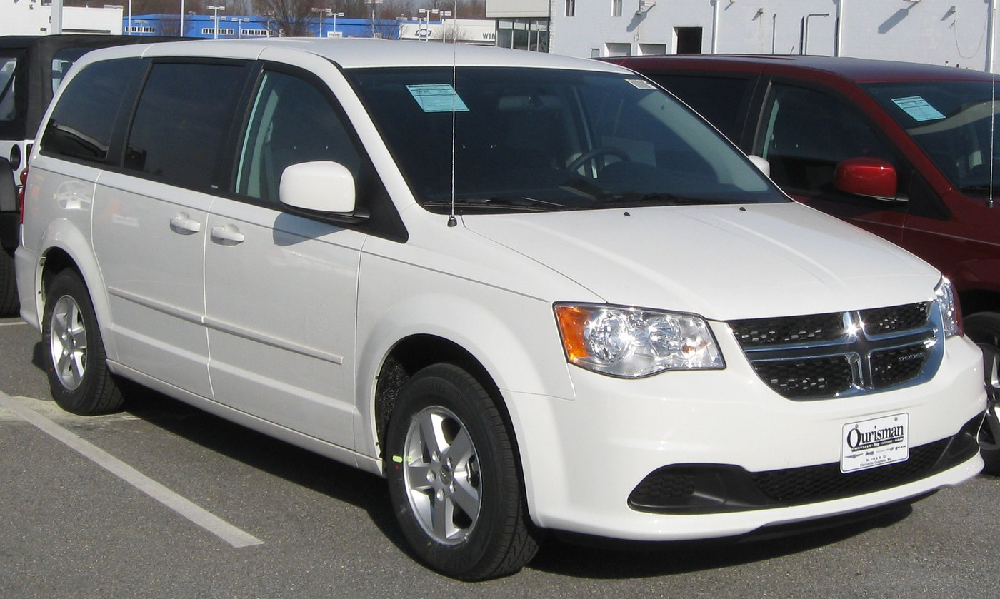
            </div>
            <div class="sequence-caption">
              <span class="seq-year">1984 &bull; Family</span>
              <span class="seq-name">Dodge Caravan</span>
              <span class="seq-desc">Pioneering front-wheel-drive passenger minivan</span>
            </div>
          </div>
          <div class="sequence-card">
            <div class="sequence-img-wrap">
              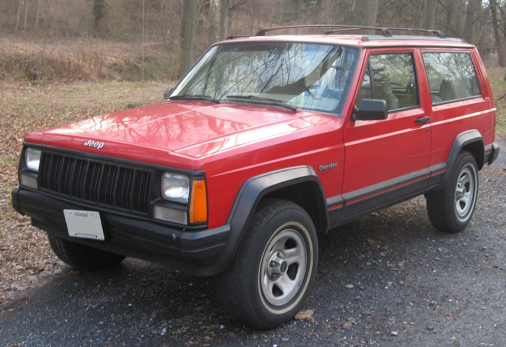
            </div>
            <div class="sequence-caption">
              <span class="seq-year">1986 &bull; SUV</span>
              <span class="seq-name">Jeep Cherokee (XJ)</span>
              <span class="seq-desc">Lightweight unibody compact SUV trailblazer</span>
            </div>
          </div>
          <div class="sequence-card">
            <div class="sequence-img-wrap">
              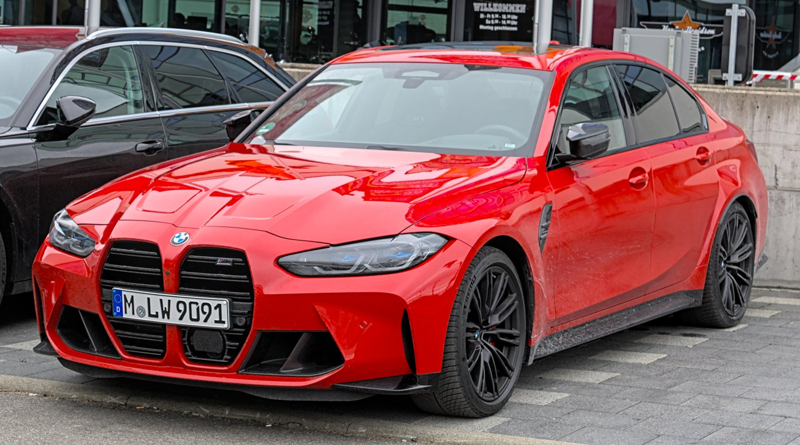
            </div>
            <div class="sequence-caption">
              <span class="seq-year">1988 &bull; Sports</span>
              <span class="seq-name">BMW M3 (E30)</span>
              <span class="seq-desc">Box-flared touring car homologation coupe</span>
            </div>
          </div>
        </div>
      </div>

      <!-- 1990s -->
      <div class="decade-gallery-block">
        <div class="decade-gallery-header">
          <span class="decade-gallery-title">1990s</span>
          <span class="decade-gallery-sub">Aerodynamic softening, safety cages, and peak analog raw power</span>
        </div>
        <div class="decade-cars-grid">
          <div class="sequence-card">
            <div class="sequence-img-wrap">
              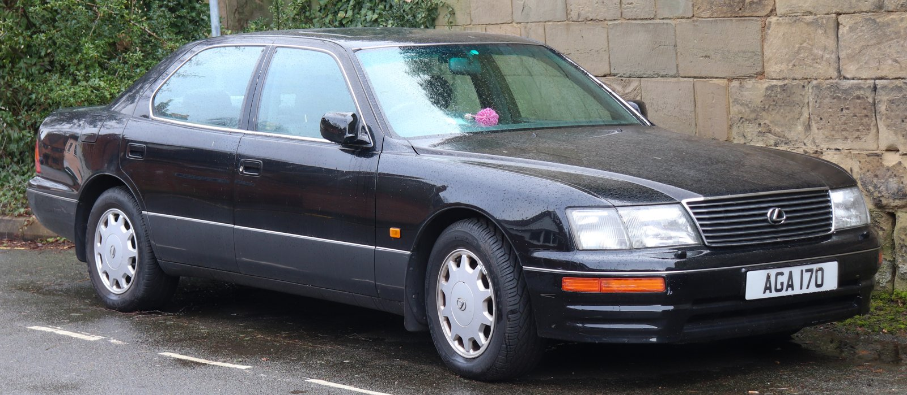
            </div>
            <div class="sequence-caption">
              <span class="seq-year">1990 &bull; Luxury</span>
              <span class="seq-name">Lexus LS 400</span>
              <span class="seq-desc">Whisper-quiet aerodynamic luxury V8 flagship</span>
            </div>
          </div>
          <div class="sequence-card">
            <div class="sequence-img-wrap">
              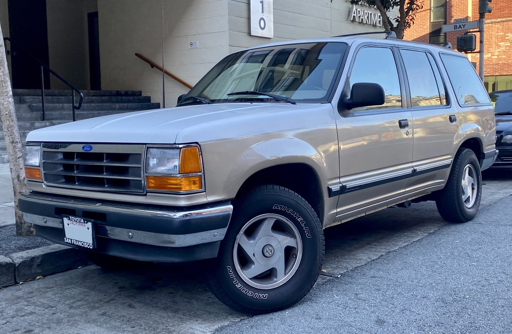
            </div>
            <div class="sequence-caption">
              <span class="seq-year">1991 &bull; SUV</span>
              <span class="seq-name">Ford Explorer</span>
              <span class="seq-desc">Catalyst for the global family SUV transition</span>
            </div>
          </div>
          <div class="sequence-card">
            <div class="sequence-img-wrap">
              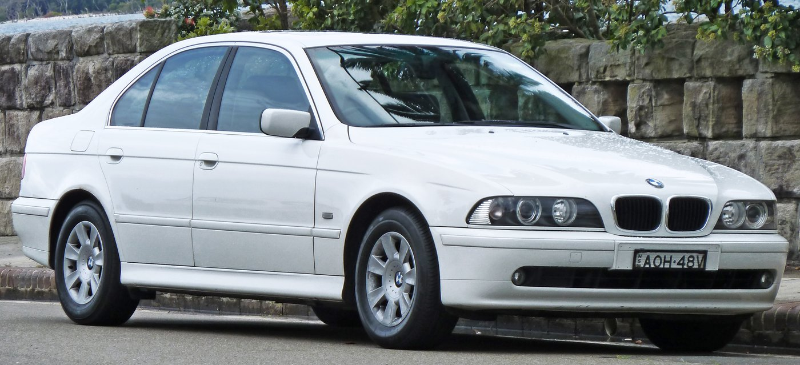
            </div>
            <div class="sequence-caption">
              <span class="seq-year">1996 &bull; Luxury</span>
              <span class="seq-name">BMW 5 Series (E39)</span>
              <span class="seq-desc">Harmonious analog executive sports saloon</span>
            </div>
          </div>
        </div>
      </div>

      <!-- 2000s -->
      <div class="decade-gallery-block">
        <div class="decade-gallery-header">
          <span class="decade-gallery-title">2000s</span>
          <span class="decade-gallery-sub">Retro-futurism, hybrid packaging, and wind-tunnel aero forms</span>
        </div>
        <div class="decade-cars-grid">
          <div class="sequence-card">
            <div class="sequence-img-wrap">
              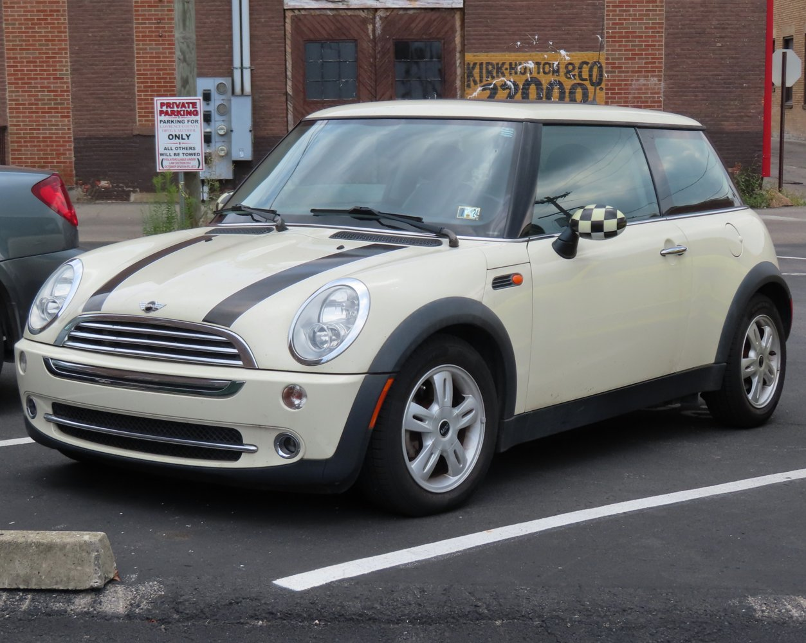
            </div>
            <div class="sequence-caption">
              <span class="seq-year">2001 &bull; Compact</span>
              <span class="seq-name">Mini Cooper</span>
              <span class="seq-desc">Retro-modern front-wheel-drive city hatchback</span>
            </div>
          </div>
          <div class="sequence-card">
            <div class="sequence-img-wrap">
              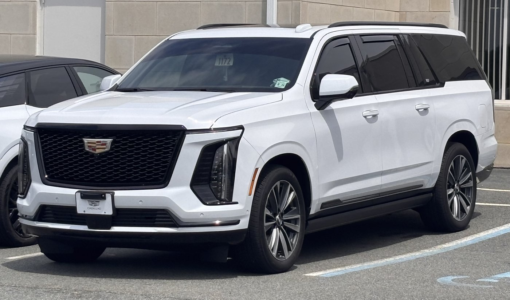
            </div>
            <div class="sequence-caption">
              <span class="seq-year">2002 &bull; SUV</span>
              <span class="seq-name">Cadillac Escalade</span>
              <span class="seq-desc">Full-size chrome-accented American luxury SUV</span>
            </div>
          </div>
          <div class="sequence-card">
            <div class="sequence-img-wrap">
              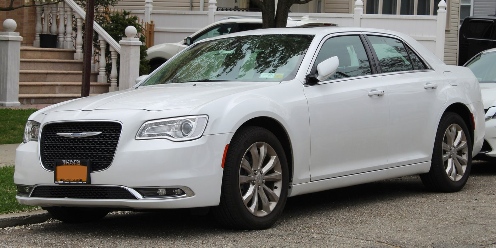
            </div>
            <div class="sequence-caption">
              <span class="seq-year">2005 &bull; Sedan</span>
              <span class="seq-name">Chrysler 300C</span>
              <span class="seq-desc">High-shoulder chopped-roofline Hemi V8 sedan</span>
            </div>
          </div>
        </div>
      </div>

      <!-- 2010s -->
      <div class="decade-gallery-block">
        <div class="decade-gallery-header">
          <span class="decade-gallery-title">2010s</span>
          <span class="decade-gallery-sub">High beltlines, luxury SUVs, and skateboard EV architectures</span>
        </div>
        <div class="decade-cars-grid">
          <div class="sequence-card">
            <div class="sequence-img-wrap">
              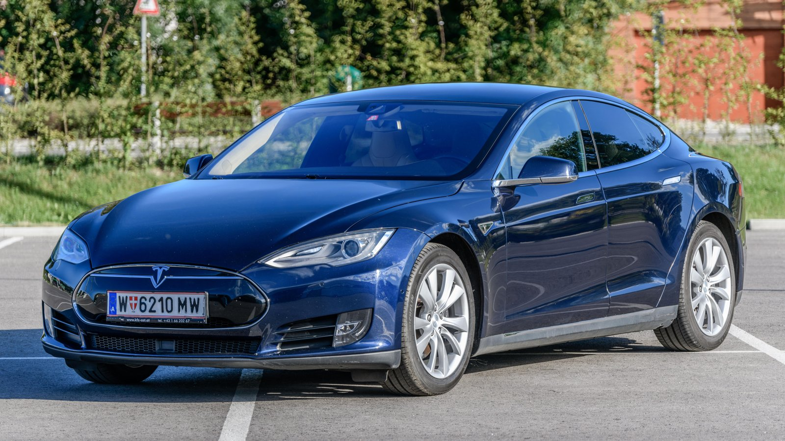
            </div>
            <div class="sequence-caption">
              <span class="seq-year">2012 &bull; Luxury</span>
              <span class="seq-name">Tesla Model S</span>
              <span class="seq-desc">Seamless aerodynamic skateboard electric sedan</span>
            </div>
          </div>
          <div class="sequence-card">
            <div class="sequence-img-wrap">
              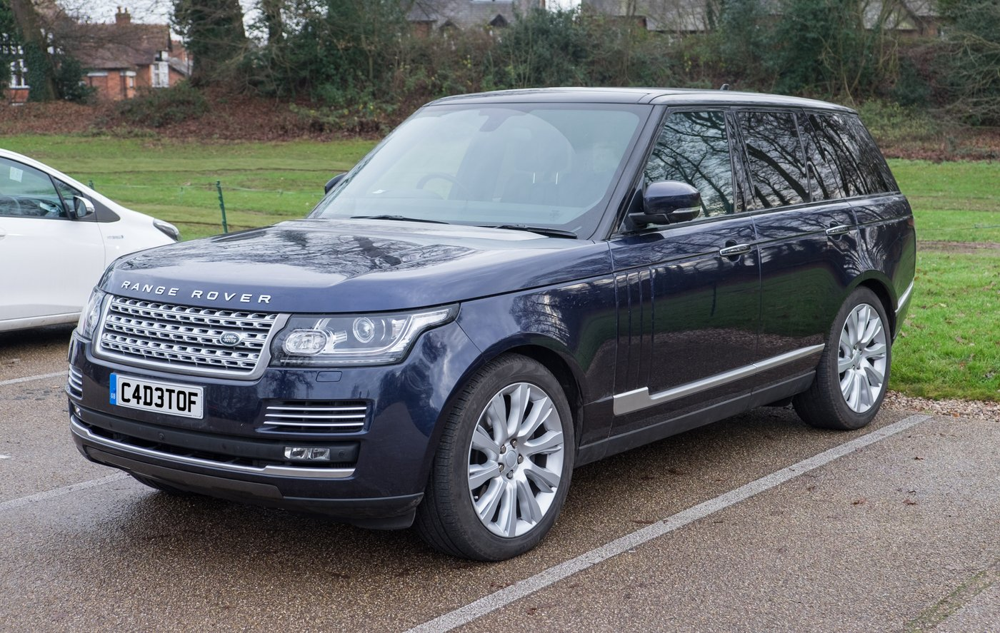
            </div>
            <div class="sequence-caption">
              <span class="seq-year">2014 &bull; SUV</span>
              <span class="seq-name">Range Rover (L405)</span>
              <span class="seq-desc">All-aluminum luxury flagship terrain vehicle</span>
            </div>
          </div>
          <div class="sequence-card">
            <div class="sequence-img-wrap">
              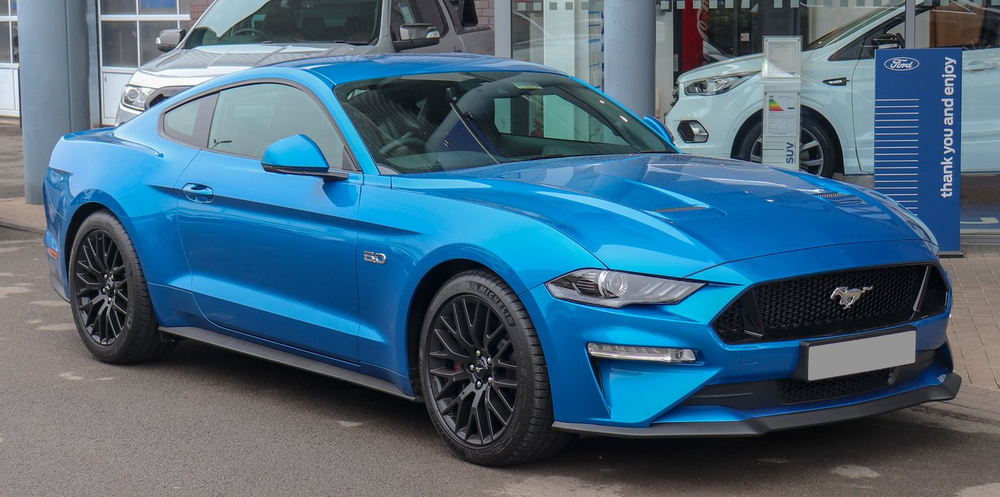
            </div>
            <div class="sequence-caption">
              <span class="seq-year">2015 &bull; Sports</span>
              <span class="seq-name">Ford Mustang (S550)</span>
              <span class="seq-desc">Modern global fastback coupe with independent rear suspension</span>
            </div>
          </div>
        </div>
      </div>

      <!-- 2020s -->
      <div class="decade-gallery-block">
        <div class="decade-gallery-header">
          <span class="decade-gallery-title">2020s</span>
          <span class="decade-gallery-sub">Digital lighting, parametric geometry, and high-performance icons</span>
        </div>
        <div class="decade-cars-grid">
          <div class="sequence-card">
            <div class="sequence-img-wrap">
              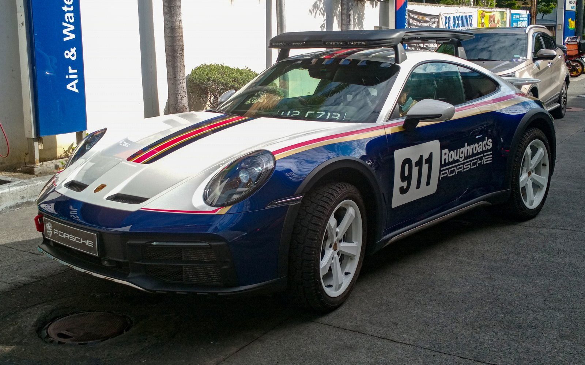
            </div>
            <div class="sequence-caption">
              <span class="seq-year">2021 &bull; Sports</span>
              <span class="seq-name">Porsche 911 (992)</span>
              <span class="seq-desc">Wide-body continuous evolutionary rear-engine icon</span>
            </div>
          </div>
          <div class="sequence-card">
            <div class="sequence-img-wrap">
              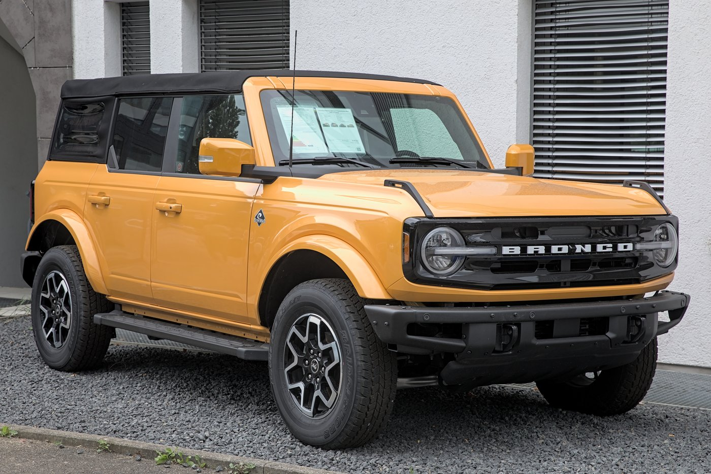
            </div>
            <div class="sequence-caption">
              <span class="seq-year">2021 &bull; SUV</span>
              <span class="seq-name">Ford Bronco</span>
              <span class="seq-desc">Boxy retro-rugged off-road adventure 4x4</span>
            </div>
          </div>
          <div class="sequence-card">
            <div class="sequence-img-wrap">
              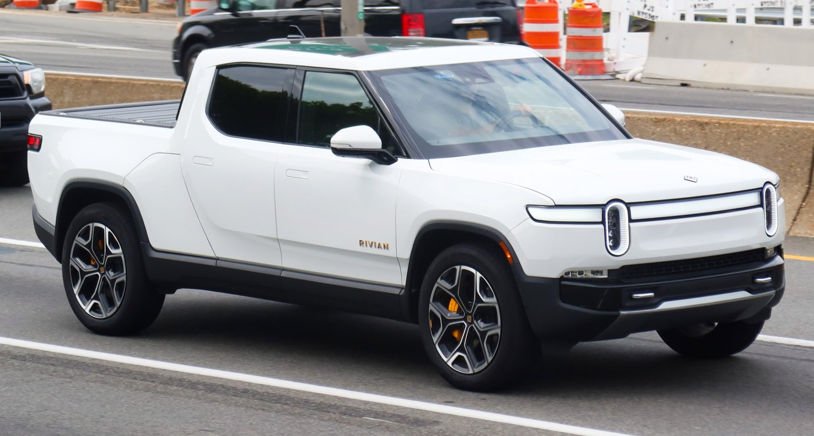
            </div>
            <div class="sequence-caption">
              <span class="seq-year">2022 &bull; Pickup</span>
              <span class="seq-name">Rivian R1T</span>
              <span class="seq-desc">Quad-motor electric adventure truck with stadium lighting</span>
            </div>
          </div>
        </div>
      </div>

    </div>

    <!-- Editorial Bridge -->
    <div class="editorial-bridge">
      <ul class="dramatic-phrases">
        <li>Different shapes.</li>
        <li>Different proportions.</li>
        <li>Different colors.</li>
        <li>Different ways of doing things.</li>
      </ul>
      <p class="whisper-text">But that's a feeling.</p>
      <h3 class="dramatic-statement">AND FEELINGS AREN'T DATA.</h3>
      <div class="inquiry-box">
        <p>So instead of asking whether cars feel less interesting, we can ask a different question:</p>
        <p class="highlighted-inquiry">Can we measure how automotive diversity changed?</p>
      </div>
    </div>
  </section>

  <!-- SECTION 3 — THE FIRST INVESTIGATION: 01 COLOR -->
  <section class="story-section">
    <div class="chapter-marker">01 &mdash; COLOR</div>
    <h2 class="investigation-title">DID THE PALETTE GET SMALLER?</h2>
    
    <div class="editorial-intro">
      <p>
        Color is one of the clearest visual signatures of automotive design.
      </p>
      <p>
        Across decades of production, manufacturers offered bold greens, deep blues, rich golds, and earthy browns. But looking at modern roads, the palette appears radically concentrated.
      </p>
    </div>

    <!-- COLOR VISUALIZATION COMPONENT (1970 - 2024) -->
    <div class="color-viz-card">
      <div class="viz-header">
        <div class="viz-title-block">
          <h3 class="viz-heading">Automotive Color Distribution (1970 &mdash; 2024)</h3>
          <p class="viz-subheading">Annual share of global production vehicles by color category across 55 consecutive years</p>
        </div>
      </div>

      <!-- Sticky Legend & Active Inspector Bar -->
      <div class="color-viz-controls-bar">
        <div class="color-legend" id="color-legend"></div>
        <div class="timeline-hover-readout" id="active-readout">
          <span class="readout-prompt">Hover or click any year below to view its exact statistical breakdown</span>
        </div>
      </div>

      <!-- Continuous 1970 - 2024 Timeline Stream -->
      <div class="color-timeline-stream" id="timeline-stream-container">
        <!-- Rendered dynamically by JavaScript with authentic 1970-2024 data -->
      </div>

      <div class="viz-footer-note">
        <span>Quantitative Data: Axalta Global Automotive Color Popularity Historical Archive (1970&ndash;2024). Major percentages displayed directly within color bands; categories under 5% shown via adjacent badges.</span>
      </div>
    </div>

    <!-- THE QUESTION: DIVERSITY METRIC -->
    <div class="diversity-investigation">
      <div class="investigation-badge">THE QUESTION</div>
      <p class="diversity-lead">
        Over time, some colors became far more common while others nearly vanished from production lines.
      </p>
      <p class="diversity-lead">
        But does that mean cars actually became less colorful?
      </p>
      <div class="diversity-answer-bridge">
        <span>That depends on how we define and measure diversity.</span>
      </div>

      <div class="metric-explainer-card">
        <div class="metric-header">
          <span class="metric-tag">STATISTICAL MEASURE</span>
          <h4 class="metric-name">COLOR DIVERSITY &bull; EFFECTIVE NUMBER OF COLORS</h4>
        </div>
        <div class="metric-formula-explanation">
          <p>
            If one color dominates the entire market, diversity is minimal. If many colors share the market evenly, diversity is high.
          </p>
          <p class="metric-plain-english">
            Statisticians quantify market variety using the Inverse Simpson Index ($D = \frac{1}{\sum p_i^2}$, where $p_i$ is each color\x27s market share proportion). This calculates the <em>effective number of equal-sized colors</em> that would yield the exact same level of market concentration.
          </p>
        </div>

        <div class="metric-stats-grid">
          <div class="metric-stat-box">
            <div class="stat-era">1970 BASELINE</div>
            <div class="stat-number color-vibrant">7.9</div>
            <div class="stat-label">Effective Colors</div>
            <div class="stat-detail">Market spread widely across blue (18%), green (16%), brown/beige (14%), red (12%), and gold (9%). Greyscale accounted for only 28%.</div>
          </div>
          <div class="metric-stat-box">
            <div class="stat-era">1985 DIVERSITY PEAK</div>
            <div class="stat-number color-vibrant">8.6</div>
            <div class="stat-label">Effective Colors</div>
            <div class="stat-detail">The statistical peak of variety: red (16%), blue (15%), brown (12%), white (17%), and silver (9%) each commanded substantial volume.</div>
          </div>
          <div class="metric-stat-box">
            <div class="stat-era">2024 MODERN MARKET</div>
            <div class="stat-number color-muted">4.7</div>
            <div class="stat-label">Effective Colors</div>
            <div class="stat-detail">White (35%), black (22%), gray (17%), and silver (8%) capture 82% of all vehicles produced globally.</div>
          </div>
        </div>
      </div>
    </div>

    <!-- ENDING TRANSITION TO CHAPTER 02 -->
    <div class="chapter-transition">
      <div class="transition-divider"></div>
      <h3 class="transition-statement">COLOR IS ONLY ONE PIECE OF THE PUZZLE.</h3>
      <p class="transition-sub">If cars changed in color, what happened to their shapes?</p>
      <div class="next-chapter-teaser">
        <span class="teaser-label">NEXT INVESTIGATION</span>
        <div class="teaser-title">02 &mdash; SHAPE</div>
        <div class="teaser-arrow">&darr;</div>
      </div>
    </div>
  </section>

  <!-- SECTION 4 — CHAPTER 02: SHAPE -->
  <section class="story-section" id="chapter-shape">
    <div class="chapter-marker">02 &mdash; SHAPE</div>
    <h2 class="investigation-title">DID CARS START LOOKING MORE ALIKE?</h2>
    
    <div class="shape-intro-header">
      <p class="shape-intro-lead">
        Color is only one piece of the puzzle. Even when two cars share the same paint, their shapes can tell completely different stories.
      </p>
      <p class="shape-intro-sub">
        For decades, cars changed in proportion, size, silhouette, and body style. But did that variety actually shrink?
      </p>
    </div>

    <!-- 2. VISUAL SILHOUETTE INTRO: 6 Representative Cars Across Decades -->
    <div class="silhouette-section">
      <div class="silhouette-header-block">
        <div class="silhouette-eyebrow">Visual Profile Comparison &bull; 1970s &mdash; 2020s</div>
        <h3 class="silhouette-heading">SIX DECADES OF AUTOMOTIVE SILHOUETTES</h3>
        <p class="silhouette-sub">
          Viewed in direct side profile, a vehicle's silhouette exposes its structural philosophy: hood length, window-to-body proportion, roof arc, and overhangs.
        </p>
      </div>

      <div class="silhouette-grid">
        <!-- 1970s: 1971 VW Beetle -->
        <div class="silhouette-card">
          <div class="silhouette-frame">
            <span class="silhouette-era-pill">1970s</span>
            
          </div>
          <div class="silhouette-info">
            <span class="sil-year-badge">1971 &bull; ECONOMY</span>
            <h4 class="sil-car-title">Volkswagen Beetle</h4>
            <p class="sil-profile-desc">Curved rear-engine teardrop silhouette with pronounced rounded fenders, tall upright cabin, and minimal forward engine hood.</p>
            <div class="sil-traits">
              <span class="sil-trait">Curved Roofline</span>
              <span class="sil-trait">Rear Engine Deck</span>
              <span class="sil-trait">Tall Cabin</span>
            </div>
          </div>
        </div>

        <!-- 1980s: 1980 Toyota Corolla -->
        <div class="silhouette-card">
          <div class="silhouette-frame">
            <span class="silhouette-era-pill">1980s</span>
            
          </div>
          <div class="silhouette-info">
            <span class="sil-year-badge">1980 &bull; ECONOMY</span>
            <h4 class="sil-car-title">Toyota Corolla</h4>
            <p class="sil-profile-desc">Crisp geometric 3-box notchback architecture with planar horizontal beltline, flat hood, and upright rectangular passenger glasshouse.</p>
            <div class="sil-traits">
              <span class="sil-trait">Sharp 3-Box Notch</span>
              <span class="sil-trait">Flat Hood & Trunk</span>
              <span class="sil-trait">Slim Pillars</span>
            </div>
          </div>
        </div>

        <!-- 1990s: 1995 Volvo 850 -->
        <div class="silhouette-card">
          <div class="silhouette-frame">
            <span class="silhouette-era-pill">1990s</span>
            
          </div>
          <div class="silhouette-info">
            <span class="sil-year-badge">1995 &bull; STATION WAGON</span>
            <h4 class="sil-car-title">Volvo 850 Estate</h4>
            <p class="sil-profile-desc">Iconic vertical 90-degree tailgate and extended roofline engineered for maximum volumetric cargo efficiency and 360-degree driver visibility.</p>
            <div class="sil-traits">
              <span class="sil-trait">Vertical Tailgate</span>
              <span class="sil-trait">Long Level Roof</span>
              <span class="sil-trait">High Visibility</span>
            </div>
          </div>
        </div>

        <!-- 2000s: 2003 Toyota Prius -->
        <div class="silhouette-card">
          <div class="silhouette-frame">
            <span class="silhouette-era-pill">2000s</span>
            
          </div>
          <div class="silhouette-info">
            <span class="sil-year-badge">2003 &bull; HYBRID</span>
            <h4 class="sil-car-title">Toyota Prius</h4>
            <p class="sil-profile-desc">Pioneering aero-derived mono-volume wedge with raked windshield continuous into the hood line, ending in a sharp aerodynamic Kammback rear lip.</p>
            <div class="sil-traits">
              <span class="sil-trait">Mono-Volume Arc</span>
              <span class="sil-trait">Raked Windshield</span>
              <span class="sil-trait">Kammback Tail</span>
            </div>
          </div>
        </div>

        <!-- 2010s: 2016 Volvo XC90 -->
        <div class="silhouette-card">
          <div class="silhouette-frame">
            <span class="silhouette-era-pill">2010s</span>
            
          </div>
          <div class="silhouette-info">
            <span class="sil-year-badge">2016 &bull; LUXURY SUV</span>
            <h4 class="sil-car-title">Volvo XC90</h4>
            <p class="sil-profile-desc">High-beltline executive crossover stance featuring elevated ground clearance, bluff upright front prow, and thick protective roof pillars.</p>
            <div class="sil-traits">
              <span class="sil-trait">High Beltline</span>
              <span class="sil-trait">Upright Prow</span>
              <span class="sil-trait">Elevated Stance</span>
            </div>
          </div>
        </div>

        <!-- 2020s: 2021 Hyundai Ioniq 5 -->
        <div class="silhouette-card">
          <div class="silhouette-frame">
            <span class="silhouette-era-pill">2020s</span>
            
          </div>
          <div class="silhouette-info">
            <span class="sil-year-badge">2021 &bull; ELECTRIC CUV</span>
            <h4 class="sil-car-title">Hyundai Ioniq 5</h4>
            <p class="sil-profile-desc">Modern EV skateboard architecture pushing axles out to a limousine-like 3,000 mm wheelbase, minimal front/rear overhangs, and 45-degree C-pillar.</p>
            <div class="sil-traits">
              <span class="sil-trait">3,000mm Wheelbase</span>
              <span class="sil-trait">Minimal Overhangs</span>
              <span class="sil-trait">Parametric C-Pillar</span>
            </div>
          </div>
        </div>
      </div>
    </div>

    <!-- 3. THE TRANSITION: CAN WE MEASURE SHAPE? -->
    <div class="measure-statement-card">
      <h3 class="measure-main-statement">&ldquo;BUT CAN WE MEASURE SHAPE?&rdquo;</h3>
      <p class="measure-sub-statement">
        Looking at cars is subjective. Proportions are measurable.
      </p>
    </div>

    <!-- 4. BODY STYLE EVOLUTION: HOW POPULAR WAS EACH ARCHITECTURE? -->
    <div class="bodystyle-viz-card">
      <div class="viz-header">
        <div class="viz-title-block">
          <span class="chapter-marker" style="margin-bottom:0.4rem;">02 &mdash; ARCHITECTURE PREVALENCE</span>
          <h3 class="viz-heading">CHOOSE A BODY SHAPE TO EXPLORE</h3>
          <p class="viz-subheading">
            Decadal composition of 16,355 classified production models across eight authentic automotive body categories (1970&ndash;2024). Click any body type button or decadal bar to isolate its physical dimensions and proportions.
          </p>
        </div>
      </div>

      <!-- Interactive Body Style Selector Bar -->
      <div class="bodystyle-selector-bar" id="bs-selector-bar">
        <!-- Rendered via JavaScript -->
      </div>

      <div class="bodystyle-legend" id="bs-legend-container">
        <!-- Rendered via JavaScript -->
      </div>

      <div class="bodystyle-stream" id="bs-stream-container">
        <!-- Rendered via JavaScript -->
      </div>

      <div class="viz-footer-note" style="margin-top:1.25rem;">
        <span>Select any body style above to inspect its isolated market share, dimensional growth, and silhouette proportions below.</span>
      </div>
    </div>

    <!-- 5. BODY-TYPE SPECIFIC PREVALENCE OVER TIME -->
    <div class="dim-explorer-card">
      <div class="viz-header">
        <div class="viz-title-block">
          <span class="chapter-marker" style="margin-bottom:0.4rem;">02 &mdash; MARKET SHARE</span>
          <h3 class="viz-heading" id="share-heading">HOW COMMON WAS THE COUPE?</h3>
          <p class="viz-subheading" id="share-subheading">
            Annual percentage share of vehicle introductions and total model counts from 1970 to 2024
          </p>
        </div>
      </div>

      <!-- Share Active Readout Strip -->
      <div class="dim-readout-strip" id="share-hover-readout">
        <div class="dim-readout-content">
          <span class="dim-readout-year">HOVER OVER TIMELINE:</span>
          <span class="dim-readout-val">Inspect annual production share and recorded model count</span>
          <span class="dim-readout-sample">[1970 &mdash; 2024]</span>
        </div>
      </div>

      <!-- Interactive Share SVG Chart -->
      <div class="dim-chart-svg-container" id="share-svg-container" style="min-height: 280px;">
        <!-- Rendered via JavaScript -->
      </div>

      <!-- Share Stats Row -->
      <div class="share-stats-row" id="share-stats-container">
        <!-- Rendered via JavaScript -->
      </div>
    </div>

    <!-- 6. BODY-TYPE SPECIFIC PHYSICAL DIMENSIONS (1970 - 2024) -->
    <div class="dim-explorer-card">
      <div class="viz-header">
        <div class="viz-title-block">
          <span class="chapter-marker" style="margin-bottom:0.4rem;">02 &mdash; ISOLATED METRICS</span>
          <h3 class="viz-heading" id="dim-heading">COUPE PHYSICAL DIMENSIONS (1970 &mdash; 2024)</h3>
          <p class="viz-subheading" id="dim-subheading">
            Median exterior dimensions derived exclusively from selected body type production models. Years with insufficient data are shown honestly with gaps.
          </p>
        </div>
      </div>

      <div class="dim-controls-row">
        <div class="dim-btn-group">
          <button class="dim-tab-btn is-active" id="dim-btn-all" onclick="switchDimension('all')">All Dimensions</button>
          <button class="dim-tab-btn" id="dim-btn-length" onclick="switchDimension('length')">Length</button>
          <button class="dim-tab-btn" id="dim-btn-width" onclick="switchDimension('width')">Width</button>
          <button class="dim-tab-btn" id="dim-btn-height" onclick="switchDimension('height')">Height</button>
          <button class="dim-tab-btn" id="dim-btn-wheelbase" onclick="switchDimension('wheelbase')">Wheelbase</button>
        </div>
        <div class="unit-toggle-wrap">
          <span style="font-size:0.75rem; color:#64748b; font-family:ui-monospace, monospace;">UNIT:</span>
          <button class="unit-btn is-active" id="unit-mm" onclick="toggleUnit('mm')">mm</button>
          <button class="unit-btn" id="unit-in" onclick="toggleUnit('in')">inches</button>
        </div>
      </div>

      <!-- Active Readout Strip -->
      <div class="dim-readout-strip" id="dim-hover-readout">
        <div class="dim-readout-content">
          <span class="dim-readout-year">HOVER OVER TIMELINE:</span>
          <span class="dim-readout-val">Hover over any year to inspect isolated body type dimensions</span>
          <span class="dim-readout-sample">[1970 &mdash; 2024]</span>
        </div>
      </div>

      <!-- Interactive SVG Chart -->
      <div class="dim-chart-svg-container" id="dim-svg-container">
        <!-- Rendered via JavaScript -->
      </div>

      <div class="gap-note">
        <span>&lowast; Honest data standard: Years with fewer than 2 distinct production vehicle records are shown with line breaks rather than artificial interpolation.</span>
      </div>

      <!-- Key Dimension Milestones -->
      <div class="dim-stats-summary-grid" id="dim-stats-summary-grid">
        <!-- Rendered via JavaScript -->
      </div>
    </div>

    <!-- 7. PROPORTIONS: THE IMPORTANT PART -->
    <div class="proportions-concept-block">
      <div class="section-badge">Geometric Principles</div>
      <h3 class="section-heading">SIZE ISN'T THE SAME AS SHAPE.</h3>
      <p class="shape-intro-lead">
        A car becoming longer does not necessarily mean its silhouette changed character. A better way to compare silhouettes is to evaluate proportions.
      </p>

      <div class="proportions-concept-grid">
        <!-- Metric 1: Length / Height -->
        <div class="prop-concept-card">
          <span class="prop-ratio-badge">RATIO 01</span>
          <h4 class="prop-ratio-title">Length &divide; Height</h4>
          <p class="prop-ratio-desc">
            How long a vehicle is relative to how tall it is. This ratio captures the primary profile stance of a vehicle silhouette.
          </p>
          <div class="prop-contrast-box">
            <div class="prop-high"><strong>Higher value (&gt; 3.2):</strong> Sleek, low-slung, stretched proportions.</div>
            <div class="prop-low"><strong>Lower value (&lt; 2.9):</strong> Tall, upright, compact proportions.</div>
          </div>
        </div>

        <!-- Metric 2: Wheelbase / Length -->
        <div class="prop-concept-card">
          <span class="prop-ratio-badge">RATIO 02</span>
          <h4 class="prop-ratio-title">Wheelbase &divide; Length</h4>
          <p class="prop-ratio-desc">
            How much of the vehicle's total length sits between the axles versus extending out as front and rear overhangs.
          </p>
          <div class="prop-contrast-box">
            <div class="prop-high"><strong>Higher value (&gt; 0.60):</strong> Wheels pushed to the corners, minimal overhangs.</div>
            <div class="prop-low"><strong>Lower value (&lt; 0.58):</strong> Long classic front and rear overhangs.</div>
          </div>
        </div>

        <!-- Metric 3: Width / Height -->
        <div class="prop-concept-card">
          <span class="prop-ratio-badge">RATIO 03</span>
          <h4 class="prop-ratio-title">Width &divide; Height</h4>
          <p class="prop-ratio-desc">
            The cross-sectional aspect ratio. Defines whether a car looks planted and athletic or upright and utilitarian.
          </p>
          <div class="prop-contrast-box">
            <div class="prop-high"><strong>Higher value (&gt; 1.30):</strong> Wide, aggressive, grounded road stance.</div>
            <div class="prop-low"><strong>Lower value (&lt; 1.18):</strong> Upright utility and high passenger headroom.</div>
          </div>
        </div>
      </div>
    </div>

    <!-- 8. BODY-TYPE SPECIFIC PROPORTIONS OVER TIME -->
    <div class="diversity-spread-card">
      <div class="viz-header">
        <div class="viz-title-block">
          <span class="chapter-marker" style="margin-bottom:0.4rem;">02 &mdash; STANCE EVOLUTION</span>
          <h3 class="viz-heading" id="prop-heading">HOW COUPE PROPORTIONS EVOLVED (1970 &mdash; 2024)</h3>
          <p class="viz-subheading" id="prop-subheading">
            Tracking the profile stance ratio (Length &divide; Height) and packaging wheelbase ratio (Wheelbase &divide; Length) specifically for this body shape over time
          </p>
        </div>
      </div>

      <div class="dispersion-legend">
        <div class="disp-legend-item">
          <span class="disp-legend-swatch" style="background:#38bdf8;"></span>
          <span>Profile Stance Ratio (Length &divide; Height &bull; Left Axis)</span>
        </div>
        <div class="disp-legend-item">
          <span class="disp-legend-swatch" style="background:#f59e0b; border-bottom: 2px dashed #f59e0b;"></span>
          <span>Wheelbase Packaging Efficiency (Wheelbase &divide; Length &bull; Right Axis)</span>
        </div>
      </div>

      <!-- Proportions Chart Container -->
      <div class="dispersion-chart-container" id="prop-svg-container">
        <!-- Rendered via JavaScript -->
      </div>

      <div class="nuance-findings-grid" id="prop-findings-grid">
        <!-- Rendered via JavaScript -->
      </div>
    </div>

    <!-- 8. VISUAL + DATA CONNECTION -->
    <div class="bridge-matrix-section">
      <div class="section-badge">Empirical Synthesis</div>
      <h3 class="section-heading">WE CAN SEE THE DIFFERENCE. NOW WE CAN MEASURE IT.</h3>
      <p class="shape-intro-lead">
        When we connect our visual impressions of silhouettes to the quantitative data, each car's historical design strategy becomes mathematically visible.
      </p>

      <div class="bridge-grid">
        <!-- 1971 Datsun 240Z -->
        <div class="bridge-card">
          <div class="bridge-img-box">
            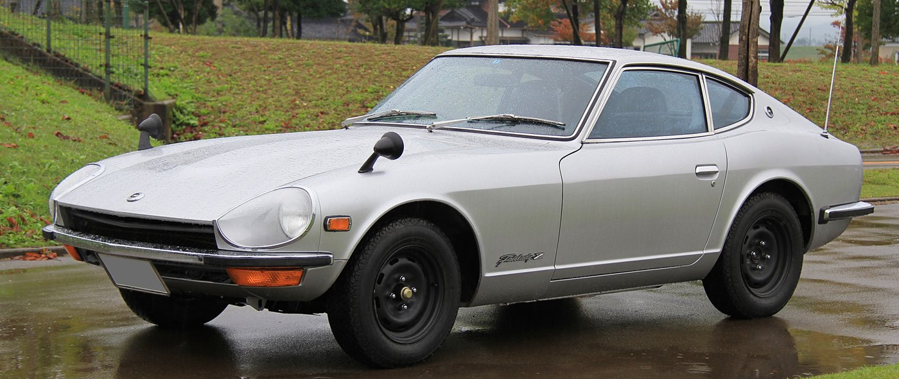
          </div>
          <div class="bridge-meta">
            <span class="bridge-year">1971</span>
            <div class="bridge-name">Datsun 240Z</div>
            <div class="bridge-specs-list">
              <span>Length: <strong>4,135 mm</strong></span>
              <span>Height: <strong>1,285 mm</strong></span>
              <span>L / H Ratio: <strong>3.22</strong></span>
              <span>WB / L: <strong>0.56</strong></span>
            </div>
          </div>
        </div>

        <!-- 1981 Audi Quattro -->
        <div class="bridge-card">
          <div class="bridge-img-box">
            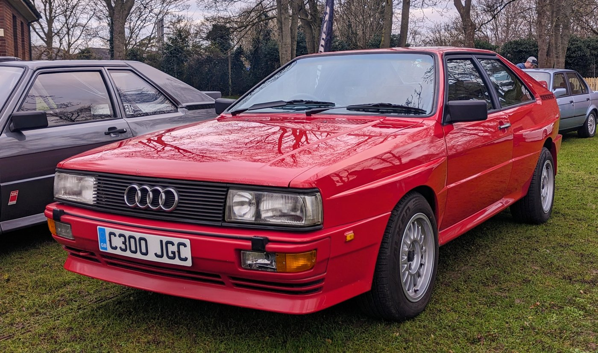
          </div>
          <div class="bridge-meta">
            <span class="bridge-year">1981</span>
            <div class="bridge-name">Audi Quattro</div>
            <div class="bridge-specs-list">
              <span>Length: <strong>4,404 mm</strong></span>
              <span>Height: <strong>1,346 mm</strong></span>
              <span>L / H Ratio: <strong>3.27</strong></span>
              <span>WB / L: <strong>0.57</strong></span>
            </div>
          </div>
        </div>

        <!-- 1990 Mazda Miata -->
        <div class="bridge-card">
          <div class="bridge-img-box">
            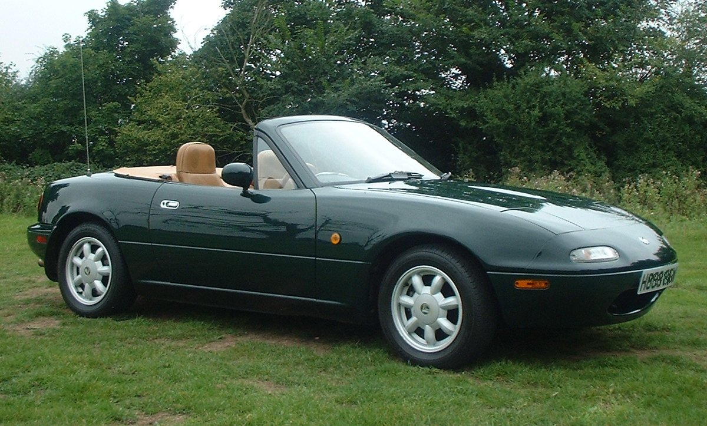
          </div>
          <div class="bridge-meta">
            <span class="bridge-year">1990</span>
            <div class="bridge-name">Mazda Miata (NA)</div>
            <div class="bridge-specs-list">
              <span>Length: <strong>3,948 mm</strong></span>
              <span>Height: <strong>1,224 mm</strong></span>
              <span>L / H Ratio: <strong>3.23</strong></span>
              <span>WB / L: <strong>0.57</strong></span>
            </div>
          </div>
        </div>

        <!-- 2008 Audi R8 -->
        <div class="bridge-card">
          <div class="bridge-img-box">
            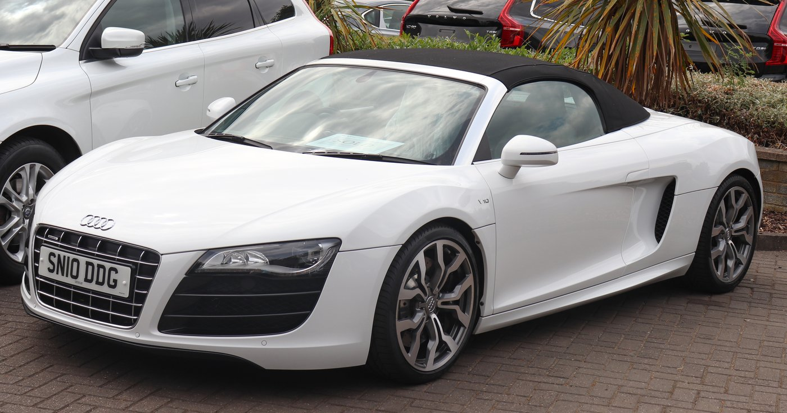
          </div>
          <div class="bridge-meta">
            <span class="bridge-year">2008</span>
            <div class="bridge-name">Audi R8</div>
            <div class="bridge-specs-list">
              <span>Length: <strong>4,431 mm</strong></span>
              <span>Height: <strong>1,249 mm</strong></span>
              <span>L / H Ratio: <strong>3.55</strong></span>
              <span>WB / L: <strong>0.60</strong></span>
            </div>
          </div>
        </div>

        <!-- 2018 Tesla Model 3 -->
        <div class="bridge-card">
          <div class="bridge-img-box">
            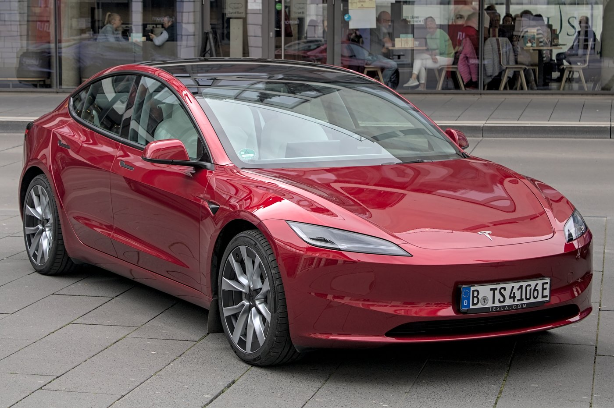
          </div>
          <div class="bridge-meta">
            <span class="bridge-year">2018</span>
            <div class="bridge-name">Tesla Model 3</div>
            <div class="bridge-specs-list">
              <span>Length: <strong>4,694 mm</strong></span>
              <span>Height: <strong>1,443 mm</strong></span>
              <span>L / H Ratio: <strong>3.25</strong></span>
              <span>WB / L: <strong>0.61</strong></span>
            </div>
          </div>
        </div>

        <!-- 2024 Tesla Cybertruck -->
        <div class="bridge-card">
          <div class="bridge-img-box">
            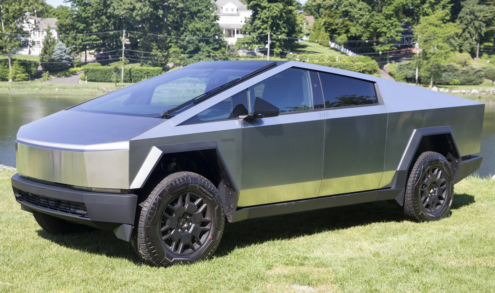
          </div>
          <div class="bridge-meta">
            <span class="bridge-year">2024</span>
            <div class="bridge-name">Tesla Cybertruck</div>
            <div class="bridge-specs-list">
              <span>Length: <strong>5,683 mm</strong></span>
              <span>Height: <strong>1,791 mm</strong></span>
              <span>L / H Ratio: <strong>3.17</strong></span>
              <span>WB / L: <strong>0.67</strong></span>
            </div>
          </div>
        </div>
      </div>
    </div>

    <!-- 9. METHODOLOGY / TRANSPARENCY -->
    <details class="methodology-details">
      <summary class="methodology-summary">
        <span>How This Was Measured &bull; Data Integrity &amp; Methodology</span>
      </summary>
      <div class="methodology-content">
        <p><strong>Primary Data Source:</strong> Global automotive engineering technical specifications dataset (<code>engines.csv</code>), covering 30,390 vehicle variants across international markets.</p>
        <p><strong>Temporal Filter:</strong> Strictly filtered to model generations introduced between <strong>1970 and 2024</strong> (28,400 clean production vehicles). Pre-1970 records were excluded from all calculations.</p>
        <p><strong>Outlier Validation:</strong> Physical dimension filters were applied to remove data-entry recording errors: length between 2,500 and 7,000 mm, width between 1,200 and 2,500 mm, height between 1,000 and 2,500 mm, and wheelbase between 1,500 and 4,500 mm (preserving 96.0% of all observations).</p>
        <p><strong>Aggregation:</strong> Median values were chosen over arithmetic means to protect metrics from distortions caused by ultra-low-volume specialty vehicles (e.g., stretched limousines or ultra-low concept exotics).</p>
        <p><strong>Dispersion Calculations:</strong> Diversity of shape was quantified through the Interquartile Range ($IQR = Q_{75} - Q_{25}$) and standard deviation of the Length / Height ratio for each year with $n \ge 5$ production entries. No subjective or synthetic character scores were constructed.</p>
        <p><strong>Body Style Classification:</strong> Body categories were mapped directly from manufacturer model and generation nomenclature into 8 distinct industry standard body styles without inventing artificial categories.</p>
      </div>
    </details>

    <!-- 10. ENDING THE SHAPE CHAPTER & TRANSITION TO SOUND -->
    <div class="sound-teaser-section">
      <div class="transition-divider"></div>
      <h3 class="sound-teaser-lead">THE SILHOUETTE CHANGED.</h3>
      <div class="sound-teaser-question">BUT DID IT BECOME LESS DIVERSE?</div>
      <p class="sound-teaser-whisper">The data reveals that cars clustered more tightly in proportion &mdash; yet split into two distinct modern profiles.</p>
      <p class="sound-teaser-whisper">Maybe character isn't only something you see.</p>
      <p class="sound-teaser-whisper">Maybe it's something you hear.</p>
      
      <div class="sound-marker-box">
        <span class="sound-chapter-tag">NEXT INVESTIGATION</span>
        <div class="sound-chapter-title">03 &mdash; SOUND</div>
        <div class="sound-chapter-arrow">&darr;</div>
      </div>
    </div>
  </section>

  <!-- SECTION 4 — CHAPTER 03: SOUND -->
  <section class="story-section" id="sound-chapter">
    <div class="section-badge">Chapter 03 &bull; Sound &bull; Powertrains</div>
    <h2 class="section-heading">MAYBE CHARACTER ISN'T ONLY SOMETHING YOU SEE.</h2>
    <div class="editorial-text">
      <p>For decades, a car's engine was part of its identity.</p>
      <p>Four cylinders. Six. Eight. Twelve. Naturally aspirated. Turbocharged. Different mechanical formulas created fundamentally different sounds.</p>
    </div>

    <!-- Acoustic Challenge Card -->
    <div class="sound-challenge-card">
      <div class="challenge-eyebrow">Acoustic Specimen Archive</div>
      <h3 class="challenge-title">&ldquo;CAN YOU HEAR THE DIFFERENCE?&rdquo;</h3>
      <p class="challenge-desc">
        Internal combustion engines produce distinctive acoustic signatures governed by displacement, cylinder count, and valve timing. Below are authentic field recordings of gasoline internal combustion engines in steady-state idle, captured via an acoustic ground-acquisition sensor.
      </p>
    </div>

    <!-- Audio Player Grid (6 Curated Petrol Specimens) -->
    <div class="sound-grid" id="sound-players-grid">
      <!-- Populated via JavaScript with interactive waveforms -->
    </div>

    <!-- Transition: Sound vs Data -->
    <div class="measure-statement-card">
      <div class="measure-eyebrow">Acoustics &bull; Quantitative Analysis</div>
      <h3 class="measure-main-statement">&ldquo;WE CAN HEAR THE DIFFERENCE.&rdquo;</h3>
      <h3 class="measure-main-statement" style="color: #38bdf8; margin-top: 0.5rem;">&ldquo;BUT CAN WE MEASURE WHAT CHANGED?&rdquo;</h3>
      <p class="measure-sub-statement">
        A feeling is subjective. The mechanical changes behind the sound are measurable.
      </p>
    </div>

    <!-- Mechanical Powertrain Breakdown (1970 - 2024 from engines.csv) -->
    <div class="powertrain-breakdown-card">
      <div class="powertrain-header">
        <div class="section-badge" style="margin-bottom: 0.6rem;">Historical Mechanical Dataset &bull; 29,880 Models</div>
        <h3 class="powertrain-title">THE SOUND HAS A MECHANICAL EXPLANATION.</h3>
        <p class="powertrain-sub">
          A car's acoustic voice is not an accident—it is the direct physical consequence of displacement, cylinder count, and aspiration method. Historical powertrain records from 1970 through 2024 demonstrate how mechanical diversity converged into standardized formulas.
        </p>
      </div>

      <!-- Engine Configuration Stacked Timeline -->
      <div class="editorial-subheading" style="color: #ffffff; font-size: 1.05rem; font-weight: 700; margin-bottom: 0.75rem;">
        Engine Architecture Distribution by Decade (1970 &ndash; 2024)
      </div>
      <div class="engine-cfg-chart" id="powertrain-chart-container">
        <!-- Rendered dynamically from authentic engines.csv stats -->
      </div>

      <!-- Engine Legend -->
      <div class="engine-legend" id="engine-legend-container">
        <!-- Rendered dynamically -->
      </div>

      <!-- Displacement Trend & Downsizing Stats -->
      <div class="editorial-subheading" style="color: #ffffff; font-size: 1.05rem; font-weight: 700; margin: 2.5rem 0 0.5rem;">
        Average Engine Displacement (Liters) by Decade
      </div>
      <p style="font-size: 0.92rem; color: #94a3b8; margin: 0 0 1rem; line-height: 1.5;">
        As turbocharging replaced natural displacement, large-displacement V8 and 6-cylinder engines were steadily replaced by standardized 2.0-liter turbocharged inline-4s.
      </p>
      <div class="disp-stats-grid">
        <div class="disp-stat-card">
          <div class="disp-decade">1970s</div>
          <div class="disp-number">2.79<span class="disp-unit">L</span></div>
          <div class="disp-note">V8s represented 20% of catalog</div>
        </div>
        <div class="disp-stat-card">
          <div class="disp-decade">1980s</div>
          <div class="disp-number">2.19<span class="disp-unit">L</span></div>
          <div class="disp-note">Emissions standards take hold</div>
        </div>
        <div class="disp-stat-card">
          <div class="disp-decade">1990s</div>
          <div class="disp-number">2.30<span class="disp-unit">L</span></div>
          <div class="disp-note">Multi-valve DOHC expansion</div>
        </div>
        <div class="disp-stat-card">
          <div class="disp-decade">2000s</div>
          <div class="disp-number">2.42<span class="disp-unit">L</span></div>
          <div class="disp-note">Peak naturally aspirated era</div>
        </div>
        <div class="disp-stat-card">
          <div class="disp-decade">2010s</div>
          <div class="disp-number">2.31<span class="disp-unit">L</span></div>
          <div class="disp-note">Rapid turbo downsizing begins</div>
        </div>
        <div class="disp-stat-card">
          <div class="disp-decade">2020s</div>
          <div class="disp-number">2.30<span class="disp-unit">L</span></div>
          <div class="disp-note">Inline-3 + EV surges to 31%</div>
        </div>
      </div>
    </div>

    <!-- The Modern Era: Electrification -->
    <div class="modern-era-card">
      <div class="era-tag">The Present &bull; Transition to Electrification</div>
      <h3 class="era-heading">The Changing Source of Vehicle Sound</h3>
      <p class="era-text">
        As the industry shifts toward hybrid and battery-electric drivetrains, vehicle sound is undergoing its most profound transformation in a century. Electrification does not simply eliminate sound—it changes its mechanical origin from reciprocating combustion pressure waves to electromagnetic motor whine, inverter switching frequencies, and tire contact acoustics.
      </p>
      <p class="era-subtext">
        <em>Note on dataset methodology:</em> The Zenodo acoustic research team explicitly removed electric vehicles during their idle-sound processing algorithm, focusing exclusively on internal combustion engine signatures.
      </p>
    </div>

    <!-- Data Transparency -->
    <div class="data-transparency-card">
      <details class="transparency-details">
        <summary class="transparency-summary">
          <span>About the Sound &amp; Powertrain Data</span>
          <span class="summary-icon">&plus;</span>
        </summary>
        <div class="transparency-body">
          <div class="transparency-grid">
            <div class="transparency-item">
              <h4>Audio Research Source</h4>
              <p><strong>Title:</strong> Sounds of Vehicle Internal Combustion Engines</p>
              <p><strong>Authors:</strong> Dejan Ćirić and Marko Milivojčević (University of Niš &amp; School of Electrical and Computer Engineering, Serbia)</p>
              <p><strong>DOI:</strong> <a href="https://zenodo.org/records/18777405" target="_blank" rel="noopener">10.5281/zenodo.18777405</a></p>
              <p><strong>License:</strong> <a href="https://creativecommons.org/licenses/by/4.0/legalcode" target="_blank" rel="noopener">Creative Commons Attribution 4.0 International (CC BY 4.0)</a></p>
              <p class="small-note">The dataset was acquired using an autonomous underground-garage acoustic acquisition rig to study engine idle signatures. A curated subset of clean petrol recordings was selected for this interactive analysis.</p>
            </div>
            <div class="transparency-item">
              <h4>Vehicle Specifications Source</h4>
              <p><strong>Database:</strong> Historical Engine &amp; Powertrain Specification Archive (29,880 models, 1970–2024)</p>
              <p><strong>Scope:</strong> Cylinders, displacement, aspiration, power, and drivetrain architecture.</p>
              <p class="small-note"><strong>Methodological distinction:</strong> The audio recordings are anonymous field measurements from the Zenodo acoustic dataset, while the historical powertrain trends are computed from the comprehensive 1970–2024 vehicle specifications database. The audio dataset itself does not contain individual vehicle model tags.</p>
            </div>
          </div>
        </div>
      </details>
    </div>
  </section>

  <!-- SECTION 5 — FINAL STORY MOMENT -->
  <div class="final-story-moment">
    <div class="moment-lines">
      <p class="moment-line highlight">&ldquo;THE COLORS CHANGED.&rdquo;</p>
      <p class="moment-line highlight">&ldquo;THE SHAPES CHANGED.&rdquo;</p>
      <p class="moment-line highlight">&ldquo;AND THE MACHINES CHANGED.&rdquo;</p>
      <div class="moment-pause"></div>
      <p class="moment-question">&ldquo;SO WHAT HAPPENED TO CAR CHARACTER?&rdquo;</p>
      <p class="moment-answer">That's harder to measure.</p>
      <p class="moment-conclusion">But now we can see how much actually changed.</p>
    </div>

    <div class="final-cta-container">
      <a href="index.html" class="final-cta-button">
        <span>EXPLORE THE DATA</span>
        <span class="cta-arrow">&rarr;</span>
      </a>
    </div>
  </div>
</div>

<script>
// Automotive Color Data (1970 - 2024) from Axalta Historical Archive
const colorData = [{"Year":1970,"White":14,"Black":5,"Gray":4,"Silver":5,"Blue":18,"Red":12,"Green":16,"Brown_Beige":14,"Yellow_Gold":9,"Other":3},{"Year":1971,"White":14,"Black":5,"Gray":4,"Silver":4,"Blue":17,"Red":12,"Green":16,"Brown_Beige":16,"Yellow_Gold":9,"Other":3},{"Year":1972,"White":13,"Black":5,"Gray":4,"Silver":4,"Blue":16,"Red":11,"Green":17,"Brown_Beige":18,"Yellow_Gold":9,"Other":3},{"Year":1973,"White":13,"Black":4,"Gray":4,"Silver":4,"Blue":16,"Red":10,"Green":17,"Brown_Beige":20,"Yellow_Gold":9,"Other":3},{"Year":1974,"White":12,"Black":4,"Gray":4,"Silver":4,"Blue":15,"Red":10,"Green":17,"Brown_Beige":22,"Yellow_Gold":9,"Other":3},{"Year":1975,"White":12,"Black":4,"Gray":4,"Silver":4,"Blue":14,"Red":10,"Green":16,"Brown_Beige":24,"Yellow_Gold":9,"Other":3},{"Year":1976,"White":13,"Black":4,"Gray":4,"Silver":4,"Blue":14,"Red":10,"Green":16,"Brown_Beige":24,"Yellow_Gold":8,"Other":3},{"Year":1977,"White":13,"Black":5,"Gray":4,"Silver":4,"Blue":14,"Red":11,"Green":15,"Brown_Beige":23,"Yellow_Gold":8,"Other":3},{"Year":1978,"White":13,"Black":6,"Gray":4,"Silver":4,"Blue":14,"Red":12,"Green":14,"Brown_Beige":22,"Yellow_Gold":8,"Other":3},{"Year":1979,"White":14,"Black":6,"Gray":4,"Silver":5,"Blue":15,"Red":12,"Green":13,"Brown_Beige":20,"Yellow_Gold":8,"Other":3},{"Year":1980,"White":14,"Black":7,"Gray":4,"Silver":6,"Blue":16,"Red":13,"Green":11,"Brown_Beige":18,"Yellow_Gold":7,"Other":4},{"Year":1981,"White":16,"Black":8,"Gray":4,"Silver":6,"Blue":16,"Red":14,"Green":10,"Brown_Beige":16,"Yellow_Gold":6,"Other":4},{"Year":1982,"White":15,"Black":8,"Gray":5,"Silver":7,"Blue":16,"Red":14,"Green":9,"Brown_Beige":15,"Yellow_Gold":6,"Other":5},{"Year":1983,"White":16,"Black":8,"Gray":5,"Silver":8,"Blue":16,"Red":14,"Green":8,"Brown_Beige":14,"Yellow_Gold":6,"Other":5},{"Year":1984,"White":16,"Black":9,"Gray":5,"Silver":8,"Blue":15,"Red":15,"Green":8,"Brown_Beige":13,"Yellow_Gold":6,"Other":5},{"Year":1985,"White":15,"Black":10,"Gray":5,"Silver":8,"Blue":15,"Red":16,"Green":8,"Brown_Beige":12,"Yellow_Gold":6,"Other":5},{"Year":1986,"White":17,"Black":10,"Gray":5,"Silver":9,"Blue":15,"Red":16,"Green":7,"Brown_Beige":11,"Yellow_Gold":5,"Other":5},{"Year":1987,"White":19,"Black":10,"Gray":5,"Silver":9,"Blue":14,"Red":16,"Green":7,"Brown_Beige":10,"Yellow_Gold":5,"Other":5},{"Year":1988,"White":19,"Black":11,"Gray":5,"Silver":9,"Blue":14,"Red":16,"Green":7,"Brown_Beige":9,"Yellow_Gold":5,"Other":5},{"Year":1989,"White":20,"Black":12,"Gray":5,"Silver":9,"Blue":14,"Red":16,"Green":8,"Brown_Beige":8,"Yellow_Gold":4,"Other":4},{"Year":1990,"White":22,"Black":12,"Gray":5,"Silver":9,"Blue":13,"Red":15,"Green":9,"Brown_Beige":7,"Yellow_Gold":4,"Other":4},{"Year":1991,"White":23,"Black":12,"Gray":5,"Silver":9,"Blue":12,"Red":15,"Green":10,"Brown_Beige":6,"Yellow_Gold":4,"Other":4},{"Year":1992,"White":24,"Black":11,"Gray":5,"Silver":9,"Blue":12,"Red":15,"Green":12,"Brown_Beige":5,"Yellow_Gold":3,"Other":4},{"Year":1993,"White":26,"Black":10,"Gray":4,"Silver":9,"Blue":11,"Red":14,"Green":15,"Brown_Beige":4,"Yellow_Gold":3,"Other":4},{"Year":1994,"White":25,"Black":10,"Gray":4,"Silver":9,"Blue":10,"Red":14,"Green":18,"Brown_Beige":4,"Yellow_Gold":3,"Other":3},{"Year":1995,"White":26,"Black":10,"Gray":4,"Silver":9,"Blue":10,"Red":13,"Green":20,"Brown_Beige":3,"Yellow_Gold":2,"Other":3},{"Year":1996,"White":25,"Black":10,"Gray":5,"Silver":10,"Blue":10,"Red":13,"Green":19,"Brown_Beige":3,"Yellow_Gold":2,"Other":3},{"Year":1997,"White":24,"Black":10,"Gray":6,"Silver":12,"Blue":10,"Red":13,"Green":16,"Brown_Beige":4,"Yellow_Gold":2,"Other":3},{"Year":1998,"White":24,"Black":11,"Gray":6,"Silver":13,"Blue":10,"Red":13,"Green":14,"Brown_Beige":4,"Yellow_Gold":2,"Other":3},{"Year":1999,"White":23,"Black":12,"Gray":6,"Silver":16,"Blue":10,"Red":12,"Green":12,"Brown_Beige":4,"Yellow_Gold":2,"Other":3},{"Year":2000,"White":21,"Black":12,"Gray":7,"Silver":20,"Blue":10,"Red":12,"Green":9,"Brown_Beige":4,"Yellow_Gold":2,"Other":3},{"Year":2001,"White":18,"Black":12,"Gray":8,"Silver":24,"Blue":10,"Red":12,"Green":7,"Brown_Beige":4,"Yellow_Gold":2,"Other":3},{"Year":2002,"White":19,"Black":13,"Gray":8,"Silver":27,"Blue":9,"Red":11,"Green":5,"Brown_Beige":4,"Yellow_Gold":1,"Other":3},{"Year":2003,"White":20,"Black":14,"Gray":8,"Silver":28,"Blue":8,"Red":10,"Green":4,"Brown_Beige":4,"Yellow_Gold":1,"Other":3},{"Year":2004,"White":19,"Black":14,"Gray":9,"Silver":28,"Blue":8,"Red":10,"Green":4,"Brown_Beige":4,"Yellow_Gold":1,"Other":3},{"Year":2005,"White":20,"Black":14,"Gray":10,"Silver":26,"Blue":8,"Red":10,"Green":4,"Brown_Beige":4,"Yellow_Gold":1,"Other":3},{"Year":2006,"White":21,"Black":15,"Gray":10,"Silver":25,"Blue":8,"Red":9,"Green":3,"Brown_Beige":5,"Yellow_Gold":1,"Other":3},{"Year":2007,"White":22,"Black":16,"Gray":10,"Silver":23,"Blue":8,"Red":9,"Green":3,"Brown_Beige":5,"Yellow_Gold":1,"Other":3},{"Year":2008,"White":23,"Black":16,"Gray":11,"Silver":21,"Blue":8,"Red":9,"Green":3,"Brown_Beige":5,"Yellow_Gold":1,"Other":3},{"Year":2009,"White":26,"Black":16,"Gray":12,"Silver":20,"Blue":8,"Red":8,"Green":2,"Brown_Beige":4,"Yellow_Gold":1,"Other":3},{"Year":2010,"White":26,"Black":17,"Gray":13,"Silver":18,"Blue":8,"Red":8,"Green":2,"Brown_Beige":4,"Yellow_Gold":1,"Other":3},{"Year":2011,"White":26,"Black":18,"Gray":14,"Silver":16,"Blue":8,"Red":8,"Green":2,"Brown_Beige":4,"Yellow_Gold":1,"Other":3},{"Year":2012,"White":29,"Black":18,"Gray":14,"Silver":15,"Blue":8,"Red":7,"Green":2,"Brown_Beige":3,"Yellow_Gold":1,"Other":3},{"Year":2013,"White":30,"Black":18,"Gray":14,"Silver":14,"Blue":8,"Red":7,"Green":2,"Brown_Beige":3,"Yellow_Gold":1,"Other":3},{"Year":2014,"White":32,"Black":19,"Gray":14,"Silver":12,"Blue":8,"Red":7,"Green":1,"Brown_Beige":3,"Yellow_Gold":1,"Other":3},{"Year":2015,"White":34,"Black":20,"Gray":14,"Silver":12,"Blue":8,"Red":6,"Green":1,"Brown_Beige":2,"Yellow_Gold":1,"Other":2},{"Year":2016,"White":35,"Black":20,"Gray":14,"Silver":11,"Blue":8,"Red":6,"Green":1,"Brown_Beige":2,"Yellow_Gold":1,"Other":2},{"Year":2017,"White":35,"Black":20,"Gray":15,"Silver":10,"Blue":8,"Red":6,"Green":1,"Brown_Beige":2,"Yellow_Gold":1,"Other":2},{"Year":2018,"White":37,"Black":19,"Gray":16,"Silver":10,"Blue":7,"Red":5,"Green":1,"Brown_Beige":2,"Yellow_Gold":1,"Other":2},{"Year":2019,"White":37,"Black":19,"Gray":16,"Silver":10,"Blue":7,"Red":5,"Green":1,"Brown_Beige":2,"Yellow_Gold":1,"Other":2},{"Year":2020,"White":38,"Black":19,"Gray":15,"Silver":9,"Blue":7,"Red":5,"Green":1,"Brown_Beige":2,"Yellow_Gold":1,"Other":3},{"Year":2021,"White":37,"Black":20,"Gray":16,"Silver":9,"Blue":8,"Red":4,"Green":1,"Brown_Beige":2,"Yellow_Gold":1,"Other":2},{"Year":2022,"White":36,"Black":21,"Gray":16,"Silver":9,"Blue":8,"Red":4,"Green":1,"Brown_Beige":2,"Yellow_Gold":1,"Other":2},{"Year":2023,"White":36,"Black":22,"Gray":16,"Silver":8,"Blue":8,"Red":4,"Green":1,"Brown_Beige":2,"Yellow_Gold":1,"Other":2},{"Year":2024,"White":35,"Black":22,"Gray":17,"Silver":8,"Blue":8,"Red":4,"Green":1,"Brown_Beige":2,"Yellow_Gold":1,"Other":2}];

const colorMeta = {
  White: { label: "White", short: "White", hex: "#f8fafc", textHex: "#0f172a", border: true },
  Black: { label: "Black", short: "Black", hex: "#18181b", textHex: "#f8fafc", border: false },
  Gray: { label: "Gray", short: "Gray", hex: "#64748b", textHex: "#ffffff", border: false },
  Silver: { label: "Silver", short: "Silver", hex: "#cbd5e1", textHex: "#0f172a", border: true },
  Blue: { label: "Blue", short: "Blue", hex: "#2563eb", textHex: "#ffffff", border: false },
  Red: { label: "Red", short: "Red", hex: "#dc2626", textHex: "#ffffff", border: false },
  Green: { label: "Green", short: "Green", hex: "#16a34a", textHex: "#ffffff", border: false },
  Brown_Beige: { label: "Brown / Beige", short: "Brown", hex: "#a16207", textHex: "#ffffff", border: false },
  Yellow_Gold: { label: "Gold / Yellow", short: "Gold", hex: "#eab308", textHex: "#0f172a", border: false },
  Other: { label: "Other", short: "Other", hex: "#7c3aed", textHex: "#ffffff", border: false }
};

/* ==========================================================================
   COLOR SECTION SCRIPT
   ========================================================================== */
function renderLegend() {
  const container = document.getElementById("color-legend");
  if (!container) return;
  container.innerHTML = Object.entries(colorMeta).map(([key, item]) => `
    <div class="legend-chip">
      <span class="legend-color-box" style="background-color: ${item.hex}; ${item.border ? "border: 1px solid rgba(255,255,255,0.4);" : ""}"></span>
      <span class="legend-color-label">${item.label}</span>
    </div>
  `).join("");
}

function renderTimelineStream() {
  const container = document.getElementById("timeline-stream-container");
  if (!container) return;

  container.innerHTML = colorData.map(d => {
    const segmentsHtml = Object.entries(colorMeta).map(([key, meta]) => {
      const pct = d[key] || 0;
      if (pct === 0) return "";
      if (pct >= 5) {
        return `<div class="bar-seg" style="width: ${pct}%; background-color: ${meta.hex}; color: ${meta.textHex};" title="${meta.label}: ${pct}% (${d.Year})">${pct}%</div>`;
      } else {
        return `<div class="bar-seg is-narrow" style="width: ${pct}%; background-color: ${meta.hex};" title="${meta.label}: ${pct}% (${d.Year})"></div>`;
      }
    }).join("");

    const smallBadgesHtml = Object.entries(colorMeta)
      .filter(([key]) => (d[key] || 0) > 0 && (d[key] || 0) < 5)
      .map(([key, meta]) => `<span class="micro-badge" title="${meta.label}: ${d[key]}%"><span class="badge-dot" style="background-color: ${meta.hex};"></span>${meta.short} ${d[key]}%</span>`)
      .join("");

    const isDecadeStart = d.Year % 10 === 0;

    return `
      <div class="timeline-row ${isDecadeStart ? "decade-start" : ""}" data-year="${d.Year}" onmouseenter="showReadout(${d.Year})" onclick="showReadout(${d.Year})">
        <div class="row-year-col">
          <span class="row-year-label">${d.Year}</span>
          ${isDecadeStart ? `<span class="decade-pill">${d.Year}s</span>` : ""}
        </div>
        <div class="row-bar-wrap">
          <div class="row-stacked-bar">${segmentsHtml}</div>
        </div>
        <div class="row-small-labels">
          ${smallBadgesHtml}
        </div>
      </div>
    `;
  }).join("");
}

function showReadout(year) {
  const d = colorData.find(item => item.Year === year);
  const readout = document.getElementById("active-readout");
  if (!d || !readout) return;

  const greyscale = d.White + d.Black + d.Gray + d.Silver;
  const chromatic = 100 - greyscale;

  const breakdownChips = Object.entries(colorMeta)
    .filter(([key]) => (d[key] || 0) > 0)
    .map(([key, meta]) => `<span class="readout-chip" style="color: ${meta.hex === "#f8fafc" ? "#ffffff" : meta.hex};">${meta.short} <strong>${d[key]}%</strong></span>`)
    .join(" &bull; ");

  readout.innerHTML = `
    <div class="readout-active-content">
      <span class="readout-year">${d.Year} RECORD:</span>
      <span class="readout-chips">${breakdownChips}</span>
      <span class="readout-summary">[Greyscale: ${greyscale}% | Chromatic: ${chromatic}%]</span>
    </div>
  `;

  document.querySelectorAll(".timeline-row").forEach(el => {
    if (el.getAttribute("data-year") === String(year)) {
      el.classList.add("is-selected-row");
    } else {
      el.classList.remove("is-selected-row");
    }
  });
}


// Shape Dataset (1970 - 2024) derived from engines.csv (16,355 classified vehicles)
const shapeDataset = {"total_vehicles_1970_2024": 28400, "yearly_dimensions": [{"year": 1970, "n": 63, "length_mm": 4775.0, "length_in": 188.0, "width_mm": 1890.0, "width_in": 74.4, "height_mm": 1280.0, "height_in": 50.4, "wheelbase_mm": 2743.0, "wheelbase_in": 108.0, "lh_ratio": 3.75, "lh_q25": 3.31, "lh_q75": 3.97, "lh_iqr": 0.656, "lh_std": 0.344, "wl_ratio": 0.564}, {"year": 1971, "n": 54, "length_mm": 4630.0, "length_in": 182.3, "width_mm": 1791.0, "width_in": 70.5, "height_mm": 1326.0, "height_in": 52.2, "wheelbase_mm": 2620.0, "wheelbase_in": 103.1, "lh_ratio": 3.47, "lh_q25": 3.38, "lh_q75": 3.93, "lh_iqr": 0.558, "lh_std": 0.389, "wl_ratio": 0.561}, {"year": 1972, "n": 93, "length_mm": 4376.0, "length_in": 172.3, "width_mm": 1651.0, "width_in": 65.0, "height_mm": 1410.0, "height_in": 55.5, "wheelbase_mm": 2510.0, "wheelbase_in": 98.8, "lh_ratio": 3.18, "lh_q25": 2.84, "lh_q75": 3.27, "lh_iqr": 0.43, "lh_std": 0.448, "wl_ratio": 0.581}, {"year": 1973, "n": 38, "length_mm": 4290.0, "length_in": 168.9, "width_mm": 1658.0, "width_in": 65.3, "height_mm": 1280.0, "height_in": 50.4, "wheelbase_mm": 2456.0, "wheelbase_in": 96.7, "lh_ratio": 3.22, "lh_q25": 3.13, "lh_q75": 3.34, "lh_iqr": 0.212, "lh_std": 0.277, "wl_ratio": 0.582}, {"year": 1974, "n": 52, "length_mm": 4316.0, "length_in": 169.9, "width_mm": 1679.0, "width_in": 66.1, "height_mm": 1359.0, "height_in": 53.5, "wheelbase_mm": 2520.0, "wheelbase_in": 99.2, "lh_ratio": 3.23, "lh_q25": 3.09, "lh_q75": 3.78, "lh_iqr": 0.697, "lh_std": 0.491, "wl_ratio": 0.584}, {"year": 1975, "n": 70, "length_mm": 4521.0, "length_in": 178.0, "width_mm": 1710.0, "width_in": 67.3, "height_mm": 1430.0, "height_in": 56.3, "wheelbase_mm": 2640.0, "wheelbase_in": 103.9, "lh_ratio": 3.28, "lh_q25": 3.16, "lh_q75": 3.34, "lh_iqr": 0.175, "lh_std": 0.214, "wl_ratio": 0.587}, {"year": 1976, "n": 66, "length_mm": 4191.0, "length_in": 165.0, "width_mm": 1727.0, "width_in": 68.0, "height_mm": 1358.0, "height_in": 53.5, "wheelbase_mm": 2444.0, "wheelbase_in": 96.2, "lh_ratio": 3.27, "lh_q25": 3.04, "lh_q75": 3.52, "lh_iqr": 0.478, "lh_std": 0.418, "wl_ratio": 0.582}, {"year": 1977, "n": 63, "length_mm": 4641.0, "length_in": 182.7, "width_mm": 1786.0, "width_in": 70.3, "height_mm": 1394.0, "height_in": 54.9, "wheelbase_mm": 2710.0, "wheelbase_in": 106.7, "lh_ratio": 3.4, "lh_q25": 3.19, "lh_q75": 3.43, "lh_iqr": 0.239, "lh_std": 0.357, "wl_ratio": 0.578}, {"year": 1978, "n": 72, "length_mm": 4440.0, "length_in": 174.8, "width_mm": 1699.0, "width_in": 66.9, "height_mm": 1379.0, "height_in": 54.3, "wheelbase_mm": 2563.0, "wheelbase_in": 100.9, "lh_ratio": 3.21, "lh_q25": 3.01, "lh_q75": 3.36, "lh_iqr": 0.344, "lh_std": 0.303, "wl_ratio": 0.577}, {"year": 1979, "n": 107, "length_mm": 4404.0, "length_in": 173.4, "width_mm": 1699.0, "width_in": 66.9, "height_mm": 1438.0, "height_in": 56.6, "wheelbase_mm": 2670.0, "wheelbase_in": 105.1, "lh_ratio": 3.07, "lh_q25": 2.28, "lh_q75": 3.4, "lh_iqr": 1.122, "lh_std": 0.58, "wl_ratio": 0.598}, {"year": 1980, "n": 52, "length_mm": 4361.0, "length_in": 171.7, "width_mm": 1710.0, "width_in": 67.3, "height_mm": 1379.0, "height_in": 54.3, "wheelbase_mm": 2456.0, "wheelbase_in": 96.7, "lh_ratio": 2.92, "lh_q25": 2.75, "lh_q75": 3.48, "lh_iqr": 0.734, "lh_std": 0.529, "wl_ratio": 0.572}, {"year": 1981, "n": 144, "length_mm": 4435.0, "length_in": 174.6, "width_mm": 1699.0, "width_in": 66.9, "height_mm": 1380.0, "height_in": 54.3, "wheelbase_mm": 2535.0, "wheelbase_in": 99.8, "lh_ratio": 3.23, "lh_q25": 3.13, "lh_q75": 3.33, "lh_iqr": 0.199, "lh_std": 0.253, "wl_ratio": 0.568}, {"year": 1982, "n": 172, "length_mm": 4564.0, "length_in": 179.7, "width_mm": 1720.0, "width_in": 67.7, "height_mm": 1379.0, "height_in": 54.3, "wheelbase_mm": 2649.0, "wheelbase_in": 104.3, "lh_ratio": 3.27, "lh_q25": 3.13, "lh_q75": 3.39, "lh_iqr": 0.255, "lh_std": 0.302, "wl_ratio": 0.588}, {"year": 1983, "n": 153, "length_mm": 4021.0, "length_in": 158.3, "width_mm": 1661.0, "width_in": 65.4, "height_mm": 1410.0, "height_in": 55.5, "wheelbase_mm": 2479.0, "wheelbase_in": 97.6, "lh_ratio": 2.98, "lh_q25": 2.74, "lh_q75": 3.31, "lh_iqr": 0.565, "lh_std": 0.348, "wl_ratio": 0.623}, {"year": 1984, "n": 160, "length_mm": 4239.0, "length_in": 166.9, "width_mm": 1680.0, "width_in": 66.1, "height_mm": 1400.0, "height_in": 55.1, "wheelbase_mm": 2520.0, "wheelbase_in": 99.2, "lh_ratio": 2.94, "lh_q25": 2.8, "lh_q75": 3.3, "lh_iqr": 0.503, "lh_std": 0.367, "wl_ratio": 0.596}, {"year": 1985, "n": 98, "length_mm": 4361.0, "length_in": 171.7, "width_mm": 1738.0, "width_in": 68.4, "height_mm": 1400.0, "height_in": 55.1, "wheelbase_mm": 2581.0, "wheelbase_in": 101.6, "lh_ratio": 3.28, "lh_q25": 3.05, "lh_q75": 3.39, "lh_iqr": 0.338, "lh_std": 0.316, "wl_ratio": 0.591}, {"year": 1986, "n": 210, "length_mm": 4399.0, "length_in": 173.2, "width_mm": 1699.0, "width_in": 66.9, "height_mm": 1400.0, "height_in": 55.1, "wheelbase_mm": 2611.0, "wheelbase_in": 102.8, "lh_ratio": 3.16, "lh_q25": 2.95, "lh_q75": 3.23, "lh_iqr": 0.274, "lh_std": 0.351, "wl_ratio": 0.586}, {"year": 1987, "n": 98, "length_mm": 4394.0, "length_in": 173.0, "width_mm": 1699.0, "width_in": 66.9, "height_mm": 1389.0, "height_in": 54.7, "wheelbase_mm": 2545.0, "wheelbase_in": 100.2, "lh_ratio": 3.13, "lh_q25": 2.94, "lh_q75": 3.29, "lh_iqr": 0.351, "lh_std": 0.284, "wl_ratio": 0.583}, {"year": 1988, "n": 243, "length_mm": 4430.0, "length_in": 174.4, "width_mm": 1699.0, "width_in": 66.9, "height_mm": 1412.0, "height_in": 55.6, "wheelbase_mm": 2601.0, "wheelbase_in": 102.4, "lh_ratio": 3.13, "lh_q25": 2.93, "lh_q75": 3.32, "lh_iqr": 0.386, "lh_std": 0.318, "wl_ratio": 0.585}, {"year": 1989, "n": 241, "length_mm": 4389.0, "length_in": 172.8, "width_mm": 1689.0, "width_in": 66.5, "height_mm": 1389.0, "height_in": 54.7, "wheelbase_mm": 2540.0, "wheelbase_in": 100.0, "lh_ratio": 3.12, "lh_q25": 2.83, "lh_q75": 3.38, "lh_iqr": 0.553, "lh_std": 0.357, "wl_ratio": 0.593}, {"year": 1990, "n": 223, "length_mm": 4400.0, "length_in": 173.2, "width_mm": 1699.0, "width_in": 66.9, "height_mm": 1410.0, "height_in": 55.5, "wheelbase_mm": 2540.0, "wheelbase_in": 100.0, "lh_ratio": 3.13, "lh_q25": 2.84, "lh_q75": 3.34, "lh_iqr": 0.497, "lh_std": 0.396, "wl_ratio": 0.58}, {"year": 1991, "n": 317, "length_mm": 4369.0, "length_in": 172.0, "width_mm": 1699.0, "width_in": 66.9, "height_mm": 1410.0, "height_in": 55.5, "wheelbase_mm": 2570.0, "wheelbase_in": 101.2, "lh_ratio": 3.17, "lh_q25": 2.83, "lh_q75": 3.35, "lh_iqr": 0.518, "lh_std": 0.403, "wl_ratio": 0.588}, {"year": 1992, "n": 306, "length_mm": 4351.0, "length_in": 171.3, "width_mm": 1700.0, "width_in": 66.9, "height_mm": 1410.0, "height_in": 55.5, "wheelbase_mm": 2540.0, "wheelbase_in": 100.0, "lh_ratio": 3.08, "lh_q25": 2.95, "lh_q75": 3.28, "lh_iqr": 0.333, "lh_std": 0.307, "wl_ratio": 0.587}, {"year": 1993, "n": 332, "length_mm": 4440.0, "length_in": 174.8, "width_mm": 1720.0, "width_in": 67.7, "height_mm": 1400.0, "height_in": 55.1, "wheelbase_mm": 2581.0, "wheelbase_in": 101.6, "lh_ratio": 3.17, "lh_q25": 2.9, "lh_q75": 3.29, "lh_iqr": 0.397, "lh_std": 0.29, "wl_ratio": 0.596}, {"year": 1994, "n": 545, "length_mm": 4483.0, "length_in": 176.5, "width_mm": 1735.0, "width_in": 68.3, "height_mm": 1420.0, "height_in": 55.9, "wheelbase_mm": 2642.0, "wheelbase_in": 104.0, "lh_ratio": 3.22, "lh_q25": 2.92, "lh_q75": 3.36, "lh_iqr": 0.447, "lh_std": 0.312, "wl_ratio": 0.584}, {"year": 1995, "n": 373, "length_mm": 4470.0, "length_in": 176.0, "width_mm": 1740.0, "width_in": 68.5, "height_mm": 1420.0, "height_in": 55.9, "wheelbase_mm": 2619.0, "wheelbase_in": 103.1, "lh_ratio": 3.13, "lh_q25": 2.95, "lh_q75": 3.27, "lh_iqr": 0.32, "lh_std": 0.269, "wl_ratio": 0.59}, {"year": 1996, "n": 449, "length_mm": 4460.0, "length_in": 175.6, "width_mm": 1730.0, "width_in": 68.1, "height_mm": 1420.0, "height_in": 55.9, "wheelbase_mm": 2581.0, "wheelbase_in": 101.6, "lh_ratio": 3.09, "lh_q25": 2.85, "lh_q75": 3.22, "lh_iqr": 0.372, "lh_std": 0.31, "wl_ratio": 0.588}, {"year": 1997, "n": 530, "length_mm": 4512.0, "length_in": 177.6, "width_mm": 1740.0, "width_in": 68.5, "height_mm": 1430.0, "height_in": 56.3, "wheelbase_mm": 2629.0, "wheelbase_in": 103.5, "lh_ratio": 3.12, "lh_q25": 2.88, "lh_q75": 3.3, "lh_iqr": 0.419, "lh_std": 0.354, "wl_ratio": 0.589}, {"year": 1998, "n": 621, "length_mm": 4455.0, "length_in": 175.4, "width_mm": 1740.0, "width_in": 68.5, "height_mm": 1430.0, "height_in": 56.3, "wheelbase_mm": 2611.0, "wheelbase_in": 102.8, "lh_ratio": 3.02, "lh_q25": 2.84, "lh_q75": 3.28, "lh_iqr": 0.436, "lh_std": 0.338, "wl_ratio": 0.589}, {"year": 1999, "n": 593, "length_mm": 4480.0, "length_in": 176.4, "width_mm": 1740.0, "width_in": 68.5, "height_mm": 1430.0, "height_in": 56.3, "wheelbase_mm": 2639.0, "wheelbase_in": 103.9, "lh_ratio": 3.08, "lh_q25": 2.88, "lh_q75": 3.26, "lh_iqr": 0.387, "lh_std": 0.329, "wl_ratio": 0.588}, {"year": 2000, "n": 604, "length_mm": 4480.0, "length_in": 176.4, "width_mm": 1742.0, "width_in": 68.6, "height_mm": 1440.0, "height_in": 56.7, "wheelbase_mm": 2611.0, "wheelbase_in": 102.8, "lh_ratio": 3.06, "lh_q25": 2.72, "lh_q75": 3.18, "lh_iqr": 0.461, "lh_std": 0.331, "wl_ratio": 0.593}, {"year": 2001, "n": 747, "length_mm": 4529.0, "length_in": 178.3, "width_mm": 1760.0, "width_in": 69.3, "height_mm": 1450.0, "height_in": 57.1, "wheelbase_mm": 2649.0, "wheelbase_in": 104.3, "lh_ratio": 3.12, "lh_q25": 2.72, "lh_q75": 3.26, "lh_iqr": 0.544, "lh_std": 0.34, "wl_ratio": 0.591}, {"year": 2002, "n": 709, "length_mm": 4524.0, "length_in": 178.1, "width_mm": 1765.0, "width_in": 69.5, "height_mm": 1461.0, "height_in": 57.5, "wheelbase_mm": 2680.0, "wheelbase_in": 105.5, "lh_ratio": 2.9, "lh_q25": 2.73, "lh_q75": 3.21, "lh_iqr": 0.482, "lh_std": 0.326, "wl_ratio": 0.596}, {"year": 2003, "n": 890, "length_mm": 4501.0, "length_in": 177.2, "width_mm": 1760.0, "width_in": 69.3, "height_mm": 1471.0, "height_in": 57.9, "wheelbase_mm": 2675.0, "wheelbase_in": 105.3, "lh_ratio": 3.06, "lh_q25": 2.7, "lh_q75": 3.26, "lh_iqr": 0.556, "lh_std": 0.364, "wl_ratio": 0.596}, {"year": 2004, "n": 1003, "length_mm": 4521.0, "length_in": 178.0, "width_mm": 1770.0, "width_in": 69.7, "height_mm": 1468.0, "height_in": 57.8, "wheelbase_mm": 2649.0, "wheelbase_in": 104.3, "lh_ratio": 3.03, "lh_q25": 2.84, "lh_q75": 3.21, "lh_iqr": 0.376, "lh_std": 0.305, "wl_ratio": 0.597}, {"year": 2005, "n": 1145, "length_mm": 4521.0, "length_in": 178.0, "width_mm": 1793.0, "width_in": 70.6, "height_mm": 1463.0, "height_in": 57.6, "wheelbase_mm": 2700.0, "wheelbase_in": 106.3, "lh_ratio": 3.13, "lh_q25": 2.73, "lh_q75": 3.27, "lh_iqr": 0.543, "lh_std": 0.343, "wl_ratio": 0.598}, {"year": 2006, "n": 917, "length_mm": 4501.0, "length_in": 177.2, "width_mm": 1783.0, "width_in": 70.2, "height_mm": 1491.0, "height_in": 58.7, "wheelbase_mm": 2670.0, "wheelbase_in": 105.1, "lh_ratio": 2.88, "lh_q25": 2.69, "lh_q75": 3.21, "lh_iqr": 0.528, "lh_std": 0.308, "wl_ratio": 0.597}, {"year": 2007, "n": 1033, "length_mm": 4595.0, "length_in": 180.9, "width_mm": 1806.0, "width_in": 71.1, "height_mm": 1488.0, "height_in": 58.6, "wheelbase_mm": 2741.0, "wheelbase_in": 107.9, "lh_ratio": 3.07, "lh_q25": 2.75, "lh_q75": 3.25, "lh_iqr": 0.499, "lh_std": 0.324, "wl_ratio": 0.597}, {"year": 2008, "n": 1561, "length_mm": 4501.0, "length_in": 177.2, "width_mm": 1814.0, "width_in": 71.4, "height_mm": 1478.0, "height_in": 58.2, "wheelbase_mm": 2690.0, "wheelbase_in": 105.9, "lh_ratio": 2.98, "lh_q25": 2.69, "lh_q75": 3.23, "lh_iqr": 0.537, "lh_std": 0.342, "wl_ratio": 0.603}, {"year": 2009, "n": 1293, "length_mm": 4648.0, "length_in": 183.0, "width_mm": 1834.0, "width_in": 72.2, "height_mm": 1488.0, "height_in": 58.6, "wheelbase_mm": 2700.0, "wheelbase_in": 106.3, "lh_ratio": 3.03, "lh_q25": 2.75, "lh_q75": 3.25, "lh_iqr": 0.5, "lh_std": 0.311, "wl_ratio": 0.595}, {"year": 2010, "n": 889, "length_mm": 4613.0, "length_in": 181.6, "width_mm": 1821.0, "width_in": 71.7, "height_mm": 1488.0, "height_in": 58.6, "wheelbase_mm": 2713.0, "wheelbase_in": 106.8, "lh_ratio": 3.07, "lh_q25": 2.69, "lh_q75": 3.3, "lh_iqr": 0.609, "lh_std": 0.341, "wl_ratio": 0.6}, {"year": 2011, "n": 730, "length_mm": 4524.0, "length_in": 178.1, "width_mm": 1839.0, "width_in": 72.4, "height_mm": 1481.0, "height_in": 58.3, "wheelbase_mm": 2695.0, "wheelbase_in": 106.1, "lh_ratio": 2.99, "lh_q25": 2.71, "lh_q75": 3.18, "lh_iqr": 0.473, "lh_std": 0.324, "wl_ratio": 0.594}, {"year": 2012, "n": 1161, "length_mm": 4524.0, "length_in": 178.1, "width_mm": 1811.0, "width_in": 71.3, "height_mm": 1466.0, "height_in": 57.7, "wheelbase_mm": 2690.0, "wheelbase_in": 105.9, "lh_ratio": 3.02, "lh_q25": 2.78, "lh_q75": 3.27, "lh_iqr": 0.495, "lh_std": 0.351, "wl_ratio": 0.601}, {"year": 2013, "n": 1439, "length_mm": 4628.0, "length_in": 182.2, "width_mm": 1839.0, "width_in": 72.4, "height_mm": 1483.0, "height_in": 58.4, "wheelbase_mm": 2710.0, "wheelbase_in": 106.7, "lh_ratio": 3.12, "lh_q25": 2.74, "lh_q75": 3.27, "lh_iqr": 0.535, "lh_std": 0.311, "wl_ratio": 0.599}, {"year": 2014, "n": 1075, "length_mm": 4567.0, "length_in": 179.8, "width_mm": 1831.0, "width_in": 72.1, "height_mm": 1481.0, "height_in": 58.3, "wheelbase_mm": 2700.0, "wheelbase_in": 106.3, "lh_ratio": 3.01, "lh_q25": 2.73, "lh_q75": 3.26, "lh_iqr": 0.522, "lh_std": 0.317, "wl_ratio": 0.601}, {"year": 2015, "n": 867, "length_mm": 4638.0, "length_in": 182.6, "width_mm": 1839.0, "width_in": 72.4, "height_mm": 1486.0, "height_in": 58.5, "wheelbase_mm": 2746.0, "wheelbase_in": 108.1, "lh_ratio": 2.97, "lh_q25": 2.78, "lh_q75": 3.24, "lh_iqr": 0.454, "lh_std": 0.309, "wl_ratio": 0.601}, {"year": 2016, "n": 1310, "length_mm": 4633.0, "length_in": 182.4, "width_mm": 1831.0, "width_in": 72.1, "height_mm": 1478.0, "height_in": 58.2, "wheelbase_mm": 2713.0, "wheelbase_in": 106.8, "lh_ratio": 3.0, "lh_q25": 2.78, "lh_q75": 3.29, "lh_iqr": 0.517, "lh_std": 0.32, "wl_ratio": 0.598}, {"year": 2017, "n": 857, "length_mm": 4506.0, "length_in": 177.4, "width_mm": 1829.0, "width_in": 72.0, "height_mm": 1491.0, "height_in": 58.7, "wheelbase_mm": 2690.0, "wheelbase_in": 105.9, "lh_ratio": 2.91, "lh_q25": 2.74, "lh_q75": 3.3, "lh_iqr": 0.56, "lh_std": 0.323, "wl_ratio": 0.602}, {"year": 2018, "n": 917, "length_mm": 4666.0, "length_in": 183.7, "width_mm": 1849.0, "width_in": 72.8, "height_mm": 1481.0, "height_in": 58.3, "wheelbase_mm": 2779.0, "wheelbase_in": 109.4, "lh_ratio": 2.95, "lh_q25": 2.77, "lh_q75": 3.31, "lh_iqr": 0.533, "lh_std": 0.317, "wl_ratio": 0.601}, {"year": 2019, "n": 758, "length_mm": 4689.0, "length_in": 184.6, "width_mm": 1887.0, "width_in": 74.3, "height_mm": 1498.0, "height_in": 59.0, "wheelbase_mm": 2728.0, "wheelbase_in": 107.4, "lh_ratio": 2.93, "lh_q25": 2.77, "lh_q75": 3.26, "lh_iqr": 0.486, "lh_std": 0.336, "wl_ratio": 0.598}, {"year": 2020, "n": 529, "length_mm": 4641.0, "length_in": 182.7, "width_mm": 1852.0, "width_in": 72.9, "height_mm": 1511.0, "height_in": 59.5, "wheelbase_mm": 2728.0, "wheelbase_in": 107.4, "lh_ratio": 2.95, "lh_q25": 2.79, "lh_q75": 3.3, "lh_iqr": 0.518, "lh_std": 0.296, "wl_ratio": 0.599}, {"year": 2021, "n": 402, "length_mm": 4681.0, "length_in": 184.3, "width_mm": 1859.0, "width_in": 73.2, "height_mm": 1575.0, "height_in": 62.0, "wheelbase_mm": 2764.0, "wheelbase_in": 108.8, "lh_ratio": 2.9, "lh_q25": 2.78, "lh_q75": 3.22, "lh_iqr": 0.433, "lh_std": 0.298, "wl_ratio": 0.603}, {"year": 2022, "n": 290, "length_mm": 4714.0, "length_in": 185.6, "width_mm": 1890.0, "width_in": 74.4, "height_mm": 1624.0, "height_in": 64.0, "wheelbase_mm": 2850.0, "wheelbase_in": 112.2, "lh_ratio": 2.87, "lh_q25": 2.75, "lh_q75": 3.27, "lh_iqr": 0.525, "lh_std": 0.331, "wl_ratio": 0.599}, {"year": 2023, "n": 375, "length_mm": 4704.0, "length_in": 185.2, "width_mm": 1864.0, "width_in": 73.4, "height_mm": 1598.0, "height_in": 62.9, "wheelbase_mm": 2766.0, "wheelbase_in": 108.9, "lh_ratio": 2.83, "lh_q25": 2.71, "lh_q75": 3.25, "lh_iqr": 0.536, "lh_std": 0.341, "wl_ratio": 0.599}, {"year": 2024, "n": 361, "length_mm": 4717.0, "length_in": 185.7, "width_mm": 1882.0, "width_in": 74.1, "height_mm": 1524.0, "height_in": 60.0, "wheelbase_mm": 2850.0, "wheelbase_in": 112.2, "lh_ratio": 2.98, "lh_q25": 2.82, "lh_q75": 3.32, "lh_iqr": 0.5, "lh_std": 0.326, "wl_ratio": 0.599}], "decades_body_styles": [{"decade": "1970s", "n": 142, "SUV_Crossover": 0.0, "Sedan": 13.4, "Hatchback": 21.1, "Station_Wagon": 7.7, "Coupe": 32.4, "Convertible": 20.4, "Pickup": 0.0, "Van_MPV": 4.9}, {"decade": "1980s", "n": 643, "SUV_Crossover": 4.2, "Sedan": 22.1, "Hatchback": 38.9, "Station_Wagon": 14.0, "Coupe": 9.2, "Convertible": 6.4, "Pickup": 0.2, "Van_MPV": 5.1}, {"decade": "1990s", "n": 1995, "SUV_Crossover": 2.0, "Sedan": 15.7, "Hatchback": 38.5, "Station_Wagon": 21.8, "Coupe": 8.0, "Convertible": 8.5, "Pickup": 1.0, "Van_MPV": 4.6}, {"decade": "2000s", "n": 4419, "SUV_Crossover": 6.3, "Sedan": 14.4, "Hatchback": 33.9, "Station_Wagon": 22.9, "Coupe": 8.7, "Convertible": 9.1, "Pickup": 2.5, "Van_MPV": 2.0}, {"decade": "2010s", "n": 3707, "SUV_Crossover": 14.2, "Sedan": 11.3, "Hatchback": 22.8, "Station_Wagon": 20.8, "Coupe": 11.0, "Convertible": 12.8, "Pickup": 5.2, "Van_MPV": 1.9}, {"decade": "2020s", "n": 571, "SUV_Crossover": 30.1, "Sedan": 15.2, "Hatchback": 12.1, "Station_Wagon": 21.5, "Coupe": 8.9, "Convertible": 6.3, "Pickup": 3.5, "Van_MPV": 2.3}]};

let currentBodyType = "Coupe";
let currentDim = "all";
let currentUnit = "mm";

document.addEventListener("DOMContentLoaded", () => {
  // Color Visuals
  renderLegend();
  renderTimelineStream();

  // Shape Visuals
  renderBodyStyleSelector();
  renderBodyStyleLegend();
  renderBodyStyleStream();
  selectBodyType("Coupe");

  // Sound & Powertrain Visuals
  renderSoundPlayers();
  renderPowertrainChart();
});

/* ==========================================================================
   SHAPE SECTION INTERACTIVE FUNCTIONS
   ========================================================================== */
function renderBodyStyleSelector() {
  const container = document.getElementById("bs-selector-bar");
  if (!container) return;
  container.innerHTML = shapeDataset.categories.map(cat => {
    const info = shapeDataset.by_type[cat];
    const isActive = cat === currentBodyType;
    return `
      <button class="bs-select-btn ${isActive ? "is-active" : ""}" id="btn-body-${cat}" onclick="selectBodyType('${cat}')">
        <span class="bs-btn-dot" style="background-color: ${info.meta.hex};"></span>
        <span>${info.meta.label}</span>
        <span class="bs-badge-count">${info.total_n.toLocaleString()}</span>
      </button>
    `;
  }).join("");
}

function renderBodyStyleLegend() {
  const container = document.getElementById("bs-legend-container");
  if (!container) return;
  container.innerHTML = shapeDataset.categories.map(cat => {
    const info = shapeDataset.by_type[cat];
    return `
      <div class="bodystyle-legend-chip" onclick="selectBodyType('${cat}')" style="cursor: pointer;" title="Click to view ${info.meta.label}">
        <span class="bs-dot" style="background-color: ${info.meta.hex};"></span>
        <span>${info.meta.label}</span>
      </div>
    `;
  }).join("");
}

function renderBodyStyleStream() {
  const container = document.getElementById("bs-stream-container");
  if (!container) return;

  container.innerHTML = shapeDataset.decades_summary.map(dec => {
    const segsHtml = shapeDataset.categories.map(cat => {
      const pct = dec[cat] || 0;
      if (pct === 0) return "";
      const isWide = pct >= 8;
      const meta = shapeDataset.category_meta[cat];
      const isCurrent = cat === currentBodyType;
      return `
        <div class="bs-seg" style="width: ${pct}%; background-color: ${meta.hex}; cursor: pointer; ${isCurrent ? 'box-shadow: inset 0 0 0 2px #ffffff; font-weight:900;' : ''}"
          onclick="selectBodyType('${cat}')"
          title="${meta.label}: ${pct}% in ${dec.decade} (Click to isolate)">
          ${isWide ? `${meta.label.split(" ")[0]} ${pct}%` : ""}
        </div>
      `;
    }).join("");

    let topName = "";
    let topPct = 0;
    shapeDataset.categories.forEach(cat => {
      if ((dec[cat] || 0) > topPct) {
        topPct = dec[cat];
        topName = shapeDataset.category_meta[cat].label;
      }
    });

    return `
      <div class="bs-decade-row">
        <div class="bs-decade-meta">
          <span class="bs-decade-label">${dec.decade}</span>
          <span class="bs-decade-top">Dominant: <strong>${topName} (${topPct}%)</strong> &bull; Total models: ${dec.n.toLocaleString()}</span>
        </div>
        <div class="bs-stacked-track">
          ${segsHtml}
        </div>
      </div>
    `;
  }).join("");
}

function selectBodyType(type) {
  if (!shapeDataset.by_type[type]) return;
  currentBodyType = type;

  // Update button active state
  shapeDataset.categories.forEach(cat => {
    const btn = document.getElementById(`btn-body-${cat}`);
    if (btn) btn.classList.toggle("is-active", cat === type);
  });

  const data = shapeDataset.by_type[type];
  const meta = data.meta;
  const labelUpper = meta.label.toUpperCase();

  // Dynamic headings
  const shareHeading = document.getElementById("share-heading");
  if (shareHeading) shareHeading.textContent = `HOW COMMON WAS THE ${type === "SUV" ? "SUV" : labelUpper}?`;

  const shareSubheading = document.getElementById("share-subheading");
  if (shareSubheading) shareSubheading.textContent = `Annual percentage share of vehicle introductions and total model counts for ${meta.label} from 1970 to 2024`;

  const dimHeading = document.getElementById("dim-heading");
  if (dimHeading) dimHeading.textContent = `${labelUpper} PHYSICAL DIMENSIONS (1970 — 2024)`;

  const dimSubheading = document.getElementById("dim-subheading");
  if (dimSubheading) dimSubheading.textContent = `Median exterior dimensions derived exclusively from ${meta.label} production models (${data.total_n.toLocaleString()} vehicles across ${data.years_with_data} distinct years). Insufficient data years are shown honestly with gaps.`;

  const propHeading = document.getElementById("prop-heading");
  if (propHeading) propHeading.textContent = `HOW ${labelUpper} PROPORTIONS EVOLVED (1970 — 2024)`;

  const propSubheading = document.getElementById("prop-subheading");
  if (propSubheading) propSubheading.textContent = `Tracking the profile stance ratio (Length ÷ Height) and wheelbase efficiency (Wheelbase ÷ Length) specifically for ${meta.label} over time`;

  // Re-render all sub-visualizations
  renderBodyStyleStream();
  renderShareChart();
  renderDimensionChart();
  renderDimensionMilestones();
  renderProportionsChart();
  renderProportionsFindings();
}

/* ==========================================================================
   BODY STYLE PREVALENCE (SHARE) CHART
   ========================================================================== */
function renderShareChart() {
  const container = document.getElementById("share-svg-container");
  const statsContainer = document.getElementById("share-stats-container");
  if (!container) return;

  const typeData = shapeDataset.by_type[currentBodyType];
  const yearly = typeData.yearly;
  const meta = typeData.meta;

  const width = 900;
  const height = 280;
  const padLeft = 65;
  const padRight = 30;
  const padTop = 25;
  const padBottom = 40;

  const plotW = width - padLeft - padRight;
  const plotH = height - padTop - padBottom;

  const xForYear = yr => padLeft + ((yr - 1970) / (2024 - 1970)) * plotW;

  // Max share for scaling
  const maxShareVal = Math.max(...yearly.map(d => d.share_pct), 10);
  const yMax = Math.ceil(maxShareVal / 10) * 10;
  const yForShare = s => padTop + plotH - (s / yMax) * plotH;

  // Y-axis grid
  let gridSvg = "";
  const gridSteps = 4;
  for (let i = 0; i <= gridSteps; i++) {
    const val = (i / gridSteps) * yMax;
    const yPos = padTop + plotH - (i / gridSteps) * plotH;
    gridSvg += `
      <line x1="${padLeft}" y1="${yPos}" x2="${width - padRight}" y2="${yPos}" stroke="rgba(255,255,255,0.07)" stroke-dasharray="3,3" />
      <text x="${padLeft - 10}" y="${yPos + 4}" fill="#64748b" font-size="11" font-family="ui-monospace, monospace" text-anchor="end">${Math.round(val)}%</text>
    `;
  }

  // X Axis Decades
  let xAxisSvg = "";
  for (let yr = 1970; yr <= 2024; yr += 10) {
    const xPos = xForYear(yr);
    xAxisSvg += `
      <line x1="${xPos}" y1="${padTop}" x2="${xPos}" y2="${padTop + plotH}" stroke="rgba(255,255,255,0.05)" />
      <text x="${xPos}" y="${padTop + plotH + 20}" fill="#94a3b8" font-size="12" font-family="ui-monospace, monospace" text-anchor="middle">${yr}</text>
    `;
  }
  xAxisSvg += `<text x="${xForYear(2024)}" y="${padTop + plotH + 20}" fill="${meta.hex}" font-weight="700" font-size="12" font-family="ui-monospace, monospace" text-anchor="middle">2024</text>`;

  // Area & Line Path
  const linePoints = yearly.map(d => `${xForYear(d.year).toFixed(1)},${yForShare(d.share_pct).toFixed(1)}`).join(" ");
  const areaPoints = `${xForYear(1970).toFixed(1)},${padTop + plotH} ` + linePoints + ` ${xForYear(2024).toFixed(1)},${padTop + plotH}`;

  // Hover columns
  const colW = plotW / yearly.length;
  const colsSvg = yearly.map(d => `
    <rect x="${xForYear(d.year) - colW / 2}" y="${padTop}" width="${colW}" height="${plotH}" fill="transparent" class="dim-hover-col" style="cursor: pointer;"
      onmouseenter="showShareReadout(${d.year})" onclick="showShareReadout(${d.year})" />
  `).join("");

  container.innerHTML = `
    <svg viewBox="0 0 ${width} ${height}" class="dim-chart-svg">
      <defs>
        <linearGradient id="shareGradient-${currentBodyType}" x1="0" y1="0" x2="0" y2="1">
          <stop offset="0%" stop-color="${meta.hex}" stop-opacity="0.35" />
          <stop offset="100%" stop-color="${meta.hex}" stop-opacity="0.0" />
        </linearGradient>
      </defs>
      ${gridSvg}
      ${xAxisSvg}
      <polygon points="${areaPoints}" fill="url(#shareGradient-${currentBodyType})" />
      <polyline points="${linePoints}" fill="none" stroke="${meta.hex}" stroke-width="2.8" stroke-linecap="round" stroke-linejoin="round" />
      ${colsSvg}
      <line id="share-guideline" x1="0" y1="${padTop}" x2="0" y2="${padTop + plotH}" stroke="${meta.hex}" stroke-width="1.5" stroke-dasharray="2,2" style="display:none;" />
    </svg>
  `;

  // Stats cards
  if (statsContainer) {
    const descMap = {
      Coupe: "Peaked as an iconic sports format in the 1970s before gradually consolidating into a dedicated enthusiast niche.",
      Sedan: "Formed the foundational backbone of passenger mobility through the 1980s and 1990s before facing strong competition from crossover utility vehicles.",
      SUV: "Rose from specialized 4x4 off-roaders into the dominant passenger vehicle format of the modern era, capturing unprecedented market share.",
      Wagon: "Long-roof estate utility maintained strong family transport demand for decades, celebrated for cargo volume without elevated ride heights.",
      Hatchback: "Dominated international commuter markets with unbeatable packaging efficiency, two-box practicality, and nimble urban footprints.",
      Convertible: "Experienced iconic booms during open-air roadster renaissances before stabilizing as specialized weekend drivers.",
      Pickup: "Expanded steadily from purely utilitarian workhorse roots into high-volume, multi-role personal passenger trucks.",
      Van: "Revolutionized spacious family and cargo transit during the minivan revolution of the 1980s and 1990s."
    };

    statsContainer.innerHTML = `
      <div class="share-stat-card">
        <span class="share-stat-label">Peak Market Share</span>
        <div class="share-stat-val" style="color:${meta.hex};">${typeData.peak_share}%</div>
        <div class="share-stat-sub">Achieved peak representation in <strong>${typeData.peak_year}</strong></div>
      </div>
      <div class="share-stat-card">
        <span class="share-stat-label">Total Models in Dataset</span>
        <div class="share-stat-val">${typeData.total_n.toLocaleString()}</div>
        <div class="share-stat-sub">Classified production variants across ${typeData.years_with_data} distinct years</div>
      </div>
      <div class="share-stat-card">
        <span class="share-stat-label">Historical Trajectory</span>
        <div class="share-stat-sub" style="margin-top:0.35rem; color:#cbd5e1; font-size:0.82rem;">${descMap[currentBodyType] || ""}</div>
      </div>
    `;
  }
}

function showShareReadout(year) {
  const typeData = shapeDataset.by_type[currentBodyType];
  const d = typeData.yearly.find(item => item.year === year);
  const readout = document.getElementById("share-hover-readout");
  if (!d || !readout) return;

  readout.innerHTML = `
    <div class="dim-readout-content">
      <span class="dim-readout-year">${d.year} SHARE:</span>
      <span class="dim-readout-val"><strong>${d.share_pct}%</strong> of all classified vehicles (${d.n} models recorded)</span>
      <span class="dim-readout-sample">[Category: ${typeData.meta.label}]</span>
    </div>
  `;

  const line = document.getElementById("share-guideline");
  if (line) {
    const width = 900;
    const padLeft = 65;
    const padRight = 30;
    const plotW = width - padLeft - padRight;
    const xPos = padLeft + ((year - 1970) / (2024 - 1970)) * plotW;
    line.setAttribute("x1", xPos);
    line.setAttribute("x2", xPos);
    line.style.display = "block";
  }
}

/* ==========================================================================
   BODY-TYPE SPECIFIC PHYSICAL DIMENSION CHART
   ========================================================================== */
function switchDimension(dim) {
  currentDim = dim;
  document.querySelectorAll(".dim-tab-btn").forEach(btn => {
    btn.classList.toggle("is-active", btn.id === `dim-btn-${dim}`);
  });
  renderDimensionChart();
}

function toggleUnit(unit) {
  currentUnit = unit;
  document.getElementById("unit-mm").classList.toggle("is-active", unit === "mm");
  document.getElementById("unit-in").classList.toggle("is-active", unit === "in");
  renderDimensionChart();
  renderDimensionMilestones();
}

function renderDimensionChart() {
  const container = document.getElementById("dim-svg-container");
  if (!container) return;

  const typeData = shapeDataset.by_type[currentBodyType];
  const yearly = typeData.yearly;

  const width = 900;
  const height = 350;
  const padLeft = 65;
  const padRight = 30;
  const padTop = 25;
  const padBottom = 40;

  const plotW = width - padLeft - padRight;
  const plotH = height - padTop - padBottom;

  const xForYear = yr => padLeft + ((yr - 1970) / (2024 - 1970)) * plotW;

  const isInch = currentUnit === "in";
  const unitLabel = isInch ? "in" : "mm";
  const factor = isInch ? 1 / 25.4 : 1;

  const valid = yearly.filter(d => d.length_mm !== null);
  if (valid.length === 0) {
    container.innerHTML = `<div style="padding:4rem; text-align:center; color:#64748b;">No dimensional data recorded for this body type.</div>`;
    return;
  }

  let yMin = 1000;
  let yMax = 5200;

  if (currentDim === "all") {
    yMin = isInch ? 40 : 1000;
    yMax = isInch ? 220 : 5400;
  } else if (currentDim === "length") {
    const minL = Math.min(...valid.map(d => d.length_mm));
    const maxL = Math.max(...valid.map(d => d.length_mm));
    yMin = Math.floor((minL - 150) / 100) * 100;
    yMax = Math.ceil((maxL + 150) / 100) * 100;
    if (isInch) { yMin = Math.floor(yMin / 25.4); yMax = Math.ceil(yMax / 25.4); }
  } else if (currentDim === "width") {
    const minW = Math.min(...valid.map(d => d.width_mm));
    const maxW = Math.max(...valid.map(d => d.width_mm));
    yMin = Math.floor((minW - 100) / 50) * 50;
    yMax = Math.ceil((maxW + 100) / 50) * 50;
    if (isInch) { yMin = Math.floor(yMin / 25.4); yMax = Math.ceil(yMax / 25.4); }
  } else if (currentDim === "height") {
    const minH = Math.min(...valid.map(d => d.height_mm));
    const maxH = Math.max(...valid.map(d => d.height_mm));
    yMin = Math.floor((minH - 100) / 50) * 50;
    yMax = Math.ceil((maxH + 100) / 50) * 50;
    if (isInch) { yMin = Math.floor(yMin / 25.4); yMax = Math.ceil(yMax / 25.4); }
  } else if (currentDim === "wheelbase") {
    const minWB = Math.min(...valid.map(d => d.wheelbase_mm));
    const maxWB = Math.max(...valid.map(d => d.wheelbase_mm));
    yMin = Math.floor((minWB - 150) / 100) * 100;
    yMax = Math.ceil((maxWB + 150) / 100) * 100;
    if (isInch) { yMin = Math.floor(yMin / 25.4); yMax = Math.ceil(yMax / 25.4); }
  }

  const yForVal = val => padTop + plotH - ((val * factor - yMin) / (yMax - yMin)) * plotH;

  // Grid lines
  const numGridLines = 5;
  let gridSvg = "";
  for (let i = 0; i <= numGridLines; i++) {
    const v = yMin + (i / numGridLines) * (yMax - yMin);
    const yPos = padTop + plotH - (i / numGridLines) * plotH;
    gridSvg += `
      <line x1="${padLeft}" y1="${yPos}" x2="${width - padRight}" y2="${yPos}" stroke="rgba(255,255,255,0.07)" stroke-dasharray="3,3" />
      <text x="${padLeft - 10}" y="${yPos + 4}" fill="#64748b" font-size="11" font-family="ui-monospace, monospace" text-anchor="end">${Math.round(v)} ${unitLabel}</text>
    `;
  }

  // X Axis Decades
  let xAxisSvg = "";
  for (let yr = 1970; yr <= 2024; yr += 10) {
    const xPos = xForYear(yr);
    xAxisSvg += `
      <line x1="${xPos}" y1="${padTop}" x2="${xPos}" y2="${padTop + plotH}" stroke="rgba(255,255,255,0.05)" />
      <text x="${xPos}" y="${padTop + plotH + 20}" fill="#94a3b8" font-size="12" font-family="ui-monospace, monospace" text-anchor="middle">${yr}</text>
    `;
  }
  xAxisSvg += `<text x="${xForYear(2024)}" y="${padTop + plotH + 20}" fill="#38bdf8" font-weight="700" font-size="12" font-family="ui-monospace, monospace" text-anchor="middle">2024</text>`;

  // Break paths on missing data (honest presentation: no fake lines across gaps)
  const makeSegmentedPaths = (key, strokeColor, strokeWidth, dash = "") => {
    let pathD = "";
    let isDrawing = false;
    let circlesSvg = "";

    yearly.forEach(d => {
      const val = d[key];
      if (val !== null && val !== undefined) {
        const x = xForYear(d.year);
        const y = yForVal(val);
        if (!isDrawing) {
          pathD += ` M ${x.toFixed(1)} ${y.toFixed(1)}`;
          isDrawing = true;
        } else {
          pathD += ` L ${x.toFixed(1)} ${y.toFixed(1)}`;
        }
        circlesSvg += `<circle cx="${x.toFixed(1)}" cy="${y.toFixed(1)}" r="2.5" fill="${strokeColor}" opacity="0.85" />`;
      } else {
        isDrawing = false;
      }
    });

    return `
      <path d="${pathD}" fill="none" stroke="${strokeColor}" stroke-width="${strokeWidth}" ${dash ? `stroke-dasharray="${dash}"` : ""} stroke-linecap="round" stroke-linejoin="round" />
      ${circlesSvg}
    `;
  };

  let pathsSvg = "";
  if (currentDim === "all" || currentDim === "length") {
    pathsSvg += makeSegmentedPaths("length_mm", "#38bdf8", 2.6);
  }
  if (currentDim === "all" || currentDim === "width") {
    pathsSvg += makeSegmentedPaths("width_mm", "#10b981", 2.6);
  }
  if (currentDim === "all" || currentDim === "height") {
    pathsSvg += makeSegmentedPaths("height_mm", "#f59e0b", 2.6);
  }
  if (currentDim === "all" || currentDim === "wheelbase") {
    pathsSvg += makeSegmentedPaths("wheelbase_mm", "#818cf8", 2.2, "4,3");
  }

  // Hover overlay columns
  const colW = plotW / yearly.length;
  const colsSvg = yearly.map(d => `
    <rect x="${xForYear(d.year) - colW / 2}" y="${padTop}" width="${colW}" height="${plotH}" fill="transparent" class="dim-hover-col" style="cursor: pointer;"
      onmouseenter="showDimensionReadout(${d.year})" onclick="showDimensionReadout(${d.year})" />
  `).join("");

  container.innerHTML = `
    <svg viewBox="0 0 ${width} ${height}" class="dim-chart-svg">
      ${gridSvg}
      ${xAxisSvg}
      ${pathsSvg}
      ${colsSvg}
      <line id="dim-guideline" x1="0" y1="${padTop}" x2="0" y2="${padTop + plotH}" stroke="#38bdf8" stroke-width="1.5" stroke-dasharray="2,2" style="display:none;" />
    </svg>
  `;
}

function showDimensionReadout(year) {
  const typeData = shapeDataset.by_type[currentBodyType];
  const d = typeData.yearly.find(item => item.year === year);
  const readout = document.getElementById("dim-hover-readout");
  if (!d || !readout) return;

  const isInch = currentUnit === "in";
  const u = isInch ? "in" : "mm";

  if (d.length_mm === null) {
    readout.innerHTML = `
      <div class="dim-readout-content">
        <span class="dim-readout-year">${d.year} RECORD:</span>
        <span class="dim-readout-val" style="color:#94a3b8; font-style:italic;">Insufficient production records for ${typeData.meta.label} in ${d.year} (n = ${d.n} models)</span>
        <span class="dim-readout-sample">[Honest gap &mdash; not estimated]</span>
      </div>
    `;
  } else {
    const len = isInch ? d.length_in : d.length_mm;
    const wid = isInch ? d.width_in : d.width_mm;
    const hgt = isInch ? d.height_in : d.height_mm;
    const wb = isInch ? d.wheelbase_in : d.wheelbase_mm;

    const firstRec = typeData.first_dimensions;
    const deltaLen = Math.round(d.length_mm - firstRec.length_mm);
    const deltaHgt = Math.round(d.height_mm - firstRec.height_mm);
    const deltaLenStr = isInch ? `${(deltaLen / 25.4).toFixed(1)} in` : `${deltaLen > 0 ? "+" : ""}${deltaLen} mm`;
    const deltaHgtStr = isInch ? `${(deltaHgt / 25.4).toFixed(1)} in` : `${deltaHgt > 0 ? "+" : ""}${deltaHgt} mm`;

    readout.innerHTML = `
      <div class="dim-readout-content">
        <span class="dim-readout-year">${d.year} ${typeData.meta.label.toUpperCase()}:</span>
        <span class="dim-readout-val">Length ${len} ${u} &bull; Width ${wid} ${u} &bull; Height ${hgt} ${u} &bull; Wheelbase ${wb} ${u}</span>
        <span class="dim-readout-delta">(${deltaLenStr} len, ${deltaHgtStr} hgt since ${firstRec.year})</span>
        <span class="dim-readout-sample">[n = ${d.n} models]</span>
      </div>
    `;
  }

  const line = document.getElementById("dim-guideline");
  if (line) {
    const width = 900;
    const padLeft = 65;
    const padRight = 30;
    const plotW = width - padLeft - padRight;
    const xPos = padLeft + ((year - 1970) / (2024 - 1970)) * plotW;
    line.setAttribute("x1", xPos);
    line.setAttribute("x2", xPos);
    line.style.display = "block";
  }
}

function renderDimensionMilestones() {
  const grid = document.getElementById("dim-stats-summary-grid");
  if (!grid) return;

  const typeData = shapeDataset.by_type[currentBodyType];
  const first = typeData.first_dimensions;
  const latest = typeData.latest_dimensions;
  if (!first || !latest) return;

  const isInch = currentUnit === "in";
  const u = isInch ? "in" : "mm";
  const conv = val => isInch ? (val / 25.4).toFixed(1) : `${val > 0 ? "+" : ""}${val}`;

  const dLen = conv(typeData.delta_length_mm);
  const dWid = conv(typeData.delta_width_mm);
  const dHgt = conv(typeData.delta_height_mm);
  const dWb = conv(typeData.delta_wheelbase_mm);

  const lenStart = isInch ? first.length_in : first.length_mm;
  const lenEnd = isInch ? latest.length_in : latest.length_mm;
  const widStart = isInch ? first.width_in : first.width_mm;
  const widEnd = isInch ? latest.width_in : latest.width_mm;
  const hgtStart = isInch ? first.height_in : first.height_mm;
  const hgtEnd = isInch ? latest.height_in : latest.height_mm;
  const wbStart = isInch ? first.wheelbase_in : first.wheelbase_mm;
  const wbEnd = isInch ? latest.wheelbase_in : latest.wheelbase_mm;

  grid.innerHTML = `
    <div class="dim-stat-card">
      <span class="dim-stat-dimension">LENGTH (MEDIAN)</span>
      <div class="dim-stat-number" style="color:#38bdf8;">${dLen} ${u}</div>
      <div class="dim-stat-caption">Measured from ${lenStart} ${u} (${first.year}) to ${lenEnd} ${u} (${latest.year}) for ${typeData.meta.label}.</div>
    </div>
    <div class="dim-stat-card">
      <span class="dim-stat-dimension">WIDTH (MEDIAN)</span>
      <div class="dim-stat-number" style="color:#10b981;">${dWid} ${u}</div>
      <div class="dim-stat-caption">Widened from ${widStart} ${u} to ${widEnd} ${u} for stability and passenger safety.</div>
    </div>
    <div class="dim-stat-card">
      <span class="dim-stat-dimension">HEIGHT (MEDIAN)</span>
      <div class="dim-stat-number" style="color:#f59e0b;">${dHgt} ${u}</div>
      <div class="dim-stat-caption">Profile shifted from ${hgtStart} ${u} to ${hgtEnd} ${u} across five decades of production.</div>
    </div>
    <div class="dim-stat-card">
      <span class="dim-stat-dimension">WHEELBASE (MEDIAN)</span>
      <div class="dim-stat-number" style="color:#818cf8;">${dWb} ${u}</div>
      <div class="dim-stat-caption">Axle span evolved from ${wbStart} ${u} to ${wbEnd} ${u} to optimize cabin space.</div>
    </div>
  `;
}

/* ==========================================================================
   BODY-TYPE SPECIFIC PROPORTIONS CHART
   ========================================================================== */
function renderProportionsChart() {
  const container = document.getElementById("prop-svg-container");
  if (!container) return;

  const typeData = shapeDataset.by_type[currentBodyType];
  const yearly = typeData.yearly;

  const width = 900;
  const height = 350;
  const padLeft = 60;
  const padRight = 60;
  const padTop = 25;
  const padBottom = 40;

  const plotW = width - padLeft - padRight;
  const plotH = height - padTop - padBottom;

  const xForYear = yr => padLeft + ((yr - 1970) / (2024 - 1970)) * plotW;

  const valid = yearly.filter(d => d.lh_ratio !== null);
  if (valid.length === 0) {
    container.innerHTML = `<div style="padding:4rem; text-align:center; color:#64748b;">No proportion records for this body type.</div>`;
    return;
  }

  // Left axis: Length / Height ratio (range ~ 2.2 to 4.2)
  const rMin = 2.2;
  const rMax = 4.0;
  const yForRatio = r => padTop + plotH - ((r - rMin) / (rMax - rMin)) * plotH;

  // Grid lines
  let gridSvg = "";
  for (let r = 2.4; r <= 3.8; r += 0.3) {
    const yPos = yForRatio(r);
    gridSvg += `
      <line x1="${padLeft}" y1="${yPos}" x2="${width - padRight}" y2="${yPos}" stroke="rgba(255,255,255,0.07)" stroke-dasharray="3,3" />
      <text x="${padLeft - 10}" y="${yPos + 4}" fill="#64748b" font-size="11" font-family="ui-monospace, monospace" text-anchor="end">${r.toFixed(1)}</text>
    `;
  }

  // Right axis: Wheelbase / Length ratio (range 0.50 to 0.68)
  for (let wb = 0.52; wb <= 0.66; wb += 0.04) {
    const scaledR = rMin + ((wb - 0.50) / (0.68 - 0.50)) * (rMax - rMin);
    const yPos = yForRatio(scaledR);
    gridSvg += `
      <text x="${width - padRight + 10}" y="${yPos + 4}" fill="#f59e0b" font-size="11" font-family="ui-monospace, monospace" text-anchor="start">${wb.toFixed(2)}</text>
    `;
  }

  // X Axis Decades
  let xAxisSvg = "";
  for (let yr = 1970; yr <= 2024; yr += 10) {
    const xPos = xForYear(yr);
    xAxisSvg += `
      <line x1="${xPos}" y1="${padTop}" x2="${xPos}" y2="${padTop + plotH}" stroke="rgba(255,255,255,0.05)" />
      <text x="${xPos}" y="${padTop + plotH + 20}" fill="#94a3b8" font-size="12" font-family="ui-monospace, monospace" text-anchor="middle">${yr}</text>
    `;
  }
  xAxisSvg += `<text x="${xForYear(2024)}" y="${padTop + plotH + 20}" fill="#38bdf8" font-weight="700" font-size="12" font-family="ui-monospace, monospace" text-anchor="middle">2024</text>`;

  // Build segmented paths for L/H ratio
  let lhPathD = "";
  let wbPathD = "";
  let isLhDrawing = false;
  let isWbDrawing = false;
  let circlesSvg = "";

  yearly.forEach(d => {
    if (d.lh_ratio !== null) {
      const x = xForYear(d.year);
      const yLh = yForRatio(d.lh_ratio);
      const scaledWbR = rMin + ((d.wl_ratio - 0.50) / (0.68 - 0.50)) * (rMax - rMin);
      const yWb = yForRatio(scaledWbR);

      if (!isLhDrawing) {
        lhPathD += ` M ${x.toFixed(1)} ${yLh.toFixed(1)}`;
        isLhDrawing = true;
      } else {
        lhPathD += ` L ${x.toFixed(1)} ${yLh.toFixed(1)}`;
      }

      if (!isWbDrawing) {
        wbPathD += ` M ${x.toFixed(1)} ${yWb.toFixed(1)}`;
        isWbDrawing = true;
      } else {
        wbPathD += ` L ${x.toFixed(1)} ${yWb.toFixed(1)}`;
      }

      circlesSvg += `<circle cx="${x.toFixed(1)}" cy="${yLh.toFixed(1)}" r="2.8" fill="#38bdf8" />`;
      circlesSvg += `<circle cx="${x.toFixed(1)}" cy="${yWb.toFixed(1)}" r="2.5" fill="#f59e0b" />`;
    } else {
      isLhDrawing = false;
      isWbDrawing = false;
    }
  });

  const first = valid[0];
  const latest = valid[valid.length - 1];

  const firstCallout = `
    <circle cx="${xForYear(first.year)}" cy="${yForRatio(first.lh_ratio)}" r="5" fill="#38bdf8" stroke="#000" stroke-width="1.5" />
    <text x="${xForYear(first.year) + 8}" y="${yForRatio(first.lh_ratio) - 8}" fill="#38bdf8" font-size="11" font-weight="700" font-family="ui-monospace, monospace">${first.year}: ${first.lh_ratio}</text>
  `;

  const latestCallout = `
    <circle cx="${xForYear(latest.year)}" cy="${yForRatio(latest.lh_ratio)}" r="5" fill="#38bdf8" stroke="#000" stroke-width="1.5" />
    <text x="${xForYear(latest.year) - 8}" y="${yForRatio(latest.lh_ratio) - 8}" fill="#38bdf8" font-size="11" font-weight="700" font-family="ui-monospace, monospace" text-anchor="end">${latest.year}: ${latest.lh_ratio}</text>
  `;

  container.innerHTML = `
    <svg viewBox="0 0 ${width} ${height}" class="dim-chart-svg">
      ${gridSvg}
      ${xAxisSvg}
      <path d="${wbPathD}" fill="none" stroke="#f59e0b" stroke-width="2.2" stroke-dasharray="4,3" stroke-linecap="round" />
      <path d="${lhPathD}" fill="none" stroke="#38bdf8" stroke-width="3" stroke-linecap="round" stroke-linejoin="round" />
      ${circlesSvg}
      ${firstCallout}
      ${latestCallout}
    </svg>
  `;
}

function renderProportionsFindings() {
  const grid = document.getElementById("prop-findings-grid");
  if (!grid) return;

  const typeData = shapeDataset.by_type[currentBodyType];
  const first = typeData.first_dimensions;
  const latest = typeData.latest_dimensions;
  if (!first || !latest) return;

  const findingsMap = {
    Coupe: [
      { tag: "Stance Identity", title: "Resilient Low-Profile Stance", p: `Coupes retained an average Length ÷ Height ratio around ${latest.lh_ratio}, remaining the sleekest, lowest-slung architecture in the fleet throughout 55 years of production.` },
      { tag: "Packaging Evolution", title: "Wheelbase Stretching", p: `Wheelbase share expanded from ${Math.round(first.wl_ratio * 100)}% to ${Math.round(latest.wl_ratio * 100)}% of total length, eliminating extreme 1970s front and rear overhangs in favor of planted high-speed stability.` }
    ],
    SUV: [
      { tag: "Aerodynamic Convergence", title: "From Tall Truck to Crossover", p: `Early utility vehicles had compact, upright ratios. Modern SUVs grew longer and more raked, bringing their silhouette ratio closer to passenger sedans.` },
      { tag: "Packaging Efficiency", title: "Expanded Passenger Cell", p: `Wheelbase proportions expanded significantly, pushing the wheels out to the vehicle corners to deliver interior legroom and electric skateboard battery packaging.` }
    ],
    Sedan: [
      { tag: "Three-Box Geometry", title: "Balanced Classic Proportions", p: `Sedans consistently maintained a balanced Length ÷ Height ratio of ~${latest.lh_ratio}, preserving aerodynamic greenhouse clearance and passenger headroom.` },
      { tag: "Axle Optimization", title: "Minimal Overhang Design", p: `Front and rear overhangs were drastically shortened over the decades, pushing the wheelbase from ${Math.round(first.wl_ratio * 100)}% to ${Math.round(latest.wl_ratio * 100)}% of total vehicle length.` }
    ],
    Wagon: [
      { tag: "Volumetric Architecture", title: "Extended Two-Box Silhouette", p: `Station wagons maintained long, horizontal roof profiles (ratio ~${latest.lh_ratio}), maximizing cargo capacity while keeping a low car-like center of gravity.` },
      { tag: "Platform Stretch", title: "High Wheelbase Ratio", p: `Wagon wheelbases stretched outward, enabling stable highway towing and vast flat loading floors.` }
    ],
    Hatchback: [
      { tag: "Urban Efficiency", title: "Compact Packaging Champion", p: `Hatchbacks kept the shortest overall length in the fleet while maximizing vertical cabin space, maintaining agile city proportions.` },
      { tag: "Wheels to the Corners", title: "Near-Zero Overhangs", p: `Hatchback wheelbases represent the highest ratio of total length (up to 65%), creating spacious subcompact interiors.` }
    ],
    Convertible: [
      { tag: "Low Greenhouse", title: "Extreme Open-Air Stance", p: `Without a fixed steel roof, convertibles maintained aggressive silhouette ratios with minimal waistline heights.` },
      { tag: "Roadster Dynamics", title: "Classic Sports Proportions", p: `Preserved sports car driving dynamics with balanced axle distributions and compact overhangs.` }
    ],
    Pickup: [
      { tag: "Utility Scale", title: "Massive Dimensional Expansion", p: `Pickups grew substantially in length and ride height, evolving from compact utilitarian runabouts into full-size multi-crew haulers.` },
      { tag: "Bed and Cab Balance", title: "Extended Wheelbase Platforms", p: `Wheelbases lengthened dramatically to accommodate dual-row crew cabs while preserving 6-to-8 foot cargo beds.` }
    ],
    Van: [
      { tag: "Mono-Volume Cabin", title: "Maximized Interior Volume", p: `Vans maintain the most upright silhouette ratio in the dataset (~2.6), prioritizing vertical passenger head room and multi-row seating.` },
      { tag: "Forward Cab Design", title: "Flat-Floor Packaging", p: `Wheelbases and cabin floorplans were pushed outward to deliver unmatched volumetric storage efficiency.` }
    ]
  };

  const findings = findingsMap[currentBodyType] || findingsMap["Coupe"];
  grid.innerHTML = findings.map((f, i) => `
    <div class="finding-card">
      <div class="finding-tag convergence">Finding 0${i + 1} &bull; ${f.tag}</div>
      <h4 class="finding-title">${f.title}</h4>
      <p class="finding-p">${f.p}</p>
    </div>
  `).join("");
}


/* ==========================================================================
   SOUND & POWERTRAIN SCRIPT
   ========================================================================== */

const soundDataset = [{"id": "petrol_rec26", "file": "audio/cars/petrol_rec26.wav", "specimen": "SPECIMEN // PETROL_REC26", "format": "44.1 kHz PCM \u2022 5.2s", "title": "Deep Low-Frequency Combustion Rumble", "desc": "Heavy low-frequency pressure pulses, slow rhythmic exhaust note", "dur": 5.2, "bars": [0.332, 0.294, 0.318, 0.345, 0.362, 0.327, 0.291, 0.358, 0.343, 0.346, 0.327, 0.353, 0.394, 0.337, 0.312, 0.342, 0.319, 0.374, 0.352, 0.357, 0.4, 0.483, 0.469, 0.691, 0.779, 0.606, 0.562, 0.762, 0.553, 0.462, 0.551, 0.744, 0.76, 0.477, 0.453, 0.488, 0.646, 0.767, 0.691, 0.881, 1.0, 0.69, 0.492, 0.47, 0.372, 0.335, 0.284, 0.28]}, {"id": "petrol_rec25", "file": "audio/cars/petrol_rec25.wav", "specimen": "SPECIMEN // PETROL_REC25", "format": "44.1 kHz PCM \u2022 5.02s", "title": "Smooth Mellow Idle Pulse", "desc": "Subdued combustion events, highly damped mechanical chatter", "dur": 5.02, "bars": [0.612, 0.501, 0.542, 0.565, 0.628, 0.777, 0.828, 0.836, 0.881, 0.807, 0.943, 0.858, 0.908, 0.913, 0.844, 0.952, 0.973, 0.828, 0.918, 0.967, 0.881, 0.905, 0.832, 0.924, 1.0, 0.803, 0.892, 0.885, 0.88, 0.869, 0.922, 0.91, 0.885, 0.833, 0.969, 0.881, 0.973, 0.901, 0.903, 0.887, 0.833, 0.922, 0.885, 0.907, 0.869, 0.861, 0.846, 0.869]}, {"id": "petrol_rec315", "file": "audio/cars/petrol_rec315.wav", "specimen": "SPECIMEN // PETROL_REC315", "format": "44.1 kHz PCM \u2022 5.02s", "title": "Balanced Linear Cam & Valvetrain Rhythm", "desc": "Distinct valvetrain tick superimposed over steady intake suction", "dur": 5.02, "bars": [0.424, 0.398, 0.42, 0.412, 0.388, 0.426, 0.411, 0.419, 0.401, 0.392, 0.383, 0.413, 0.41, 0.432, 0.429, 0.444, 0.43, 0.437, 0.408, 0.441, 0.415, 0.377, 0.335, 0.329, 0.391, 0.76, 0.669, 0.71, 0.625, 0.576, 0.534, 0.496, 0.507, 0.41, 0.392, 0.423, 0.455, 0.495, 0.511, 0.482, 0.617, 0.862, 1.0, 0.715, 0.646, 0.621, 0.671, 0.781]}, {"id": "petrol_rec6", "file": "audio/cars/petrol_rec6.wav", "specimen": "SPECIMEN // PETROL_REC6", "format": "44.1 kHz PCM \u2022 5.2s", "title": "Crisp High-Compression Combustion Tone", "desc": "Sharper ignition transient spikes, distinct cylinder firing cadence", "dur": 5.2, "bars": [0.201, 0.199, 0.208, 0.203, 0.202, 0.203, 0.219, 0.216, 0.273, 0.285, 0.228, 0.223, 0.211, 0.204, 0.201, 0.2, 0.201, 0.196, 0.204, 0.199, 0.206, 0.236, 0.248, 0.319, 0.359, 0.336, 0.341, 0.305, 0.333, 0.345, 0.278, 0.326, 0.268, 0.284, 0.289, 0.422, 0.418, 0.539, 0.866, 0.861, 1.0, 0.835, 0.52, 0.362, 0.29, 0.232, 0.231, 0.246]}, {"id": "petrol_rec108", "file": "audio/cars/petrol_rec108.wav", "specimen": "SPECIMEN // PETROL_REC108", "format": "44.1 kHz PCM \u2022 5.02s", "title": "Resonant Multi-Valve Intake Signature", "desc": "Airflow resonance mixed with metallic reciprocating mass acoustics", "dur": 5.02, "bars": [0.313, 0.316, 0.306, 0.314, 0.301, 0.312, 0.31, 0.313, 0.317, 0.318, 0.323, 0.316, 0.307, 0.316, 0.328, 0.323, 0.339, 0.356, 0.362, 0.394, 0.333, 0.35, 0.368, 0.388, 0.404, 0.392, 0.468, 0.428, 0.422, 0.433, 0.458, 0.519, 0.536, 0.552, 0.545, 0.491, 0.427, 0.463, 0.553, 0.608, 0.539, 0.449, 0.431, 0.407, 0.506, 0.59, 0.881, 1.0]}, {"id": "petrol_rec177", "file": "audio/cars/petrol_rec177.wav", "specimen": "SPECIMEN // PETROL_REC177", "format": "44.1 kHz PCM \u2022 5.02s", "title": "High-Frequency Mechanical Pulse Train", "desc": "Energetic combustion cycle, rapid firing pulses, pronounced mechanical resonance", "dur": 5.02, "bars": [0.248, 0.249, 0.245, 0.238, 0.249, 0.243, 0.245, 0.237, 0.238, 0.236, 0.233, 0.236, 0.237, 0.241, 0.249, 0.238, 0.246, 0.298, 0.409, 0.492, 0.542, 0.597, 0.496, 0.446, 0.465, 0.435, 0.386, 0.41, 0.371, 0.332, 0.329, 0.318, 0.304, 0.275, 0.29, 0.321, 0.443, 0.515, 0.546, 0.625, 0.694, 0.697, 1.0, 0.83, 0.567, 0.458, 0.424, 0.412]}];

const powertrainMeta = {
  i4: { label: "Inline-4", hex: "#38bdf8" },
  v8: { label: "V8", hex: "#f43f5e" },
  v6_i6: { label: "6-Cylinder (V6 / I6)", hex: "#a855f7" },
  i3: { label: "Inline-3", hex: "#eab308" },
  other: { label: "Electric / Hybrid / Other", hex: "#10b981" },
  niche: { label: "Niche (I5 / V10 / V12)", hex: "#64748b" }
};

const powertrainDecades = [
  { decade: "1970s", n: 689, i4: 52.7, v8: 19.9, v6_i6: 20.6, i3: 0.0, other: 1.9, niche: 4.9, dominant: "Inline-4 (52.7%) &bull; V8 (19.9%)" },
  { decade: "1980s", n: 1580, i4: 68.7, v8: 7.2, v6_i6: 17.0, i3: 0.4, other: 0.9, niche: 5.8, dominant: "Inline-4 (68.7%)" },
  { decade: "1990s", n: 4315, i4: 67.7, v8: 6.5, v6_i6: 19.8, i3: 0.7, other: 0.4, niche: 4.9, dominant: "Inline-4 (67.7%)" },
  { decade: "2000s", n: 9996, i4: 65.0, v8: 8.1, v6_i6: 20.6, i3: 2.0, other: 0.5, niche: 3.8, dominant: "Inline-4 (65.0%) &bull; V6/I6 (20.6%)" },
  { decade: "2010s", n: 10384, i4: 65.6, v8: 7.9, v6_i6: 15.4, i3: 7.0, other: 1.9, niche: 2.2, dominant: "Inline-4 (65.6%)" },
  { decade: "2020s", n: 2547, i4: 46.3, v8: 7.2, v6_i6: 14.1, i3: 10.2, other: 20.8, niche: 1.4, dominant: "Inline-4 (46.3%) &bull; EV/Hybrid (20.8%)" }
];

let activeAudioElement = null;
let activeSoundCard = null;

function renderSoundPlayers() {
  const container = document.getElementById("sound-players-grid");
  if (!container) return;

  container.innerHTML = soundDataset.map((s, idx) => {
    const barsHtml = s.bars.map((h, bIdx) => 
      `<div class="waveform-bar" style="height: ${Math.round(h * 100)}%;" data-idx="${bIdx}"></div>`
    ).join("");

    return `
      <div class="sound-card" id="card-${s.id}">
        <audio id="audio-${s.id}" src="${s.file}" preload="none"></audio>
        
        <div>
          <div class="sound-card-header">
            <span class="sound-specimen-pill">${s.specimen}</span>
            <span class="sound-format-badge">${s.format}</span>
          </div>
          
          <h4 class="sound-card-title">${s.title}</h4>
          <p class="sound-card-character">${s.desc}</p>
        </div>

        <div>
          <div class="sound-waveform-track" id="track-${s.id}" title="Click waveform to seek">
            ${barsHtml}
          </div>

          <div class="sound-controls-row">
            <button class="sound-play-btn" id="btn-${s.id}" type="button" aria-label="Play recording">
              <span class="btn-play-icon">▶</span>
              <span class="btn-label-text">LISTEN</span>
            </button>
            <span class="sound-time-readout" id="time-${s.id}">0:00 / 0:0${Math.round(s.dur)}</span>
            <span class="sound-status-dot">
              <span class="status-indicator-circle"></span>
              <span class="status-label" id="status-${s.id}">IDLE</span>
            </span>
          </div>
        </div>
      </div>
    `;
  }).join("");

  // Attach event listeners to each sound card
  soundDataset.forEach(s => {
    const audio = document.getElementById(`audio-${s.id}`);
    const card = document.getElementById(`card-${s.id}`);
    const btn = document.getElementById(`btn-${s.id}`);
    const timeEl = document.getElementById(`time-${s.id}`);
    const statusEl = document.getElementById(`status-${s.id}`);
    const track = document.getElementById(`track-${s.id}`);
    if (!audio || !card || !btn || !track) return;

    const bars = track.querySelectorAll(".waveform-bar");

    function resetThisPlayer() {
      audio.pause();
      audio.currentTime = 0;
      card.classList.remove("is-playing");
      btn.innerHTML = '<span class="btn-play-icon">▶</span> <span class="btn-label-text">LISTEN</span>';
      timeEl.textContent = `0:00 / 0:0${Math.round(s.dur)}`;
      statusEl.textContent = "IDLE";
      bars.forEach(b => {
        b.classList.remove("passed");
        b.classList.remove("active-bar");
      });
    }

    btn.addEventListener("click", () => {
      if (!audio.paused) {
        // Currently playing: pause it
        audio.pause();
        card.classList.remove("is-playing");
        btn.innerHTML = '<span class="btn-play-icon">▶</span> <span class="btn-label-text">LISTEN</span>';
        statusEl.textContent = "PAUSED";
      } else {
        // Stop any other playing audio on the page
        if (activeAudioElement && activeAudioElement !== audio) {
          activeAudioElement.pause();
          if (activeSoundCard) {
            activeSoundCard.classList.remove("is-playing");
            const prevBtn = activeSoundCard.querySelector(".sound-play-btn");
            if (prevBtn) prevBtn.innerHTML = '<span class="btn-play-icon">▶</span> <span class="btn-label-text">LISTEN</span>';
            const prevStatus = activeSoundCard.querySelector(".status-label");
            if (prevStatus) prevStatus.textContent = "IDLE";
          }
        }

        activeAudioElement = audio;
        activeSoundCard = card;

        audio.play().then(() => {
          card.classList.add("is-playing");
          btn.innerHTML = '<span class="btn-play-icon">❚❚</span> <span class="btn-label-text">PAUSE</span>';
          statusEl.textContent = "PLAYING";
        }).catch(err => {
          console.warn("Audio playback interrupted or blocked:", err);
        });
      }
    });

    audio.addEventListener("timeupdate", () => {
      if (!audio.duration) return;
      const cur = audio.currentTime;
      const dur = audio.duration;
      const curSec = Math.floor(cur);
      const curMs = Math.floor((cur % 1) * 10);
      timeEl.textContent = `0:0${curSec}.${curMs} / 0:0${Math.round(dur)}`;

      const progress = cur / dur;
      const activeIdx = Math.min(bars.length - 1, Math.floor(progress * bars.length));

      bars.forEach((b, idx) => {
        if (idx < activeIdx) {
          b.classList.add("passed");
          b.classList.remove("active-bar");
        } else if (idx === activeIdx) {
          b.classList.add("passed");
          b.classList.add("active-bar");
        } else {
          b.classList.remove("passed");
          b.classList.remove("active-bar");
        }
      });
    });

    audio.addEventListener("ended", () => {
      resetThisPlayer();
      if (activeAudioElement === audio) {
        activeAudioElement = null;
        activeSoundCard = null;
      }
    });

    // Click track to seek
    track.addEventListener("click", (e) => {
      const rect = track.getBoundingClientRect();
      const clickX = e.clientX - rect.left;
      const frac = Math.max(0, Math.min(1, clickX / rect.width));
      if (audio.duration) {
        audio.currentTime = frac * audio.duration;
      }
      if (audio.paused) {
        btn.click();
      }
    });
  });
}

function renderPowertrainChart() {
  const container = document.getElementById("powertrain-chart-container");
  const legendContainer = document.getElementById("engine-legend-container");
  if (!container) return;

  // Render Stacked Bars
  container.innerHTML = powertrainDecades.map(dec => {
    const slicesHtml = Object.entries(powertrainMeta).map(([k, meta]) => {
      const pct = dec[k] || 0;
      if (pct === 0) return "";
      const isWide = pct >= 8;
      return `
        <div class="engine-slice" style="width: ${pct}%; background-color: ${meta.hex};" title="${meta.label}: ${pct}% in ${dec.decade}">
          ${isWide ? `${meta.label.split(" ")[0]} ${pct}%` : ""}
        </div>
      `;
    }).join("");

    return `
      <div class="engine-decade-row">
        <div class="engine-meta-row">
          <span class="engine-decade-label">${dec.decade}</span>
          <span class="engine-dominant-tag">Dominant: <strong>${dec.dominant}</strong> &bull; ${dec.n.toLocaleString()} models</span>
        </div>
        <div class="engine-stacked-bar">
          ${slicesHtml}
        </div>
      </div>
    `;
  }).join("");

  // Render Legend
  if (legendContainer) {
    legendContainer.innerHTML = Object.entries(powertrainMeta).map(([k, meta]) => `
      <div class="engine-legend-item">
        <span class="engine-legend-dot" style="background-color: ${meta.hex};"></span>
        <span>${meta.label}</span>
      </div>
    `).join("");
  }
}

</script>
```
