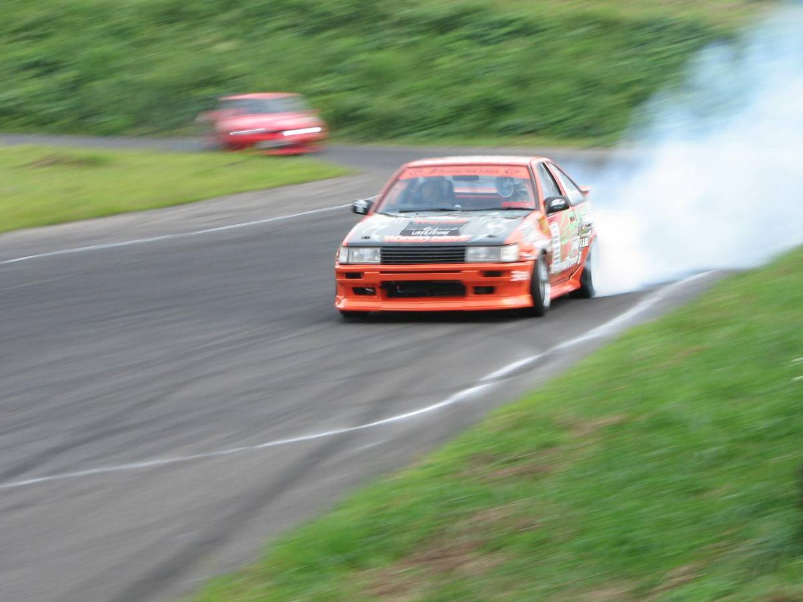
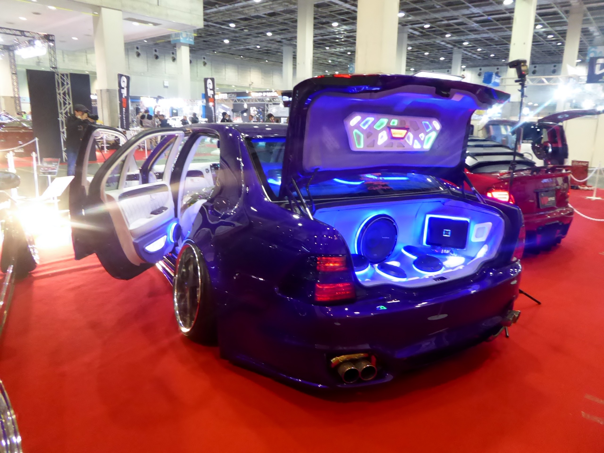
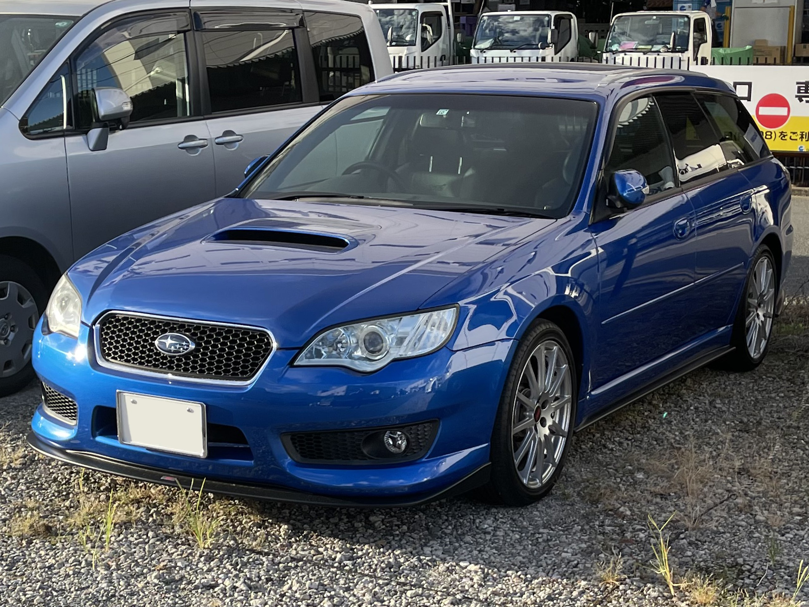
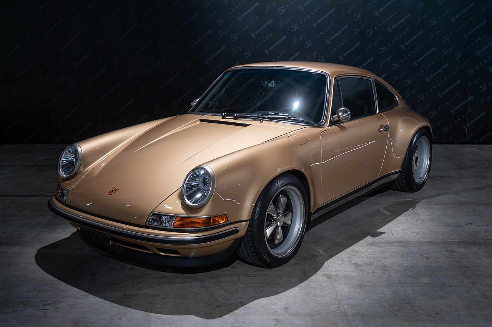
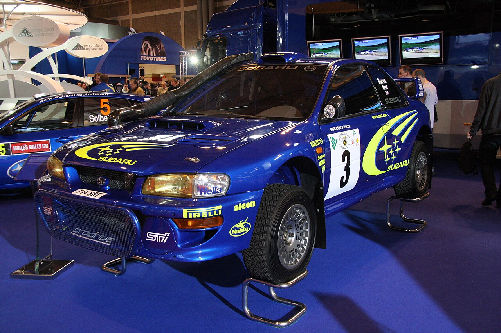

```{=html}
<div class="tuning-feature-wrapper">

  <!-- MASTHEAD / HEADER -->
  <header class="tuning-masthead">
    <div class="tuning-kicker">Motoring Culture &bull; Post-Production Reinterpretation</div>
    <h1 class="tuning-headline">The Factory Is Only the Beginning</h1>
    <p class="tuning-deck">
      How car owners and global automotive cultures give machines a second identity long after they roll off the assembly line.
    </p>

    <!-- CORE IDEA HIGHLIGHT -->
    <div class="tuning-core-quote">
      <blockquote>
        &ldquo;Manufacturers decide what a car leaves the factory as. Owners decide what happens next.&rdquo;
      </blockquote>
    </div>

    <p class="tuning-core-intro">
      Automobiles leave the factory with fixed specifications: factory ride heights, commuter gear ratios, compliant springs, and showroom silhouettes. Yet a car is rarely a finished cultural statement. Around the world, diverse subcultures have taken ordinary production platforms and reshaped them according to distinct technical, aesthetic, and mechanical philosophies. The purpose is not to argue that modified cars are objectively superior to original machinery, but to observe how deeply people can reinterpret the very same physical foundation.
    </p>
  </header>

  <!-- FIVE TUNING PHILOSOPHIES -->
  <div class="tuning-sections">

    <!-- 01 — DRIFT -->
    <article class="tuning-item tuning-item-drift">
      <div class="tuning-grid-drift">
        <figure class="tuning-figure">
          
          <figcaption class="tuning-caption">
            <span class="tuning-caption-tag">01 &middot; DRIFT</span>
            <span>Toyota AE86 &middot; Japan</span>
          </figcaption>
        </figure>
        <div class="tuning-content">
          <div class="tuning-meta-header">
            <span class="tuning-number">Subsection 01</span>
            <h2 class="tuning-title">DRIFT</h2>
          </div>
          <div class="tuning-thesis">Change what the car does.</div>
          <p class="tuning-prose">
            The 1983 Toyota Sprinter Trueno AE86 left the factory as a lightweight, economical Japanese coupe. It was neither fast nor luxurious. But drivers on mountain passes discovered that its rear-wheel-drive layout, natural chassis balance, and modest power made it uniquely controllable beyond the limits of traction.
          </p>
          <p class="tuning-prose">
            Rather than modifying a car to grip the road faster, drift culture modified it to slide with sustained momentum and angle. Suspensions were stiffened, steering angles widened, and mechanical limited-slip differentials installed—reorienting the car&rsquo;s entire mechanical objective from transit to dynamic expression.
          </p>
        </div>
      </div>

      <!-- EXPANDABLE REAL BUILD STORY -->
      <details class="tuning-build-details">
        <summary class="tuning-build-summary">
          <span class="tuning-summary-title">
            <span class="summary-label-closed">Explore the Build</span>
            <span class="summary-label-open">Close the Build</span>
          </span>
          <span class="tuning-summary-indicator" aria-hidden="true">
            <span class="indicator-plus">+</span>
            <span class="indicator-minus">&minus;</span>
          </span>
        </summary>

        <!-- FACTORY → MODIFIED → CULTURE (DATASET EVIDENCE) -->
        <div class="tuning-dataset-block">
          <div class="tuning-dataset-header">
            <div class="tuning-dataset-kicker">Factory &rarr; Modified &rarr; Culture</div>
            <h3 class="tuning-dataset-title">FROM THE DATASET</h3>
          </div>

          <div class="tuning-dataset-layout">
            <!-- Small magazine-style vehicle specification block -->
            <div class="tuning-spec-table">
              <div class="tuning-spec-row">
                <span class="tuning-spec-label">Model Year</span>
                <span class="tuning-spec-val">1983</span>
              </div>
              <div class="tuning-spec-row">
                <span class="tuning-spec-label">Model</span>
                <span class="tuning-spec-val">Toyota Sprinter Trueno AE86</span>
              </div>
              <div class="tuning-spec-row">
                <span class="tuning-spec-label">Engine</span>
                <span class="tuning-spec-val">1.6L DOHC 16V</span>
              </div>
              <div class="tuning-spec-row">
                <span class="tuning-spec-label">Horsepower</span>
                <span class="tuning-spec-val">128 hp</span>
              </div>
              <div class="tuning-spec-row">
                <span class="tuning-spec-label">Transmission</span>
                <span class="tuning-spec-val">5-speed manual</span>
              </div>
              <div class="tuning-spec-row">
                <span class="tuning-spec-label">Drivetrain</span>
                <span class="tuning-spec-val">RWD</span>
              </div>
              <div class="tuning-spec-row">
                <span class="tuning-spec-label">Body Style</span>
                <span class="tuning-spec-val">Coupe</span>
              </div>
            </div>

            <!-- Editorial Transition -->
            <div class="tuning-dataset-narrative">
              <p>
                The car left the factory as a relatively ordinary production coupe. Over time, people gave cars like the AE86 a different identity through drifting, modification, competition, and enthusiast culture.
              </p>
              <div class="tuning-dataset-core-thought">
                The factory built the car. People gave it another life.
              </div>
            </div>
          </div>
        </div>

        <div class="tuning-owner-block">
          <div class="tuning-dataset-header">
          <div class="tuning-dataset-kicker">Documented Enthusiast Build &middot; Japan</div>
          <h3 class="tuning-dataset-title">THEN THE OWNER CHANGED IT</h3>
        </div>

        <div class="tuning-comparison-grid">
          <!-- FACTORY (From Project Dataset) -->
          <div class="tuning-comparison-col">
            <div class="tuning-comparison-badge">
              <span class="tuning-badge-source">Project Dataset</span>
              <h4 class="tuning-comparison-heading">FACTORY</h4>
            </div>
            <div class="tuning-spec-table">
              <div class="tuning-spec-row">
                <span class="tuning-spec-label">Model</span>
                <span class="tuning-spec-val">1983 Toyota Sprinter Trueno AE86</span>
              </div>
              <div class="tuning-spec-row">
                <span class="tuning-spec-label">Engine</span>
                <span class="tuning-spec-val">1.6L DOHC 16V</span>
              </div>
              <div class="tuning-spec-row">
                <span class="tuning-spec-label">Horsepower</span>
                <span class="tuning-spec-val">128 hp</span>
              </div>
              <div class="tuning-spec-row">
                <span class="tuning-spec-label">Transmission</span>
                <span class="tuning-spec-val">5-speed manual</span>
              </div>
              <div class="tuning-spec-row">
                <span class="tuning-spec-label">Drivetrain</span>
                <span class="tuning-spec-val">RWD</span>
              </div>
              <div class="tuning-spec-row">
                <span class="tuning-spec-label">Body Style</span>
                <span class="tuning-spec-val">Coupe</span>
              </div>
            </div>
          </div>

          <!-- Transition Indicator -->
          <div class="tuning-comparison-arrow" aria-hidden="true">&darr;</div>

          <!-- MODIFIED (From Documented Build) -->
          <div class="tuning-comparison-col">
            <div class="tuning-comparison-badge">
              <span class="tuning-badge-source">Documented Real Build &middot; Tec-Art&rsquo;s</span>
              <h4 class="tuning-comparison-heading">MODIFIED</h4>
            </div>
            <div class="tuning-mod-list">
              <div class="tuning-mod-item">
                <div class="tuning-mod-header">
                  <span class="tuning-mod-system">Engine</span>
                  <span class="tuning-mod-part">1.8L 7A-GE 20-Valve Conversion</span>
                </div>
                <p class="tuning-mod-detail">
                  The owner replaced the factory 1.6L unit with a 1.8-litre 7A-GE built by specialist shop Tec-Art&rsquo;s, using a 7A block, 20-valve cylinder head, Toda Racing camshafts (272&deg; in / 288&deg; ex), Toda valves and springs, and a TRD custom exhaust. The builder documented that this was tuned for linear throttle control and mid-range response on mountain passes rather than sheer peak horsepower.
                </p>
              </div>

              <div class="tuning-mod-item">
                <div class="tuning-mod-header">
                  <span class="tuning-mod-system">Drivetrain</span>
                  <span class="tuning-mod-part">Close-Ratio 1st&ndash;3rd &amp; TRD 2-Way LSD</span>
                </div>
                <p class="tuning-mod-detail">
                  The owner changed the drivetrain to close-ratio gearing for first through third, a short-shift lever kit, and a TRD two-way limited-slip differential with a 4.778 final drive to withstand aggressive clutch-kicking and keep the engine in its optimal torque band during slides.
                </p>
              </div>

              <div class="tuning-mod-item">
                <div class="tuning-mod-header">
                  <span class="tuning-mod-system">Suspension</span>
                  <span class="tuning-mod-part">Custom In-House Tec-Art&rsquo;s Setup</span>
                </div>
                <p class="tuning-mod-detail">
                  The previous coilover setup was replaced by a custom in-house suspension designed by Tec-Art&rsquo;s specifically to tighten body control and reward precise weight transfer while actively punishing driver errors.
                </p>
              </div>

              <div class="tuning-mod-item">
                <div class="tuning-mod-header">
                  <span class="tuning-mod-system">Chassis &amp; Body</span>
                  <span class="tuning-mod-part">3,500 Spot Welds &amp; Carbon Bonnet</span>
                </div>
                <p class="tuning-mod-detail">
                  The unibody received 3,500 spot welds and 22 additional reinforcement points to handle drifting stresses without flexing, paired with a lightweight green carbon-fibre bonnet, Zenki front lip, and TRD boot spoiler.
                </p>
              </div>

              <div class="tuning-mod-item">
                <div class="tuning-mod-header">
                  <span class="tuning-mod-system">Wheels</span>
                  <span class="tuning-mod-part">15-inch Work Meister CR-01</span>
                </div>
                <p class="tuning-mod-detail">
                  The owner chose 15-inch Work Meister wheels to preserve period-authentic Japanese proportions rather than fitting oversized modern diameters.
                </p>
              </div>
            </div>
          </div>
        </div>

        <div class="tuning-owner-narrative">
          <p>
            The project dataset captures what this car was when it left the factory: an economical, lightweight Japanese coupe. But this particular documented build—Keiichi Tsuchiya&rsquo;s personal Trueno, developed and maintained by Japanese AE86 specialist Tec-Art&rsquo;s—shows how an owner reoriented that starting point around a completely different mechanical purpose.
          </p>
          <div class="tuning-dataset-core-thought">
            A factory specification is only the starting point.
          </div>
          <p class="tuning-source-note">
            Source: One documented example detailed by <em>NZ Performance Car</em>, <a href="https://nzperformancecar.co.nz/2014-12-9-high-expectations-dorikins-86/" target="_blank" rel="noopener noreferrer">&ldquo;High expectations &mdash; Dorikin&rsquo;s 86&rdquo;</a> (11 January 2015).
          </p>
        </div>
      </div>
      </details>
    </article>

    <!-- 02 — VIP / STANCE -->
    <article class="tuning-item tuning-item-vip">
      <div class="tuning-grid-vip">
        <div class="tuning-content">
          <div class="tuning-meta-header">
            <span class="tuning-number">Subsection 02</span>
            <h2 class="tuning-title">VIP / STANCE</h2>
          </div>
          <div class="tuning-thesis">Change how the car looks.</div>
          <p class="tuning-prose">
            Originating in Japan, VIP style (or <em>Bippu</em>) takes large, conservative executive saloons—such as the Toyota Crown and Celsior—and radically disrupts their formal executive character. What was originally built to convey understated corporate authority becomes an arresting street sculpture.
          </p>
          <p class="tuning-prose">
            Through aggressive negative camber, dramatically lowered ride heights, deep-dish polished wheels, and widened body panels, stance culture shifts visual gravity to the asphalt. The transformation demonstrates how altering proportion and wheel fitment can fundamentally redefine a vehicle&rsquo;s cultural posture.
          </p>
        </div>
        <figure class="tuning-figure">
          
          <figcaption class="tuning-caption">
            <span class="tuning-caption-tag">02 &middot; VIP / STANCE</span>
            <span>Toyota Crown &middot; Japan</span>
          </figcaption>
        </figure>
      </div>

      <!-- EXPANDABLE REAL BUILD STORY -->
      <details class="tuning-build-details">
        <summary class="tuning-build-summary">
          <span class="tuning-summary-title">
            <span class="summary-label-closed">Explore the Build</span>
            <span class="summary-label-open">Close the Build</span>
          </span>
          <span class="tuning-summary-indicator" aria-hidden="true">
            <span class="indicator-plus">+</span>
            <span class="indicator-minus">&minus;</span>
          </span>
        </summary>

        <div class="tuning-owner-block">
          <div class="tuning-dataset-header">
          <div class="tuning-dataset-kicker">Documented Enthusiast Build &middot; Japan &amp; USA</div>
          <h3 class="tuning-dataset-title">THEN THE OWNER CHANGED IT</h3>
        </div>

        <div class="tuning-comparison-grid">
          <!-- FACTORY (From Project Dataset) -->
          <div class="tuning-comparison-col">
            <div class="tuning-comparison-badge">
              <span class="tuning-badge-source">Project Dataset</span>
              <h4 class="tuning-comparison-heading">FACTORY</h4>
            </div>
            <div class="tuning-spec-table">
              <div class="tuning-spec-row">
                <span class="tuning-spec-label">Model</span>
                <span class="tuning-spec-val">1990 Lexus LS 400</span>
              </div>
              <div class="tuning-spec-row">
                <span class="tuning-spec-label">Engine</span>
                <span class="tuning-spec-val">4.0L DOHC 32V V8</span>
              </div>
              <div class="tuning-spec-row">
                <span class="tuning-spec-label">Horsepower</span>
                <span class="tuning-spec-val">245 hp</span>
              </div>
              <div class="tuning-spec-row">
                <span class="tuning-spec-label">Transmission</span>
                <span class="tuning-spec-val">4-speed automatic</span>
              </div>
              <div class="tuning-spec-row">
                <span class="tuning-spec-label">Drivetrain</span>
                <span class="tuning-spec-val">RWD</span>
              </div>
              <div class="tuning-spec-row">
                <span class="tuning-spec-label">Body Style</span>
                <span class="tuning-spec-val">Luxury Saloon</span>
              </div>
              <div class="tuning-spec-row">
                <span class="tuning-spec-label">Wheelbase</span>
                <span class="tuning-spec-val">111.0 in (2,819 mm)</span>
              </div>
            </div>
          </div>

          <!-- Transition Indicator -->
          <div class="tuning-comparison-arrow" aria-hidden="true">&darr;</div>

          <!-- MODIFIED (From Documented Build) -->
          <div class="tuning-comparison-col">
            <div class="tuning-comparison-badge">
              <span class="tuning-badge-source">Documented Real Build &middot; Junction Produce / Matt Campos</span>
              <h4 class="tuning-comparison-heading">MODIFIED</h4>
            </div>
            <div class="tuning-mod-list">
              <div class="tuning-mod-item">
                <div class="tuning-mod-header">
                  <span class="tuning-mod-system">Suspension</span>
                  <span class="tuning-mod-part">Air Runner Air Suspension System</span>
                </div>
                <p class="tuning-mod-detail">
                  The factory steel-spring suspension was replaced by an Air Runner air setup. This allows the saloon to achieve the signature VIP ground-scraping stance when parked while retaining the ability to raise the chassis several inches on the move to clear city obstacles without cracking low-slung aero panels.
                </p>
              </div>

              <div class="tuning-mod-item">
                <div class="tuning-mod-header">
                  <span class="tuning-mod-system">Wheels</span>
                  <span class="tuning-mod-part">19-inch Leon Hardiritt Orden</span>
                </div>
                <p class="tuning-mod-detail">
                  The owner replaced standard factory alloys with imported 19-inch Leon Hardiritt Orden multi-piece wheels from Japan, utilizing aggressive negative offset and polished lips to fill the wheel arches and pull the vehicle&rsquo;s visual weight down to the road surface.
                </p>
              </div>

              <div class="tuning-mod-item">
                <div class="tuning-mod-header">
                  <span class="tuning-mod-system">Bodywork</span>
                  <span class="tuning-mod-part">Full Junction Produce Aero Package</span>
                </div>
                <p class="tuning-mod-detail">
                  Originally prepared as an official demo car by Japanese tuning house Junction Produce for the SEMA Show, the body received a full authentic aerodynamic package, extending the bumpers and sills downward to disrupt the conservative factory executive silhouette.
                </p>
              </div>

              <div class="tuning-mod-item">
                <div class="tuning-mod-header">
                  <span class="tuning-mod-system">Interior</span>
                  <span class="tuning-mod-part">Junction Produce Pillows &amp; Crystal Curtains</span>
                </div>
                <p class="tuning-mod-detail">
                  Reflecting authentic Japanese <em>Bippu</em> culture, the cabin was converted into an executive salon with Junction Produce leather-wrapped pads, custom seat cushions, and window privacy curtains trimmed with Swarovski crystals.
                </p>
              </div>

              <div class="tuning-mod-item">
                <div class="tuning-mod-header">
                  <span class="tuning-mod-system">Electronics</span>
                  <span class="tuning-mod-part">Ambient LED Illumination &amp; Upgraded Audio</span>
                </div>
                <p class="tuning-mod-detail">
                  The interior received bespoke nighttime ambient LED lighting alongside an upgraded stereo navigation head unit and CD changer to complete the private lounge environment.
                </p>
              </div>
            </div>
          </div>
        </div>

        <div class="tuning-owner-narrative">
          <p>
            The project dataset captures what this platform was when it left the factory: an impeccably engineered luxury flagship designed for whisper-quiet corporate transit. But this documented build—first prepared by Japanese styling house Junction Produce for SEMA and personalized by Matt Campos—demonstrates how the VIP subculture inverts that character. Rather than conveying understated corporate conformity, the saloon becomes a pavement-skimming, countercultural street lounge.
          </p>
          <div class="tuning-dataset-core-thought">
            The factory built a boardroom cruiser. The subculture turned it into low-slung street royalty.
          </div>
          <p class="tuning-source-note">
            Source: One documented example detailed by Antonio Alvendia in <em>Driving Line</em>, <a href="https://www.drivingline.com/articles/rolling-vip-with-junction-produce-lexus/" target="_blank" rel="noopener noreferrer">&ldquo;Rolling VIP With Junction Produce Lexus&rdquo;</a> (17 April 2013). Factory baseline from project dataset (1990 Lexus LS 400).
          </p>
        </div>
      </div>
      </details>
    </article>

    <!-- 03 — OEM+ -->
    <article class="tuning-item tuning-item-oem">
      <div class="tuning-grid-oem">
        <figure class="tuning-figure">
          
          <figcaption class="tuning-caption">
            <span class="tuning-caption-tag">03 &middot; OEM+</span>
            <span>Honda Civic &middot; Japan</span>
          </figcaption>
        </figure>
        <div class="tuning-content">
          <div class="tuning-meta-header">
            <span class="tuning-number">Subsection 03</span>
            <h2 class="tuning-title">OEM+</h2>
          </div>
          <div class="tuning-thesis">Improve the original without losing it.</div>
          <p class="tuning-prose">
            OEM+ is the discipline of restraint. Rather than installing dramatic aftermarket body kits or flamboyant spoilers, this approach treats the original design with surgical reverence—improving components while keeping the car looking as though it could have been an unreleased factory special edition.
          </p>
          <p class="tuning-prose">
            A subtly modified Honda Civic exemplifies this philosophy: performance upgrades borrowed from higher-spec factory trims, tasteful ride height refinements, and period-correct wheels. The car remains immediately recognizable, yet sharper and cleaner in every detail.
          </p>
        </div>
      </div>

      <!-- EXPANDABLE REAL BUILD STORY -->
      <details class="tuning-build-details">
        <summary class="tuning-build-summary">
          <span class="tuning-summary-title">
            <span class="summary-label-closed">Explore the Build</span>
            <span class="summary-label-open">Close the Build</span>
          </span>
          <span class="tuning-summary-indicator" aria-hidden="true">
            <span class="indicator-plus">+</span>
            <span class="indicator-minus">&minus;</span>
          </span>
        </summary>

        <div class="tuning-owner-block">
          <div class="tuning-dataset-header">
          <div class="tuning-dataset-kicker">Documented Enthusiast Build &middot; North Carolina, USA</div>
          <h3 class="tuning-dataset-title">THEN THE OWNER CHANGED IT</h3>
        </div>

        <div class="tuning-comparison-grid">
          <!-- FACTORY (From Project Dataset) -->
          <div class="tuning-comparison-col">
            <div class="tuning-comparison-badge">
              <span class="tuning-badge-source">Project Dataset</span>
              <h4 class="tuning-comparison-heading">FACTORY</h4>
            </div>
            <div class="tuning-spec-table">
              <div class="tuning-spec-row">
                <span class="tuning-spec-label">Model</span>
                <span class="tuning-spec-val">2000 BMW M3 (E46)</span>
              </div>
              <div class="tuning-spec-row">
                <span class="tuning-spec-label">Engine</span>
                <span class="tuning-spec-val">3.2L DOHC 24V I6 (S54)</span>
              </div>
              <div class="tuning-spec-row">
                <span class="tuning-spec-label">Horsepower</span>
                <span class="tuning-spec-val">343 hp</span>
              </div>
              <div class="tuning-spec-row">
                <span class="tuning-spec-label">Transmission</span>
                <span class="tuning-spec-val">6-speed manual</span>
              </div>
              <div class="tuning-spec-row">
                <span class="tuning-spec-label">Drivetrain</span>
                <span class="tuning-spec-val">RWD</span>
              </div>
              <div class="tuning-spec-row">
                <span class="tuning-spec-label">Body Style</span>
                <span class="tuning-spec-val">Sports Coupe</span>
              </div>
              <div class="tuning-spec-row">
                <span class="tuning-spec-label">Curb Weight</span>
                <span class="tuning-spec-val">1,470 kg (3,241 lbs)</span>
              </div>
            </div>
          </div>

          <!-- Transition Indicator -->
          <div class="tuning-comparison-arrow" aria-hidden="true">&darr;</div>

          <!-- MODIFIED (From Documented Build) -->
          <div class="tuning-comparison-col">
            <div class="tuning-comparison-badge">
              <span class="tuning-badge-source">Documented Real Build &middot; Paul Ehrlich / Ehrlich Wheel Works</span>
              <h4 class="tuning-comparison-heading">MODIFIED</h4>
            </div>
            <div class="tuning-mod-list">
              <div class="tuning-mod-item">
                <div class="tuning-mod-header">
                  <span class="tuning-mod-system">Roof &amp; Aero</span>
                  <span class="tuning-mod-part">OEM BMW M3 CSL Carbon Slicktop &amp; CSL Trunk</span>
                </div>
                <p class="tuning-mod-detail">
                  The factory steel roof and sunroof cassette were replaced with an authentic OEM BMW M3 CSL carbon-fiber roof panel, eliminating significant unsprung weight from the highest point of the vehicle. Complemented by an authentic OEM CSL front bumper, CSL ducktail trunk lid, subtle carbon front splitter, and rear diffuser, all refinished in factory Alpine White.
                </p>
              </div>

              <div class="tuning-mod-item">
                <div class="tuning-mod-header">
                  <span class="tuning-mod-system">Braking</span>
                  <span class="tuning-mod-part">Porsche 996 Brembo 4-Piston Calipers</span>
                </div>
                <p class="tuning-mod-detail">
                  In a revered OEM-plus cross-platform upgrade, the factory single-piston floating front calipers were replaced by Porsche 996-generation Brembo four-piston monobloc calipers mounted on bespoke brackets. The conversion improves pedal firmness and thermal capacity while fitting discreetly behind period wheel spokes.
                </p>
              </div>

              <div class="tuning-mod-item">
                <div class="tuning-mod-header">
                  <span class="tuning-mod-system">Suspension &amp; Drivetrain</span>
                  <span class="tuning-mod-part">Broadway Static Coilovers &amp; Diffsonline 4.10 LSD</span>
                </div>
                <p class="tuning-mod-detail">
                  Fitted with Broadway Static coilovers dialed in for functional road compliance rather than extreme stance, paired with a rebuilt Diffsonline 4.10 limited-slip differential. Every undercarriage control arm, bushing, ball joint, and bracket was dismantled, powder-coated, or re-plated with fresh factory hardware.
                </p>
              </div>

              <div class="tuning-mod-item">
                <div class="tuning-mod-header">
                  <span class="tuning-mod-system">Wheels</span>
                  <span class="tuning-mod-part">Custom 3-Piece BBS Super RS (19&times;10 front, 19&times;11 rear)</span>
                </div>
                <p class="tuning-mod-detail">
                  Built by Ehrlich Wheel Works, the wheels are three-piece converted, double-stepped 19-inch BBS Super RS mesh alloys (19&times;10 ET27 front, 19&times;11 ET22 rear). The design preserves the classic motorsport mesh pattern synonymous with high-performance BMW heritage, modernized through custom modular multi-piece engineering without excessive tire stretch.
                </p>
              </div>

              <div class="tuning-mod-item">
                <div class="tuning-mod-header">
                  <span class="tuning-mod-system">Interior</span>
                  <span class="tuning-mod-part">Recaro Pole Positions in Factory Imola Red Leather</span>
                </div>
                <p class="tuning-mod-detail">
                  The cabin features fixed-back Recaro Pole Position bucket seats reupholstered in OEM-spec BMW Imola Red leather, accented by Alpine White painted seat backs. The headliner, pillars, and consoles were reupholstered in wrinkle-free Euro Black smooth leather, paired with piano black trim and custom door sills.
                </p>
              </div>
            </div>
          </div>
        </div>

        <div class="tuning-owner-narrative">
          <p>
            The project dataset captures what the E46 M3 was when it left Munich in 2000: an atmospheric straight-six benchmark of factory balance. But builder Paul Ehrlich&rsquo;s decade-long project shows how the OEM+ philosophy works in practice. Rather than installing exaggerated widebody flares or forced induction, the build sharpens the car by borrowing lightweight carbon-fiber composite components from BMW&rsquo;s own halo model—the M3 CSL—and combining them with period-correct Porsche Brembo calipers and factory-spec Imola Red leather. The car remains unmistakably an E46, yet elevated in every mechanical and visual detail.
          </p>
          <div class="tuning-dataset-core-thought">
            Sometimes giving a car more character means knowing when to leave its character alone.
          </div>
          <p class="tuning-source-note">
            Source: One documented example detailed by Mike Bevels in <em>BimmerLife</em>, <a href="https://bimmerlife.com/2024/07/30/rising-from-the-ashes-paul-ehrlichs-2001-m3/" target="_blank" rel="noopener noreferrer">&ldquo;Rising From The Ashes: Paul Ehrlich’s 2001 M3&rdquo;</a> (30 July 2024). Factory baseline from project dataset (2000 BMW M3 E46).
          </p>
        </div>
      </div>
      </details>
    </article>

    <!-- 04 — RESTOMOD -->
    <article class="tuning-item tuning-item-restomod">
      <div class="tuning-grid-restomod">
        <figure class="tuning-figure">
          
          <figcaption class="tuning-caption">
            <span class="tuning-caption-tag">04 &middot; RESTOMOD</span>
            <span>Porsche 911 &middot; Germany</span>
          </figcaption>
        </figure>
        <div class="tuning-content">
          <div class="tuning-meta-header">
            <span class="tuning-number">Subsection 04</span>
            <h2 class="tuning-title">RESTOMOD</h2>
          </div>
          <div class="tuning-thesis">Keep the old character. Modernize the rest.</div>
          <p class="tuning-prose">
            The restomod movement resolves a classic automotive paradox: vintage cars possess timeless silhouette and tactile soul, but often suffer from dated brakes, fragile electrics, and harsh reliability. Restomodding preserves the iconic exterior character while re-engineering everything underneath.
          </p>
          <p class="tuning-prose">
            Applied to the classic air-cooled Porsche 911, the approach pairs classic styling with carbon-composite panels, precision modern suspension, and bespoke engine architecture. The car maintains its historical identity while gaining modern performance and durability.
          </p>
        </div>
      </div>

      <!-- EXPANDABLE REAL BUILD STORY -->
      <details class="tuning-build-details">
        <summary class="tuning-build-summary">
          <span class="tuning-summary-title">
            <span class="summary-label-closed">Explore the Build</span>
            <span class="summary-label-open">Close the Build</span>
          </span>
          <span class="tuning-summary-indicator" aria-hidden="true">
            <span class="indicator-plus">+</span>
            <span class="indicator-minus">&minus;</span>
          </span>
        </summary>

        <div class="tuning-owner-block">
          <div class="tuning-dataset-header">
          <div class="tuning-dataset-kicker">Documented Bespoke Commission &middot; Singer Vehicle Design</div>
          <h3 class="tuning-dataset-title">THEN THE OWNER CHANGED IT</h3>
        </div>

        <div class="tuning-comparison-grid">
          <!-- FACTORY (From Project Dataset) -->
          <div class="tuning-comparison-col">
            <div class="tuning-comparison-badge">
              <span class="tuning-badge-source">Project Dataset</span>
              <h4 class="tuning-comparison-heading">FACTORY</h4>
            </div>
            <div class="tuning-spec-table">
              <div class="tuning-spec-row">
                <span class="tuning-spec-label">Model</span>
                <span class="tuning-spec-val">1990 Porsche 911 Carrera 2 (964)</span>
              </div>
              <div class="tuning-spec-row">
                <span class="tuning-spec-label">Engine</span>
                <span class="tuning-spec-val">3.6L SOHC 12V Flat-6 (M64/01)</span>
              </div>
              <div class="tuning-spec-row">
                <span class="tuning-spec-label">Horsepower</span>
                <span class="tuning-spec-val">250 hp @ 6,100 rpm</span>
              </div>
              <div class="tuning-spec-row">
                <span class="tuning-spec-label">Transmission</span>
                <span class="tuning-spec-val">5-speed manual (G50)</span>
              </div>
              <div class="tuning-spec-row">
                <span class="tuning-spec-label">Drivetrain</span>
                <span class="tuning-spec-val">RWD</span>
              </div>
              <div class="tuning-spec-row">
                <span class="tuning-spec-label">Body Style</span>
                <span class="tuning-spec-val">Sports Coupe</span>
              </div>
              <div class="tuning-spec-row">
                <span class="tuning-spec-label">Curb Weight</span>
                <span class="tuning-spec-val">1,350 kg (2,976 lbs)</span>
              </div>
            </div>
          </div>

          <!-- Transition Indicator -->
          <div class="tuning-comparison-arrow" aria-hidden="true">&darr;</div>

          <!-- MODIFIED (From Documented Build) -->
          <div class="tuning-comparison-col">
            <div class="tuning-comparison-badge">
              <span class="tuning-badge-source">Documented Real Build &middot; Singer Vehicle Design &ldquo;Goldfinger&rdquo;</span>
              <h4 class="tuning-comparison-heading">MODIFIED</h4>
            </div>
            <div class="tuning-mod-list">
              <div class="tuning-mod-item">
                <div class="tuning-mod-header">
                  <span class="tuning-mod-system">Engine &amp; Powertrain</span>
                  <span class="tuning-mod-part">4.0L Hand-Built Flat-6 by Ed Pink Racing Engines</span>
                </div>
                <p class="tuning-mod-detail">
                  The original 3.6-liter engine was stripped to bare crankcases and rebuilt into a bespoke 4.0-liter naturally aspirated flat-six producing approximately 390 hp. Hand-assembled with Cosworth-designed cylinder heads, Carrillo connecting rods, Mahle forged pistons and cylinders, a lightweight Pankl crankshaft, Rothsport individual throttle bodies, and an AEM programmable engine management system.
                </p>
              </div>

              <div class="tuning-mod-item">
                <div class="tuning-mod-header">
                  <span class="tuning-mod-system">Transmission</span>
                  <span class="tuning-mod-part">Getrag 6-Speed Manual &amp; Limited-Slip Differential</span>
                </div>
                <p class="tuning-mod-detail">
                  Replaced the factory 5-speed G50 gearbox with a bespoke close-ratio Getrag 6-speed manual transmission mated to an upgraded limited-slip differential, calibrated to harness the increased torque band while delivering precise, tactile vintage shift throws.
                </p>
              </div>

              <div class="tuning-mod-item">
                <div class="tuning-mod-header">
                  <span class="tuning-mod-system">Body &amp; Aerodynamics</span>
                  <span class="tuning-mod-part">Carbon-Fiber Panels &amp; Casablanca Beige Metallic</span>
                </div>
                <p class="tuning-mod-detail">
                  The factory steel front fenders, hood, rear quarters, and bumpers were replaced with hand-laid pre-preg carbon-fiber composite panels. The bodywork backdates the profile to iconic late-1960s long-hood proportions while reducing weight, finished in one-of-one Paint-to-Sample Casablanca Beige Metallic with nickel Touring bumperettes and 24-karat gold-plated decklid badging.
                </p>
              </div>

              <div class="tuning-mod-item">
                <div class="tuning-mod-header">
                  <span class="tuning-mod-system">Suspension</span>
                  <span class="tuning-mod-part">&Ouml;hlins 2-Way Adjustable Sport Coilovers</span>
                </div>
                <p class="tuning-mod-detail">
                  The factory suspension was substituted with an &Ouml;hlins 2-way adjustable sport coilover setup paired with lightweight modern suspension linkages and sway bars, delivering supple GT ride compliance on broken road surfaces alongside flat cornering stability on track.
                </p>
              </div>

              <div class="tuning-mod-item">
                <div class="tuning-mod-header">
                  <span class="tuning-mod-system">Braking &amp; Wheels</span>
                  <span class="tuning-mod-part">Brembo 4-Piston Calipers &amp; 17&Prime; Fuchs-Style Forged Alloys</span>
                </div>
                <p class="tuning-mod-detail">
                  Equipped with high-performance Brembo 4-piston calipers in Singer Racing Red over cross-drilled steel rotors, resolving the heat dissipation limits of 1990 factory brakes. Housed within bespoke 17-inch forged Fuchs-style wheels with nickel RS centers, wrapped in sticky Michelin Pilot Sport rubber.
                </p>
              </div>
            </div>
          </div>
        </div>

        <div class="tuning-owner-narrative">
          <p>
            A factory specification describes what a car was when it left the manufacturer. It does not describe everything the car can become afterward. The project dataset catalogs the 1990 Porsche 911 (Typ 964) as an air-cooled classic with 250 horsepower, steel bodywork, and period switchgear. But Singer Vehicle Design&rsquo;s &ldquo;Goldfinger Commission&rdquo; illustrates the restorative philosophy at the heart of the restomod movement: changing the car without completely abandoning what made the original car distinctive.
          </p>
          <p>
            By preserving the unmistakable air-cooled flat-six cadence, rear-engine weight balance, and iconic silhouette while re-engineering the chassis in carbon fiber, modernizing the valvetrain with Ed Pink racing architecture, and fitting &Ouml;hlins damping, the build erases four decades of mechanical compromises. The car retains its vintage soul, yet operates with the reliability, structural stiffness, and stopping power of a contemporary supercar.
          </p>
          <div class="tuning-dataset-core-thought">
            Keep the character. Change what needs changing.
          </div>
          <p class="tuning-source-note">
            Source: Documented build specifications from Singer Vehicle Design and Broad Arrow Auctions, <a href="https://www.broadarrowauctions.com/vehicles/dg25_r0011/1990-porsche-911-coupe-reimagined-by-singer-goldfinger-commission" target="_blank" rel="noopener noreferrer">&ldquo;1990 Porsche 911 Coupe Reimagined by Singer &lsquo;Goldfinger Commission&rsquo;&rdquo;</a> (Chassis WP0AB2964LS451541, Zurich 2025). Factory baseline from project dataset (1989&ndash;1993 Porsche 911 Typ 964 Carrera 2).
          </p>
        </div>
      </div>
      </details>
    </article>

    <!-- 05 — RALLY -->
    <article class="tuning-item tuning-item-rally">
      <div class="tuning-grid-rally">
        <div class="tuning-content">
          <div class="tuning-meta-header">
            <span class="tuning-number">Subsection 05</span>
            <h2 class="tuning-title">RALLY</h2>
          </div>
          <div class="tuning-thesis">Build around a purpose.</div>
          <p class="tuning-prose">
            Unlike aesthetic or stylistic modifications, rally builds are shaped strictly by function, terrain, and survival. Every component added or subtracted answers an environmental demand: raised long-travel suspension, reinforced underbody skid plates, mud flaps, and high-intensity auxiliary lighting.
          </p>
          <p class="tuning-prose">
            In competition platforms like the Subaru Impreza WRC, all-wheel-drive capability is honed to withstand gravel, snow, jumps, and mud. The resulting machine has an unmistakable functional aesthetic—an identity born purely from the terrain it was built to master.
          </p>
        </div>
        <figure class="tuning-figure">
          
          <figcaption class="tuning-caption">
            <span class="tuning-caption-tag">05 &middot; RALLY</span>
            <span>Subaru Impreza &middot; Japan</span>
          </figcaption>
        </figure>
      </div>

      <!-- EXPANDABLE REAL BUILD STORY -->
      <details class="tuning-build-details">
        <summary class="tuning-build-summary">
          <span class="tuning-summary-title">
            <span class="summary-label-closed">Explore the Build</span>
            <span class="summary-label-open">Close the Build</span>
          </span>
          <span class="tuning-summary-indicator" aria-hidden="true">
            <span class="indicator-plus">+</span>
            <span class="indicator-minus">&minus;</span>
          </span>
        </summary>

        <div class="tuning-owner-block">
          <div class="tuning-dataset-header">
          <div class="tuning-dataset-kicker">Documented Competition Build &middot; Banbury, UK &amp; Nairobi, Kenya</div>
          <h3 class="tuning-dataset-title">THEN THE OWNER CHANGED IT</h3>
        </div>

        <div class="tuning-comparison-grid">
          <!-- FACTORY (From Project Dataset) -->
          <div class="tuning-comparison-col">
            <div class="tuning-comparison-badge">
              <span class="tuning-badge-source">Project Dataset</span>
              <h4 class="tuning-comparison-heading">FACTORY</h4>
            </div>
            <div class="tuning-spec-table">
              <div class="tuning-spec-row">
                <span class="tuning-spec-label">Model</span>
                <span class="tuning-spec-val">1998 Subaru Impreza WRX STi (GC8)</span>
              </div>
              <div class="tuning-spec-row">
                <span class="tuning-spec-label">Engine</span>
                <span class="tuning-spec-val">2.0L Turbo Flat-4 (EJ20)</span>
              </div>
              <div class="tuning-spec-row">
                <span class="tuning-spec-label">Horsepower</span>
                <span class="tuning-spec-val">265 hp @ 6,000 rpm</span>
              </div>
              <div class="tuning-spec-row">
                <span class="tuning-spec-label">Transmission</span>
                <span class="tuning-spec-val">5-speed manual</span>
              </div>
              <div class="tuning-spec-row">
                <span class="tuning-spec-label">Drivetrain</span>
                <span class="tuning-spec-val">AWD</span>
              </div>
              <div class="tuning-spec-row">
                <span class="tuning-spec-label">Body Style</span>
                <span class="tuning-spec-val">Sports Saloon</span>
              </div>
              <div class="tuning-spec-row">
                <span class="tuning-spec-label">Curb Weight</span>
                <span class="tuning-spec-val">1,260 kg (2,778 lbs)</span>
              </div>
            </div>
          </div>

          <!-- Transition Indicator -->
          <div class="tuning-comparison-arrow" aria-hidden="true">&darr;</div>

          <!-- MODIFIED (From Documented Build) -->
          <div class="tuning-comparison-col">
            <div class="tuning-comparison-badge">
              <span class="tuning-badge-source">Documented Real Build &middot; Prodrive / Subaru World Rally Team</span>
              <h4 class="tuning-comparison-heading">MODIFIED</h4>
            </div>
            <div class="tuning-mod-list">
              <div class="tuning-mod-item">
                <div class="tuning-mod-header">
                  <span class="tuning-mod-system">Safari Protection</span>
                  <span class="tuning-mod-part">A-Pillar Snorkel &amp; Chassis-Mounted Kangaroo Bar</span>
                </div>
                <p class="tuning-mod-detail">
                  Engineered specifically for the Safari Rally Kenya, an external carbon-composite snorkel intake was routed from the right front wing up the A-pillar to the roofline, preventing fine dust ingestion and engine drowning during river crossings. A heavy-duty tubular steel kangaroo bar with protective wire mesh was mounted directly to the chassis frame ahead of the front bumper, safeguarding the radiator, oil coolers, and intercooler against wildlife and boulder collisions.
                </p>
              </div>

              <div class="tuning-mod-item">
                <div class="tuning-mod-header">
                  <span class="tuning-mod-system">Suspension &amp; Chassis</span>
                  <span class="tuning-mod-part">Prodrive/Bilstein Inverted Long-Travel Coilovers</span>
                </div>
                <p class="tuning-mod-detail">
                  Production road dampers were replaced with heavy-duty Prodrive/Bilstein inverted long-travel MacPherson struts featuring hydraulic bump stops, substantially elevated ride height, and reinforced tubular steel lower control arms with spherical rose joints. The unibody was seam-welded and integrated with a multi-point T45 steel roll cage, enduring repeated high-speed jumps and punishing volcanic bedrock ruts.
                </p>
              </div>

              <div class="tuning-mod-item">
                <div class="tuning-mod-header">
                  <span class="tuning-mod-system">Transmission</span>
                  <span class="tuning-mod-part">Hewland 6-Speed Paddle-Shift &amp; Active Differentials</span>
                </div>
                <p class="tuning-mod-detail">
                  Substituted the factory H-pattern manual gearbox with a Prodrive/Hewland hydraulically actuated 6-speed sequential gearbox controlled via steering-column paddle shifters&mdash;allowing gear selection without removing hands from the wheel over violently rough terrain. Symmetrical AWD was upgraded with computer-managed active hydraulic front, center, and Hewland rear differentials to continuously adjust front-to-rear torque split over shifting sand and mud.
                </p>
              </div>

              <div class="tuning-mod-item">
                <div class="tuning-mod-header">
                  <span class="tuning-mod-system">Engine &amp; Powertrain</span>
                  <span class="tuning-mod-part">EJ20 Boxer with IHI RX6 Turbo &amp; Anti-Lag System</span>
                </div>
                <p class="tuning-mod-detail">
                  The 2.0-liter flat-four was blueprinted with an aluminum block, lightweight forged internals, high-flow cylinder heads, and an IHI RX6 turbocharger restricted by the mandatory FIA 34mm restrictor. Calibrated with an aggressive Anti-Lag System (ALS) that kept boost spooled under deceleration, yielding a regulated 300 bhp and an enormous 650 Nm (479 lb-ft) of low-end torque to claw through thick mud.
                </p>
              </div>

              <div class="tuning-mod-item">
                <div class="tuning-mod-header">
                  <span class="tuning-mod-system">Wheels &amp; Brakes</span>
                  <span class="tuning-mod-part">15&Prime; Forged OZ Racing Wheels &amp; AP Racing 4-Piston Calipers</span>
                </div>
                <p class="tuning-mod-detail">
                  The platform was fitted with rugged 15-inch forged OZ Racing gravel wheels wrapped in reinforced, deep-tread Pirelli rally tires with run-flat mousse. Braking was converted to water-cooled AP Racing 4-piston calipers gripping ventilated steel gravel rotors designed to shed caked clay, complemented by twin spare wheels and auxiliary night-stage pod lamps.
                </p>
              </div>
            </div>
          </div>
        </div>

        <div class="tuning-owner-narrative">
          <p>
            A factory specification describes what a car was when it left the manufacturer. It does not describe everything the car can become afterward. The project dataset catalogs the 1998 Subaru Impreza WRX STi as a spirited road car: a 265-horsepower all-wheel-drive saloon engineered for paved mountain passes and wet tarmac. But chassis PRO-WRC-99.010 (registered as T14 SRT)&mdash;prepared by Prodrive for the 2000 Safari Rally Kenya and driven by Richard Burns and Robert Reid&mdash;demonstrates how competition transforms that character entirely.
          </p>
          <p>
            Over 2,698 kilometers of unforgiving African savanna, deep riverbeds, and suffocating volcanic silt, the build transformed the car&rsquo;s relationship with the environment. With raised long-travel suspension clearing jagged rocks, an A-pillar snorkel drawing clean air above dust clouds, and an active all-wheel-drive system adapting to shifting sand in milliseconds, the car was no longer an ordinary road car modified for speed. It became a survival machine purpose-built to conquer terrain the factory car was never designed to navigate.
          </p>
          <div class="tuning-dataset-core-thought">
            Take the road less traveled. Then make the car ready for it.
          </div>
          <p class="tuning-source-note">
            Source: Documented competition build specifications from Prodrive Heritage Collection and FIA World Rally Championship archives, &ldquo;1999 Subaru Impreza WRC99 &lsquo;Safari Rally Spec&rsquo;&rdquo; (Chassis PRO-WRC-99.010, Registration T14 SRT, driven by Richard Burns and Robert Reid to victory at the 2000 Safari Rally Kenya). Factory baseline from project dataset (1998 Subaru Impreza WRX STi GC8).
          </p>
        </div>
      </div>
      </details>
    </article>

  </div>

</div>
```
